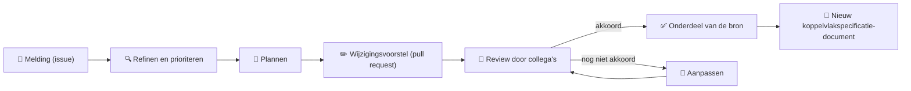
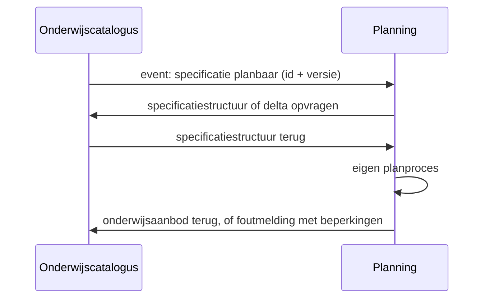

<!-- TITELSLIDE -->
<div class="np-bg" style="background-image: url(/npuls/powerpoint_slides/Slide1.PNG);"></div>

<div style="position: absolute; inset: 0; display: flex; flex-direction: column; justify-content: center; align-items: center; text-align: center; padding: 2rem 4rem; z-index: 1;">
  <h1 style="font-size: 3rem; line-height: 1.15; margin-bottom: 0.6rem; color: var(--np-ink);">Koppelvlakspecificaties</h1>
  <p style="font-size: 1.15rem; color: var(--np-dark-gray); max-width: 680px; line-height: 1.5; margin-bottom: 1rem;">
    De eerste structuur voor het eindproduct
  </p>
  <div style="font-size: 0.92rem; color: var(--np-ink);">
    <strong>Kerngroep techniek</strong> &middot; Amersfoort
  </div>
  <div style="font-size: 0.82rem; color: var(--np-mid-gray); margin-top: 0.3rem;">OKx &middot; Onderwijskoppelingen &middot; Npuls &middot; 19 augustus 2026</div>
</div>

<!--
Framing vanaf de eerste zin: vereenvoudiging en consolidatie van wat er al was, geen
koerswijziging. De aanleiding is de vraag uit de keten zelf: "wanneer is iets af, en waar
vinden we het?" Dit gezelschap heet de kerngroep techniek.
-->

---

<!-- OPENING: HET KERNPUNT -->
<div class="np-bg" style="background-image: url(/npuls/powerpoint_slides/Slide3.PNG);"></div>

<div class="fill">

<div style="display: flex; flex-direction: column; align-items: center; justify-content: center; height: 100%; text-align: center; padding: 0 2rem;">
  <div style="font-family: 'Cooper Light BT', serif; font-size: 2.1rem; line-height: 1.4; color: var(--np-blue); max-width: 760px;">
    De eerste structuur van de koppelvlakspecificatie staat.
  </div>
  <p style="margin-top: 1.2rem; font-size: 1.05rem; color: var(--np-dark-gray); max-width: 640px; line-height: 1.6;">
    Gereleased als alpha-document v0.0.1, in docx en pdf.
  </p>
  <p style="margin-top: 1rem; font-size: 1.25rem; color: var(--np-ink); max-width: 680px; line-height: 1.6;">
    Vandaag onderzoeken we samen of de structuur werkt voor onze doelen, en hoe we verder bouwen.
  </p>
</div>

</div>

<!--
Dit is de boodschap van de hele sessie, in de eerste minuut. Alles wat volgt is uitwerking
van deze ene zin. Niet doorpraten; laten landen en door naar het programma.
-->

---

<!-- AGENDA -->
<div class="np-bg" style="background-image: url(/npuls/powerpoint_slides/Slide2.PNG);"></div>

<div style="margin-left: 42%; height: 100%; display: flex; flex-direction: column; justify-content: center; padding-right: 3rem;">
  <p class="eyebrow">Wat gaan we bespreken</p>
  <h1 style="font-size: 2.1rem !important; margin-bottom: 1.1rem;">Programma</h1>
  <div style="display: flex; flex-direction: column; gap: 0.7rem;">
    <div style="display: flex; align-items: center; gap: 0.8rem;">
      <span class="np-num">1</span>
      <div><strong>Versimpelde werkwijze</strong><br/><span class="muted" style="font-size: 0.8rem;">Twee bronnen, elk hun eigen prioriteit</span></div>
    </div>
    <div style="display: flex; align-items: center; gap: 0.8rem;">
      <span class="np-num" style="background: var(--np-orange);">2</span>
      <div><strong>De publieke repository</strong><br/><span class="muted" style="font-size: 0.8rem;">De opbouw van een koppelvlakspecificatie</span></div>
    </div>
    <div style="display: flex; align-items: center; gap: 0.8rem;">
      <span class="np-num" style="background: var(--np-green);">3</span>
      <div><strong>Release management</strong><br/><span class="muted" style="font-size: 0.8rem;">Van bron naar releasepakket</span></div>
    </div>
    <div style="display: flex; align-items: center; gap: 0.8rem;">
      <span class="np-num">4</span>
      <div><strong>Alpha-document v0.0.1</strong><br/><span class="muted" style="font-size: 0.8rem;">Wat erin zit en wat we vragen</span></div>
    </div>
    <div style="display: flex; align-items: center; gap: 0.8rem;">
      <span class="np-num" style="background: var(--np-orange);">5</span>
      <div><strong>Planning</strong><br/><span class="muted" style="font-size: 0.8rem;">De belangrijkste issues voor de komende periode</span></div>
    </div>
  </div>
</div>

<!--
De volgorde is de agenda zoals Ruud die heeft vastgesteld. Tussendoor een werkdeel: iedereen
gaat zelf de repository en het document in. Er is bewust geen volledige demo.
-->

---

<!-- DIVIDER DEEL 1 -->
<div class="np-bg" style="background-image: url(/npuls/powerpoint_slides/Slide14.PNG);"></div>

<div class="flex items-center justify-center h-full">
  <div style="text-align: center;">
    <p class="eyebrow" style="color: rgba(255,255,255,0.85);">Deel 1</p>
    <h1 style="color: #FFFFFF !important; font-size: 3rem;">Versimpelde werkwijze</h1>
  </div>
</div>

<!--
Kernwoorden: versimpeld, consolidatie, bestendiging; nooit "nieuw" of "anders".
De inhoud die iedereen kent blijft; hij wordt beter vindbaar en expliciet af of niet-af.
-->

---

<!-- AANLEIDING -->
<div class="np-bg" style="background-image: url(/npuls/powerpoint_slides/Slide3.PNG);"></div>

<div class="fill">

# De aanleiding

<div class="np-grid-2" style="margin-top: 0.8rem;">
<div style="font-size: 0.98rem; line-height: 1.9;">

- Stakeholders konden de informatie niet vinden: <strong>"wanneer is iets af, en waar vinden we het?"</strong>
- Het werken via GitHub werd breder geadopteerd en het team groeide
- De behoefte: een <strong>professionele werkomgeving</strong>, en producten die <strong>klaar zijn voor gebruik</strong>

</div>
<div>
  <div class="np-card accent-orange">
    <h3>Consolidatie, geen koerswijziging</h3>
    <p style="font-size: 0.95rem; color: var(--np-dark-gray); line-height: 1.6; margin: 0.4rem 0 0;">
      Wat af is, staat op &eacute;&eacute;n publieke plek en krijgt via
      release management een versienummer. Wat nog rijpt, blijft werkmateriaal.
    </p>
  </div>
</div>
</div>

</div>

<!--
Kort houden; de rest mondeling: werkmateriaal en vastgestelde specificaties stonden op
dezelfde plek, daardoor was niet te zien wat telde. Geruststelling erbij vertellen: de
inhoud verandert niet, dezelfde informatiestromen en hetzelfde begrippenkader blijven
de kern.
-->

---

<!-- TWEE BRONNEN -->
<div class="np-bg" style="background-image: url(/npuls/powerpoint_slides/Slide3.PNG);"></div>

<div class="fill">

# Van werkomgeving naar release

<div style="display: grid; grid-template-columns: 1fr 1.9fr; gap: 1.2rem; align-items: center; margin-top: 0.6rem;">
<div style="font-size: 0.92rem; line-height: 1.75; display: flex; flex-direction: column; gap: 0.7rem;">
  <div><strong>Private source</strong><br/>De werkomgeving van het projectteam: bronbestanden, ideeën en memo's. Alle context om het eindproduct te realiseren.</div>
  <div><strong>Public source</strong><br/>Alle bronbestanden van de koppelvlakspecificatie.</div>
  <div><strong>Public release</strong><br/>Het geversioneerde koppelvlakspecificatie-document.</div>
</div>
<div style="display: flex; justify-content: center;">
  <div style="background: #1d2733; border-radius: 12px; padding: 0.9rem 1.1rem;">
    
  </div>
</div>
</div>

</div>

<!--
Leeswijzer bij de plaat: links de private source (interne planning en referentiemateriaal),
midden de public source met bronmateriaal, CI/CD en documentatie, rechts de public release
met de pakketten, en de rollen erboven: OKx Techniek draagt bij, contributors dragen bij
aan de public source, implementers gebruiken de release. De scheiding is er een van
prioriteiten: werken versus opleveren.
-->

---

<!-- META WORDT PRIVE -->
<div class="np-bg" style="background-image: url(/npuls/powerpoint_slides/Slide3.PNG);"></div>

<div class="fill">

# De werkomgeving wordt privé

<div class="np-grid-2" style="margin-top: 0.8rem; align-items: start;">
<div style="font-size: 0.95rem; line-height: 1.9;">

- De meta-repository wordt <strong>privé</strong>, en daar blijft het team werken
- Wat daar blijft: de bronbestanden die de <strong>kaderstelling</strong> dragen, en de verdiepende context bij de werkwijze, zoals productiviteitstooling en interne memo's
- De publieke repository is puur de <strong>productrepository</strong>: de specificaties en hun releases

</div>
<div>
  <div class="np-card accent-blue">
    <h3>Wat dit voor afnemers betekent</h3>
    <p class="muted" style="font-size: 0.86rem; margin: 0;">Alles wat nodig is om een koppelvlak te bouwen, staat in de publieke repository. Vraagt iets om externe verdieping of verantwoording, dan wegen we overheveling naar de publieke bron.</p>
  </div>
</div>
</div>

</div>

<!--
Deze vraag komt sowieso: wat gebeurt er in meta versus public. Meta is de source repository
met complexere bestanden en meer context; de koppelvlakspecificaties hebben markdown-bronnen
die daar geïtereerd worden; releases en definitieve documenten leven publiek.
-->

---

<!-- DIVIDER DEEL 2 -->
<div class="np-bg" style="background-image: url(/npuls/powerpoint_slides/Slide14.PNG);"></div>

<div class="flex items-center justify-center h-full">
  <div style="text-align: center;">
    <p class="eyebrow" style="color: rgba(255,255,255,0.85);">Deel 2</p>
    <h1 style="color: #FFFFFF !important; font-size: 3rem;">De publieke repository</h1>
  </div>
</div>

<!--
Zwaartepunt van de sessie: de kaart van de repository en de vaste opbouw van een
koppelvlakspecificatie. Alles hier is straks in het werkdeel zelf aan te klikken.
-->

---

<!-- REPO-STRUCTUUR -->
<div class="np-bg" style="background-image: url(/npuls/powerpoint_slides/Slide3.PNG);"></div>

<div class="fill">

# Twee folders

<div class="np-grid-2" style="margin-top: 0.6rem; align-items: start;">
<div>

<pre style="background: #f6f8fa; color: var(--np-ink); border: 1px solid #e2e8f0; border-radius: 8px; padding: 0.7rem 0.9rem; font-size: 0.72rem; line-height: 1.5; margin: 0; font-family: ui-monospace, monospace;">Koppelvlakspecificaties/
├── inleiding.md
├── afbakening.md          ← eisen aan de keten
├── Applicatiecomponenten/ ← rollen + endpoints
├── Interactiepatronen/    ← per koppeling, met
│                            functionele eisen
├── Datamodelschema's/     ← JSON-schema's
├── auth-standaard.md      ← eigen pijler
└── uitgangspunten.md</pre>

</div>
<div>

<pre style="background: #f6f8fa; color: var(--np-ink); border: 1px solid #e2e8f0; border-radius: 8px; padding: 0.7rem 0.9rem; font-size: 0.72rem; line-height: 1.5; margin: 0; font-family: ui-monospace, monospace;">Referentiemateriaal/
├── adr/                   ← besluiten met
│                            onderbouwing
├── principes/
├── kaderscenario's/       ← de leerroutes
└── persona's/             ← wie de student is</pre>

<p class="muted" style="font-size: 0.82rem; margin-top: 0.4rem;">
Bouwen gebeurt uit <strong>Koppelvlakspecificaties/</strong>; de context die nodig is om de koppelvlakspecificaties te begrijpen staat in <strong>Referentiemateriaal/</strong>.
</p>

</div>
</div>

<div style="display: flex; align-items: stretch; justify-content: center; gap: 0.6rem; margin-top: 0.6rem;">
  <div class="np-card accent-blue" style="padding: 0.45rem 0.7rem; flex: 1; max-width: 15rem;">
    <span class="np-badge blue">Verken</span>
    <p style="font-size: 0.78rem; color: var(--np-dark-gray); margin: 0.25rem 0 0;">Loop door de twee folders. Wat valt als eerste op?</p>
  </div>
  <div class="np-card accent-green" style="padding: 0.45rem 0.7rem; flex: 1; max-width: 15rem;">
    <span class="np-badge green">Herken</span>
    <p style="font-size: 0.78rem; color: var(--np-dark-gray); margin: 0.25rem 0 0;">Zoek iets dat je al kent: het eigen systeem, een interactie, een begrip van de hoofdplaat. Staat het waar je het verwacht?</p>
  </div>
  <div class="np-card accent-orange" style="padding: 0.45rem 0.7rem; flex: 1; max-width: 15rem;">
    <span class="np-badge orange">Vind</span>
    <p style="font-size: 0.78rem; color: var(--np-dark-gray); margin: 0.25rem 0 0;">Wat zoek je en kun je niet vinden?</p>
  </div>
  <div style="display: flex; flex-direction: column; align-items: center; gap: 0.2rem; justify-content: center;">
    
    <span class="muted" style="font-size: 0.7rem;">github.com/Npuls-OKx/Public</span>
  </div>
</div>

</div>

<!--
Link ook in de chat delen. Vijf minuten laten klikken terwijl dit deel doorloopt;
de oogst komt op de volgende slide.
-->

---

<!-- OPHALEN VERKENNING -->
<div class="np-bg" style="background-image: url(/npuls/powerpoint_slides/Slide3.PNG);"></div>

<div class="fill">

<div style="display: flex; flex-direction: column; align-items: center; justify-content: center; height: 100%; text-align: center; padding: 0 2rem;">
  <div style="font-family: 'Cooper Light BT', serif; font-size: 2rem; line-height: 1.4; color: var(--np-blue); max-width: 700px;">
    Kun je vinden wat je zoekt?
  </div>
  <p style="margin-top: 1rem; font-size: 1.05rem; color: var(--np-dark-gray); max-width: 620px; line-height: 1.7;">
    Wat viel als eerste op? Wat herkende je? En wat kon je niet vinden?
  </p>
</div>

</div>

<!--
Ophalen en spelen met de zaal: een paar mensen laten vertellen wat ze aanklikten en of
ze vonden wat ze zochten. Wat niet vindbaar is, is de eerste oogst aan feedback.
-->

---

<!-- BIJDRAGEFLOW -->
<div class="np-bg" style="background-image: url(/npuls/powerpoint_slides/Slide3.PNG);"></div>

<div class="fill">

# Iets gezien dat niet klopt, of dat anders kan?



<div class="np-bottomline" style="margin-top: 0.7rem;">
  Elke bijdrage volgt dezelfde route: van melding tot een nieuw gebouwd document. <strong>Niets verandert stilletjes.</strong>
</div>

</div>

<!--
Voor wie GitHub niet kent, in gewone taal: een melding heet daar een issue; die wordt
gerefined en geprioriteerd, ingepland, en uitgewerkt tot een wijzigingsvoorstel dat
collega's reviewen. Akkoord betekent onderdeel van de bron; nog niet akkoord betekent
aanpassen tot het goed is, of archiveren. Uit de bron bouwt de pipeline het nieuwe
document.
-->

---

<!-- OPBOUW KOPPELVLAKSPECIFICATIE -->
<div class="np-bg" style="background-image: url(/npuls/powerpoint_slides/Slide3.PNG);"></div>

<div class="fill">

# De opbouw van een koppelvlakspecificatie

<div style="display: grid; grid-template-columns: 1fr 2.3fr; gap: 1rem; align-items: center; margin-top: 0.5rem;">
<div style="display: flex; flex-direction: column; gap: 0.3rem; font-size: 0.72rem; line-height: 1.45;">
  <div class="np-card accent-blue" style="padding: 0.35rem 0.6rem;"><strong>Functionele eisen</strong><br/>Wat moet dit koppelvlak concreet doen om de sectoreisen waar te maken?</div>
  <div class="np-card accent-blue" style="padding: 0.35rem 0.6rem;"><strong>Applicatiecomponenten</strong><br/>De spelers: welke systemen interacteren met elkaar?</div>
  <div class="np-card accent-orange" style="padding: 0.35rem 0.6rem;"><strong>Interactiepatronen</strong><br/>De machine-naar-machineprocessen waarmee de spelers interacteren</div>
  <div class="np-card accent-green" style="padding: 0.35rem 0.6rem;"><strong>Endpoints</strong><br/>De aanspreekpunten waarmee een speler zijn verantwoordelijkheden waarmaakt</div>
  <div class="np-card accent-green" style="padding: 0.35rem 0.6rem;"><strong>Datamodelschema's</strong><br/>De exacte afspraak waarmee gegevens worden uitgewisseld</div>
</div>
<div style="display: flex; justify-content: center;">
  
</div>
</div>

</div>

<!--
Nieuw in de plaat: het blok sectoreisen, de wensen en eisen van instellingen, leveranciers
en opdrachtgever, gebundeld in de OKx-requirementsboom; de brug naar de vooruitblik-slide.
De authenticatiestandaard mondeling duiden als losse pijler voor alle koppelvlakken.
Plaatcorrecties voor later: het blok Referentiesystemen moet applicatiecomponenten heten,
en de zwarte relatielabels zijn slecht leesbaar.
-->

---

<!-- VOORBEELD -->
<div class="np-bg" style="background-image: url(/npuls/powerpoint_slides/Slide3.PNG);"></div>

<div class="fill">

# Voorbeeld: van wens naar interactie

<div style="display: grid; grid-template-columns: 1.2fr 1fr; gap: 1rem; align-items: center; margin-top: 0.6rem;">
<div style="display: flex; flex-direction: column; gap: 0.2rem; font-size: 0.78rem; line-height: 1.5;">
  <div class="np-card accent-green" style="padding: 0.45rem 0.8rem;">
    <span class="np-badge green">Requirementsboom &middot; story</span>
    <p style="margin: 0.25rem 0 0; color: var(--np-dark-gray);"><em>"Als planner wil ik dat de catalogus een planbaar geworden specificatie met een dun event (id en versie) meldt en ik de structuur of delta kan ophalen, zodat ik er opleidingsaanbod van kan maken."</em></p>
  </div>
  <div style="text-align: center; color: var(--np-mid-gray); font-size: 0.72rem;">&#8595; technisch gedragen door</div>
  <div class="np-card accent-blue" style="padding: 0.45rem 0.8rem;">
    <span class="np-badge blue">Functionele eis</span>
    <p style="margin: 0.25rem 0 0; color: var(--np-dark-gray);"><em>"De onderwijscatalogus moet het planningssysteem kunnen laten weten dat een specificatie gereed is om te plannen&nbsp;&hellip;"</em></p>
  </div>
  <div style="text-align: center; color: var(--np-mid-gray); font-size: 0.72rem;">&#8595; werkt via</div>
  <div class="np-card accent-orange" style="padding: 0.45rem 0.8rem;">
    <span class="np-badge orange">Interactiepatroon &middot; interactie</span>
    <p style="margin: 0.25rem 0 0; color: var(--np-dark-gray);"><strong>Specificatie planbaar melden</strong>, volgens het patroon notify-then-pull.</p>
  </div>
</div>
<div style="display: flex; justify-content: center;">



</div>
</div>

</div>

<!--
Niet voorlezen; de keten wijst zichzelf: de wens van de planner wordt technisch gedragen
door een functionele eis en werkt via een interactie. Rechts hoe die interactie tussen de
twee systemen verloopt. Dezelfde eis bestaat ook keten-breed in de afbakening.
-->

---

<!-- VOORBEELD DEEL 2 -->
<div class="np-bg" style="background-image: url(/npuls/powerpoint_slides/Slide3.PNG);"></div>

<div class="fill">

# Voorbeeld: van interactie naar gegevens

<div style="display: grid; grid-template-columns: 1.2fr 1fr; gap: 1rem; align-items: center; margin-top: 0.6rem;">
<div style="display: flex; flex-direction: column; gap: 0.2rem; font-size: 0.78rem; line-height: 1.5;">
  <div class="np-card accent-orange" style="padding: 0.45rem 0.8rem;">
    <span class="np-badge orange">Interactiepatroon &middot; interactie</span>
    <p style="margin: 0.25rem 0 0; color: var(--np-dark-gray);"><strong>Specificatie planbaar melden</strong>: de afnemer haalt de structuur of de delta op.</p>
  </div>
  <div style="text-align: center; color: var(--np-mid-gray); font-size: 0.72rem;">&#8595; landt op</div>
  <div class="np-card accent-green" style="padding: 0.45rem 0.8rem;">
    <span class="np-badge green">Applicatiecomponent &middot; endpoint</span>
    <p style="margin: 0.25rem 0 0; color: var(--np-dark-gray);"><code>/onderwijsspecificaties/{id}</code> &middot; GET &middot; statuscodes 200, 400, 404</p>
  </div>
  <div style="text-align: center; color: var(--np-mid-gray); font-size: 0.72rem;">&#8595; wisselt uit volgens</div>
  <div class="np-card accent-blue" style="padding: 0.45rem 0.8rem;">
    <span class="np-badge blue">Datamodelschema</span>
    <p style="margin: 0.25rem 0 0; color: var(--np-dark-gray);"><code>education-specification.json</code>: valideerbaar JSON-schema van het antwoord.</p>
  </div>
</div>
<div>

```json
{
  "learningOutcomes": [ … ],
  "educationSpecifications": [{
    "id": "uuid",
    "specificationType": "enum, bijv. onderwijseenheidspecificatie",
    "version": "string",
    "name": "string",
    "parentSpecificationId": "uuid of null",
    "learningOutcomeId": "uuid",
    "studyLoad": "volume.json",
    …
  }],
  "ruleSets": [ … ]
}
```

</div>
</div>

</div>

<!--
De landing: het endpoint levert een antwoord dat exact aan het schema voldoet; leeruitkomsten,
specificaties en regelsets zijn de drie hoofdonderdelen. Hiermee is de lijn rond: wens,
functionele eis, interactie, endpoint, gegevens. In het werkdeel loopt iedereen deze lijn
zelf na.
-->

---

<!-- VOORUITBLIK FUNCTIONELE EISEN -->
<div class="np-bg" style="background-image: url(/npuls/powerpoint_slides/Slide3.PNG);"></div>

<div class="fill">

# Waar de functionele eisen vandaan komen

<div class="np-pipeline" style="margin-top: 1.3rem;">
  <div class="np-step blue" style="flex: 1.3;">
    <strong style="font-size: 0.85rem;">Npuls: Leren zonder Drempels</strong>
    <small>lerenden krijgen regie over hun leerroute, zonder drempels</small>
  </div>
  <div class="np-arrow">&#8594;</div>
  <div class="np-step orange" style="flex: 1;">
    <strong style="font-size: 0.85rem;">OKx-projectdoelen</strong>
    <small>één taal, werkende gegevensuitwisseling, ruimte voor studentkeuze</small>
  </div>
  <div class="np-arrow">&#8594;</div>
  <div class="np-step green" style="flex: 1;">
    <strong style="font-size: 0.85rem;">Epics</strong>
    <small>aanbod plannen en roosteren</small>
  </div>
  <div class="np-arrow">&#8594;</div>
  <div class="np-step blue" style="flex: 1;">
    <strong style="font-size: 0.85rem;">Features en stories</strong>
    <small>geldig, gefaseerd aanbod afleiden</small>
  </div>
  <div class="np-arrow">&#8594;</div>
  <div class="np-step orange" style="flex: 1;">
    <strong style="font-size: 0.85rem;">Functionele eisen</strong>
    <small>planbare specificaties melden aan het planningssysteem</small>
  </div>
</div>

<div class="np-grid-2" style="margin-top: 1.2rem; align-items: start;">
  <div class="np-card accent-orange">
    <p style="font-size: 0.9rem; color: var(--np-dark-gray); line-height: 1.6; margin: 0;">
      De sector levert de input: via de opdracht Leren zonder Drempels, en via de adviesgroep als features en stories. De kerngroep techniek vertaalt die naar de functionele eisen per koppelvlak.
    </p>
  </div>
  <div class="np-card accent-green">
    <p style="font-size: 0.9rem; color: var(--np-dark-gray); line-height: 1.6; margin: 0;">
      Elke functionele eis wordt herleidbaar tot de wens waaruit hij voortkomt. En andersom: geen eis zonder herkomst.
    </p>
  </div>
</div>

</div>

<!--
Alleen aankondigen, niet uitwerken; geen toezeggingen over wanneer. Mondeling: wensen en
eisen van instellingen en van leveranciers landen als features en stories in deze keten ,
de zaal zit er dus zelf in. Bij vragen: dat is precies de werkvraag van het werkdeel.
-->

---

<!-- DIVIDER DEEL 3 -->
<div class="np-bg" style="background-image: url(/npuls/powerpoint_slides/Slide14.PNG);"></div>

<div class="flex items-center justify-center h-full">
  <div style="text-align: center;">
    <p class="eyebrow" style="color: rgba(255,255,255,0.85);">Deel 3</p>
    <h1 style="color: #FFFFFF !important; font-size: 3rem;">Release management</h1>
  </div>
</div>

<!--
Dit deel beantwoordt de kernvraag uit de aanleiding: wanneer is iets af. Kort houden.
-->

---

<!-- RELEASE -->
<div class="np-bg" style="background-image: url(/npuls/powerpoint_slides/Slide3.PNG);"></div>

<div class="fill">

# Van bron naar releasepakket

<div class="np-pipeline" style="margin-top: 1rem;">
  <div class="np-step blue" style="flex: 1; max-width: 250px;">
    <strong style="font-size: 0.92rem;">Publieke bron</strong>
    <small>bronbestanden per onderwerp: eisen, applicatiecomponenten, interacties, endpoints, datamodellen, auth</small>
  </div>
  <div class="np-arrow">&#8594;</div>
  <div class="np-step orange" style="flex: 1; max-width: 250px;">
    <strong style="font-size: 0.92rem;">Automatische controle en bouw</strong>
    <small>tot het koppelvlakspecificatie-document (CI/CD)</small>
  </div>
  <div class="np-arrow">&#8594;</div>
  <div class="np-step green" style="flex: 1; max-width: 250px;">
    <strong style="font-size: 0.92rem;">Releasepakket</strong>
    <small>&eacute;&eacute;n document, docx en pdf</small>
  </div>
</div>

<div class="np-proof-strip" style="justify-content: center; margin-top: 0.9rem;">
  <div class="np-proof-item"><span class="np-proof-check">&#10003;</span>Links en conventies automatisch gecontroleerd</div>
  <div class="np-proof-divider"></div>
  <div class="np-proof-item"><span class="np-proof-check">&#10003;</span>Diagrammen meegebouwd</div>
</div>

<div class="np-grid-2" style="margin-top: 0.9rem; align-items: start;">
  <div class="np-card accent-green">
    <h3 style="font-size: 0.95rem;">v0.0.1 staat: de aftrap</h3>
    <p class="muted" style="font-size: 0.82rem; margin: 0;">Elke release hierna groeit door wat we samen vinden.</p>
  </div>
  <div class="np-card accent-blue">
    <h3 style="font-size: 0.95rem;">v1.0.0 is het doel</h3>
    <p class="muted" style="font-size: 0.82rem; margin: 0;">De versie waarop leveranciers kunnen implementeren.</p>
  </div>
</div>

<div style="display: flex; justify-content: center; margin-top: 0.7rem;">
  <div class="np-card accent-orange" style="padding: 0.45rem 0.9rem;">
    <span class="np-badge orange">Opdracht</span>
    <span style="font-size: 0.84rem; color: var(--np-dark-gray); margin-left: 0.5rem;">Vind de release v0.0.1 op github.com/Npuls-OKx/Public. Waar staan de releases?</span>
  </div>
</div>

</div>

<!--
Antwoord op "wanneer is iets af": als het in een release zit. Verwijzen gebeurt naar een
versienummer, niet naar de laatste stand van een branch. Toon positief: dit is de aftrap
van de samenwerking; werkt iets niet, dan horen we het graag als issue en groeit de
volgende release. Wie wil kan hier al issues gaan zoeken in de spec.
-->

---

<!-- DIVIDER DEEL 4 -->
<div class="np-bg" style="background-image: url(/npuls/powerpoint_slides/Slide14.PNG);"></div>

<div class="flex items-center justify-center h-full">
  <div style="text-align: center;">
    <p class="eyebrow" style="color: rgba(255,255,255,0.85);">Deel 4</p>
    <h1 style="color: #FFFFFF !important; font-size: 3rem;">Koppelvlakspecificatie v0.0.1</h1>
  </div>
</div>

<!--
Alpha zegt precies wat het is: compleet genoeg om op te schieten, niet af.
-->

---

<!-- WAT ERIN ZIT -->
<div class="np-bg" style="background-image: url(/npuls/powerpoint_slides/Slide3.PNG);"></div>

<div class="fill">

# Koppelvlakspecificatie-document: de structuur staat

<p style="margin-top: 0.4rem; font-size: 0.95rem; color: var(--np-dark-gray);">De inhoud is bewust nog niet af: die geven we samen vorm.</p>

<div class="np-grid-3" style="margin-top: 0.5rem; gap: 0.5rem; align-items: stretch;">
  <div class="np-card accent-blue" style="padding: 0.5rem 0.7rem;"><strong style="font-size: 0.85rem;">Inleiding en afbakening</strong><br/><span class="muted" style="font-size: 0.75rem;">de eisen aan de keten</span></div>
  <div class="np-card accent-orange" style="padding: 0.5rem 0.7rem;"><strong style="font-size: 0.85rem;">Applicatiecomponenten</strong><br/><span class="muted" style="font-size: 0.75rem;">met hun endpoints</span></div>
  <div class="np-card accent-green" style="padding: 0.5rem 0.7rem;"><strong style="font-size: 0.85rem;">Interactiepatronen</strong><br/><span class="muted" style="font-size: 0.75rem;">met functionele eisen, per koppeling</span></div>
  <div class="np-card accent-green" style="padding: 0.5rem 0.7rem;"><strong style="font-size: 0.85rem;">Authenticatiestandaard</strong><br/><span class="muted" style="font-size: 0.75rem;">&eacute;&eacute;n pijler voor alle koppelvlakken</span></div>
  <div class="np-card accent-blue" style="padding: 0.5rem 0.7rem;"><strong style="font-size: 0.85rem;">Datamodelschema's</strong><br/><span class="muted" style="font-size: 0.75rem;">met voorbeeldpayloads</span></div>
  <div class="np-card accent-orange" style="padding: 0.5rem 0.7rem;"><strong style="font-size: 0.85rem;">Uitgangspunten en mapping</strong><br/><span class="muted" style="font-size: 0.75rem;">de aannames en veldnamen</span></div>
</div>

<div class="np-bottomline" style="margin-top: 0.9rem;">
  Het belangrijkste gat: de <strong>kaderstelling en sectorverantwoording</strong>. De eerstvolgende iteratie daarop is de <strong>requirementsboom</strong>.
</div>

</div>

<!--
De boodschap is niet de hoofdstukkenlijst maar dat de structuur staat, inclusief de
hoofdstukken. Het gat expliciet benoemen en doorspelen naar de planning: de
requirementsboom is de eerstvolgende iteratie. Niet openen; dat gebeurt in het werkdeel.
-->

---

<!-- AUTH -->
<div class="np-bg" style="background-image: url(/npuls/powerpoint_slides/Slide3.PNG);"></div>

<div class="fill">

# Authenticatie en autorisatie

<div class="np-grid-2" style="margin-top: 0.8rem; align-items: start;">
<div style="font-size: 0.95rem; line-height: 1.9;">

- Doel: <strong>standaarden vaststellen</strong> voor de API-endpoints en de koppelvlakspecificatielaag, niet hoe een partij dat implementeert
- Uitgangspunt: open standaarden, <strong>OAuth 2.0 client credentials</strong>, conform het Edukoppeling-profiel
- Het bestaande OKE-document (hoofdstuk 5) blijft leidend tot het profiel definitief is

</div>
<div style="display: flex; flex-direction: column; align-items: center; gap: 0.5rem;">
  <div class="np-card accent-green">
    <h3 style="font-size: 0.98rem;">Status</h3>
    <p class="muted" style="font-size: 0.84rem; margin: 0;">Voorlopig vastgesteld als uitgangspunt; formele bekrachtiging loopt via de werkgroep OKx.</p>
  </div>
  <a href="https://www.edustandaard.nl/app/uploads/2026/06/2026-06-01-Edukoppeling-OAuth-client-credentials-profiel-voor-RESTful-APIs.pdf" style="display: flex; flex-direction: column; align-items: center; gap: 0.2rem; text-decoration: none;">
    
    <span class="muted" style="font-size: 0.7rem;">Edukoppeling-profiel (pdf, edustandaard.nl)</span>
  </a>
</div>
</div>

</div>

<!--
Bewust kort en eenvoudig: geen lijst eisen richting leveranciers. De diepgang van dit
gesprek bepaalt de zaal; Ruud jaagt de discussie aan als het stil blijft.
-->

---

<!-- VRAAGSTELLING -->
<div class="np-bg" style="background-image: url(/npuls/powerpoint_slides/Slide3.PNG);"></div>

<div class="fill">

# Gevraagd: feedback op de structuur

<div class="np-grid-2" style="margin-top: 0.8rem; align-items: center;">
<div style="font-size: 0.95rem; line-height: 1.9;">

- Vandaag vooral: is het document <strong>logisch te volgen</strong> en navigeerbaar?
- Inhoudelijke feedback trappen we <strong>vanaf nu</strong> af; modellen, authenticatielagen en interactiepatronen itereren door
- Alle feedback, structuur en inhoud: <strong>leg het vast als issue onder OKx Public</strong>

</div>
<div style="display: flex; flex-direction: column; align-items: center; gap: 0.4rem;">
  
  <span class="muted" style="font-size: 0.8rem;">github.com/Npuls-OKx/Public</span>
</div>
</div>

</div>

<!--
Expliciet ontmoedigen dat mensen morgen de inhoud gaan fileren: daar wordt nog veel
overheen geïtereerd. De vraag is of de structuur draagt. Link ook in de chat delen.
-->

---

<!-- DIVIDER DEEL 5 -->
<div class="np-bg" style="background-image: url(/npuls/powerpoint_slides/Slide14.PNG);"></div>

<div class="flex items-center justify-center h-full">
  <div style="text-align: center;">
    <p class="eyebrow" style="color: rgba(255,255,255,0.85);">Deel 5</p>
    <h1 style="color: #FFFFFF !important; font-size: 3rem;">Planning</h1>
  </div>
</div>

<!--
Overdracht aan Ruud: hij heeft de issues geselecteerd en loopt ze langs.
-->

---

<!-- PLANNING -->
<div class="np-bg" style="background-image: url(/npuls/powerpoint_slides/Slide3.PNG);"></div>

<div class="fill">

# Planning

<div class="np-grid-2" style="margin-top: 0.8rem; align-items: start;">
  <div class="np-card accent-blue">
    <h3 style="font-size: 0.98rem;">Zo plannen we</h3>
    <p class="muted" style="font-size: 0.84rem; margin: 0;">Een openbaar issuebord op OKx Public: issues refinen en prioriteren we in de kerngroep, en wie ruimte heeft pakt een issue op. Zichtbaar voor iedereen, zonder claim op andermans agenda.</p>
  </div>
  <div class="np-card accent-orange">
    <h3 style="font-size: 0.98rem;">In uitwerking</h3>
    <p class="muted" style="font-size: 0.84rem; margin: 0;">Een voorstel voor alle requirements (de requirementsboom) en voor de keuzeregels met de bijbehorende regelset.</p>
  </div>
</div>

</div>

<!--
Overdracht aan Ruud. Plannen zonder directe zeggenschap over inzet en beschikbaarheid:
transparantie doet het werk; het bord toont wat er ligt, de kerngroep prioriteert, en
capaciteit volgt vrijwillig. De volgende slide toont de zeven grote backlog-items.
-->

---

<!-- BACKLOG -->
<div class="np-bg" style="background-image: url(/npuls/powerpoint_slides/Slide3.PNG);"></div>

<div class="fill">

# De zeven grote items

<div style="font-size: 0.8rem; margin-top: 0.5rem;">

| Backlog-item | Hangt onder epic |
|---|---|
| Requirementsboom: kaderstelling en sectorverantwoording publiceren | Gezamenlijke taal en standaard |
| Keuzeregels en regelset-payload uitwerken | Student kiest onderwijsspecificaties |
| Functionele eisen per koppelvlak completeren, onder andere foutherstel en abonnementen voor SIS en LMS | Betrouwbare en vervangbare koppelingen |
| Authenticatiestandaard bekrachtigen (Edukoppeling-profiel) | Betrouwbare en vervangbare koppelingen |
| Datamodelschema's itereren met voorbeeldpayloads | Onderwijsaanbod specificeren en ontsluiten |
| Volgende koppelvlakken uitwerken, minimaal drie | Aanbod plannen en roosteren |
| Feedback uit deze sessie verwerken richting de volgende release | Standaard beproeven en adopteren |

</div>

</div>

<!--
De epics komen uit de requirementsboom; elk backlog-item krijgt daar zijn plek zodat de
herleidbaarheid vanaf dag een meeloopt. Prioritering is aan Ruud met de kerngroep.
-->

---

<!-- AFSLUITSLIDE -->
<div class="np-bg" style="background-image: url(/npuls/powerpoint_slides/Slide17.PNG);"></div>

<!--
Afsluiting: herhaal de oproep. Inlezen v0.0.1, structuurfeedback als issue onder OKx Public.
-->
