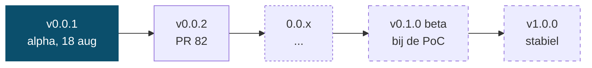
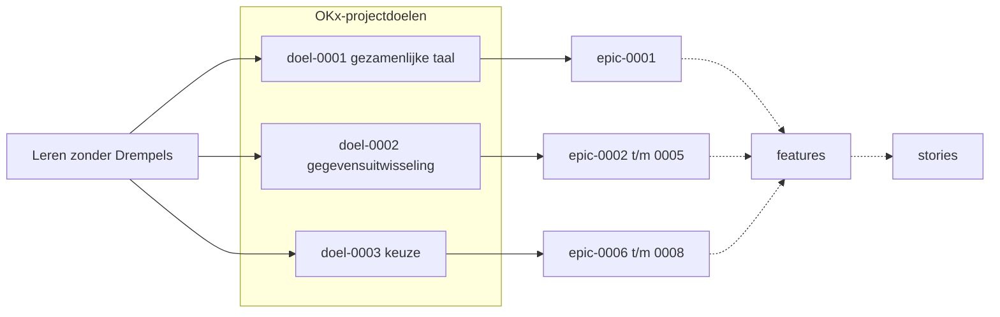
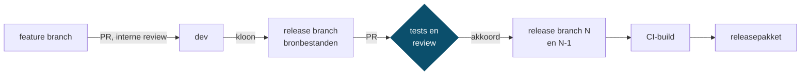

<!-- 1. TITEL -->

  <h1 style="font-size: 3.2rem; line-height: 1.15; margin-bottom: 0.8rem; color: var(--np-ink);">Kerngroep techniek</h1>
  
OKx &middot; Npuls &middot; 1 september 2026

<!--
Kort houden. Doorlopen: stand van zaken, voortgang, branching en release, reviewregels.
-->

---

<!-- 2. STAND VAN ZAKEN -->

# Stand van zaken

**Gesloten sinds 19 augustus: 9**

- Requirementsboom overgeheveld: [#33](https://github.com/Npuls-OKx/Public/issues/33)
- Id-conventie voor eisen: [#37](https://github.com/Npuls-OKx/Public/issues/37), [#38](https://github.com/Npuls-OKx/Public/issues/38)
- Leesroute en verdieping per rij: [#60](https://github.com/Npuls-OKx/Public/issues/60), [#69](https://github.com/Npuls-OKx/Public/issues/69), [#70](https://github.com/Npuls-OKx/Public/issues/70)
- Engelse veldnamen in de schema's: [#8](https://github.com/Npuls-OKx/Public/issues/8)
- LMS-koppelvlakplaat gecorrigeerd: [#48](https://github.com/Npuls-OKx/Public/issues/48), review-opmerking verwerkt: [#28](https://github.com/Npuls-OKx/Public/issues/28)

**Ter review**

- [PR 82](https://github.com/Npuls-OKx/Public/pull/82): release v0.0.2

<!--
We staan op alpha. De doelen zijn nog niet bereikt, we werken ernaartoe. Dat is de toon
van het hele deck. PR 82 is de release-PR waar we straks de demo op doen.
-->

---

<!-- OPDRACHTEN VORIGE SESSIE -->

# Opdrachten vorige sessie

| Opdracht | Stand |
|---|---|
| De architectuurbesluiten doorlezen | Nog geen reacties binnen |
| Het referentiemateriaal doornemen: kaderscenario, persona, principes | Nog geen reacties binnen |
| Structuur en navigeerbaarheid beproeven, bevindingen als issue | Drie issues van buiten het projectteam |

De vraag vandaag: is er tijd voor geweest, en wat is ervoor nodig om dit wel te laten lukken?

<!--
Eerlijk beginnen: de opdrachten van 19 augustus zijn grotendeels blijven liggen. Niet als
verwijt, wel als vraag. Wat helpt: minder materiaal tegelijk, een kortere lijst, of meer tijd?
-->

---

<!-- REFERENTIEMATERIAAL -->

# Waar het materiaal staat

**Om te lezen**

- [Architectuurbesluiten](https://github.com/Npuls-OKx/Public/tree/dev/Referentiemateriaal/adr): 26 besluiten, alle met status voorstel
- [Kaderscenario leerroute 1](https://github.com/Npuls-OKx/Public/tree/dev/Referentiemateriaal/kaderscenario's): de keten van begin tot eind
- [Persona Jochem](https://github.com/Npuls-OKx/Public/tree/dev/Referentiemateriaal/persona's): de student die door dat scenario loopt

**Om op te bouwen**

- [Principes en uitgangspunten](https://github.com/Npuls-OKx/Public/tree/dev/Referentiemateriaal/principes): waarom en hoe
- [Requirementsboom](https://github.com/Npuls-OKx/Public/tree/dev/Referentiemateriaal/requirementsboom): van doel naar eis
- [Koppelvlakspecificaties](https://github.com/Npuls-OKx/Public/tree/dev/Koppelvlakspecificaties): het releasepakket

<!--
Concreet maken wat er te lezen is, zodat de oproep aan het eind niet in het luchtledige
hangt. De besluiten dragen allemaal de status voorstel: commentaar erop is nog van invloed.
-->

---

<!-- 3. OPEN WERK -->

# Open werk

**Vijf milestones met openstaand werk**

| Milestone | Open |
|---|---|
| [Releaseproces en kwaliteit](https://github.com/Npuls-OKx/Public/milestone/4) | 10 |
| [Requirementsboom doorontwikkelen](https://github.com/Npuls-OKx/Public/milestone/3) | 9 |
| [Interactiepatroon-documenten](https://github.com/Npuls-OKx/Public/milestone/5) | 7 |
| [Leerroute-refactor](https://github.com/Npuls-OKx/Public/milestone/1) | 4 |
| [Keuzedelen](https://github.com/Npuls-OKx/Public/milestone/7) | 3 |

**Vermoedelijk werk zonder issue**

- Informatiemodel eerst reviewen, dan de payloads
- Supporttermijn en deprecatie: AP06 belooft het, het releasedocument sluit het uit
- Eigenaarschap en RACI van het releasepakket: het template is er, nooit ingevuld

<!--
Rechts staat wat tussen wal en schip dreigt te vallen: besproken werk dat nooit een
issue kreeg. Vraag de groep of ze er meer zien. De issues onder Informatiestromen
hoofdplaat zijn inmiddels met een highlight opgelost en staan hier niet meer bij; de
harness-issues horen op meta, niet op Public.
-->

---

<!-- 4. OPENSTAANDE ITEMS 19 AUGUSTUS -->

# Voortgang issues vorige meeting

| Item | Vervolgactie |
|---|---|
| [#47](https://github.com/Npuls-OKx/Public/issues/47) versionering tussen koppelingen | Voorstel volgt als pull request |
| [#51](https://github.com/Npuls-OKx/Public/issues/51) releases via pull request | Ingericht, PR 82 loopt deze route |
| [#45](https://github.com/Npuls-OKx/Public/issues/45) klikbare referenties | Deels opgenomen in de requirementsboom |
| [#46](https://github.com/Npuls-OKx/Public/issues/46) tags van releases bewaren | Opgelost via de release branches; issue nog bij te werken |
| [#44](https://github.com/Npuls-OKx/Public/issues/44) werkwijze issuesessie | Nog niet opgepakt |
| Informatiemodel eerst reviewen, dan payloads | **Geen issue, dus niet opgepakt** |

<!--
De laatste regel is het punt van deze slide. Kees en Jos vroegen op conceptueel niveau
over het informatiemodel te sparren voordat we de payloads in gaan. Dat is nooit een
issue geworden en is daardoor blijven liggen. Vraag: wat missen we nog meer?
-->

---

<!-- 4. DIVIDER VOORTGANG -->

  

    
Deel 1

    <h1 style="color: #FFFFFF !important; font-size: 3rem;">Voortgang</h1>
  

---

<!-- 5. REQUIREMENTSBOOM -->

# Requirementsboom

- De structuur staat: van doel via epic en feature naar story, en door naar de eis
- Klikbaar in beide richtingen, deels antwoord op [#45](https://github.com/Npuls-OKx/Public/issues/45)
- Verdieping loopt in milestone [Requirementsboom doorontwikkelen](https://github.com/Npuls-OKx/Public/milestone/3)

<!--
De boom is de koppeling tussen business en techniek, beschreven in ADR 0025 (voorstel).
Negen van de 28 stories reiken nu tot een functionele eis; de rest volgt. De verdieping
zit in de milestone, met onder meer de keuzesemantiek (#64).
-->

---

<!-- CALL TO ACTION BOOM -->

# Loop het wensen- en eisenpakket door

Voordat we gaan bouwen moeten we scherp hebben wat we willen en wat we moeten kunnen.

**Drie vragen, via [PR 82](https://github.com/Npuls-OKx/Public/pull/82)**

- Wat mis je?
- Wat staat er goed?
- Is dit de juiste vorm?

**Hulp bij het doorlopen**

- Een sessie van een uur per leverancier, via Teams
- De wekelijkse inloop op vrijdag

<!--
Dit is de belangrijkste vraag van de sessie. Concreet: welke epics, features, stories en
functionele eisen mis je voor jouw koppeling, en klopt de vorm waarin ze staan. Ruud
plant de individuele sessies; drempel bewust laag.
-->

---

<!-- 7. DIVIDER RELEASE -->

  

    
Deel 2

    <h1 style="color: #FFFFFF !important; font-size: 3rem;">Branching en release</h1>
  

---

<!-- BRANCHMODEL -->

  <h1 style="font-size: 1.9rem; margin: 0;">Branchmodel</h1>
  Voorstel, Public PR 81

  

<!--
Toelichting door Garik. De huidige en de vorige majorversie blijven allebei bestaan,
als branch en als pakket.
-->

---

<!-- 9. RELEASEPROCES -->

# Van bron naar releasepakket

- Feature branch met pull request naar dev: de interne review
- Dev wordt gekloond naar een release branch, met alle bronbestanden erin
- Vanaf die release branch een pull request ter review voor de kerngroep techniek
- Na akkoord landen de bronbestanden op release branch N; de vorige blijft als N-1 staan
- Daarna start de CI de build; de bronbestanden blijven refereerbaar ([#46](https://github.com/Npuls-OKx/Public/issues/46))
- De build levert ook het volledige document als markdown, zodat twee versies naast elkaar te leggen zijn

<!--
Twee reviewmomenten: intern op de feature branch, extern op de release branch. De kloon
zorgt dat doorlopend werk op dev de release niet verschuift, en houdt de bronbestanden
bij de release zodat je er later naar kunt verwijzen.
-->

---

<!-- 9. WAT IS EEN PULL REQUEST -->

# Wat is een pull request

- Een voorstel tot wijziging, met de aanleiding erbij
- Regel voor regel te bekijken en van commentaar te voorzien
- Automatische controles draaien mee en moeten slagen
- Pas na goedkeuring gaat de wijziging erin

<!--
Voor wie GitHub niet dagelijks gebruikt. Dit is de aanloop naar de demo en naar de
vraag daarna: wanneer is een pull request gedragen door de kerngroep techniek.
-->

---

<!-- 11. DIVIDER DEMO -->

  

    
Demo

    <h1 style="color: #FFFFFF !important; font-size: 2.6rem;">Reviewen via een pull request</h1>
  

---

<!-- 12. RESUME DEMO -->

# Reviewen in vier stappen

1Opgemaakte weergave van de wijziging

2Commentaar per regel

3Review indienen

4Automatische controles: werken de verwijzingen nog

De controles groeien mee: verwijzingen, diagrammen tegen de schema's, navigeerbaarheid van de boom.

<!--
Live in GitHub op PR 82, de release van v0.0.2. Doel: de groep weet na afloop waar de
review plaatsvindt en waar te klikken. Bij de controles: dit is geen afvinklijst maar
een groeiend vangnet. Suggesties voor nieuwe controles zijn welkom als issue.
-->

---

<!-- 11. REVIEWREGELS -->

# Afspraken bij een pull request-review

Status: concept

| | Voorzet |
|---|---|
| **Goedkeuringen** | Minimaal een per leverancier die de koppeling bouwt, plus een vanuit de sector |
| **Tester** | Automatische controles, aangevuld met een mens die de testgevallen naloopt |
| **Reviewer** | Een ander persoon dan de tester, beoordeelt de inhoud |
| **Termijn** | Twee weken, tot de volgende sessie |
| **Nooit** | Een review door de maker van de wijziging |

<dl class="np-besluit" style="margin-top: 0.9rem;">
  <dt>Besluit nodig op</dt><dd>zijn we het eens met dit concept?</dd>
</dl>

<!--
Voorzet, bewust concreet zodat er iets ligt om op te reageren. Open vraag in de zaal:
is een goedkeuring per bouwende leverancier haalbaar, en wie vertegenwoordigt de sector?
-->

---

<!-- 12. OPENSTAANDE PUNTEN -->

# Openstaande punten

| | Vervolgactie |
|---|---|
| **Versionering per koppeling** ([#47](https://github.com/Npuls-OKx/Public/issues/47)) | Voorstel eerst intern in het kernteam, daarna als PR hierheen |
| **Meerdere instanties van een referentiecomponent** ([meta #80](https://github.com/Npuls-OKx/meta/issues/80)) | Uitwerken, nog geen uitspraak |
| **Keuzes en regelsets** ([#74](https://github.com/Npuls-OKx/Public/issues/74)) | Keuzeregel-typologie toetsen aan echte scenario's |
| **Informatiemodel voor payloads** | Issue aanmaken, dan agenderen |

<dl class="np-besluit" style="margin-top: 1rem;">
  <dt>Input gevraagd</dt><dd>waar ligt de prioriteit, en welke issues missen we nog</dd>
</dl>

<!--
Alleen echte openstaande punten. Voorstel voor de route: eerst interne review in het
kernteam OKx, en pas als dat staat een pull request hierheen. Vraag de groep expliciet
of er nog meer werk is dat wel besproken is maar nooit een issue werd.
-->

---

<!-- 13. GEVRAAGD -->

# Gevraagd

<dl class="np-besluit review" style="margin-top: 1rem;">
  <dt>Review</dt><dd>de requirementsboom in PR 82: welke epics, features, stories en functionele eisen mis jij? Tot de volgende sessie</dd>
</dl>

<dl class="np-besluit" style="margin-top: 0.8rem;">
  <dt>Besluit</dt><dd>de afspraken voor een pull request-review, en de prioritering van de openstaande punten</dd>
</dl>

<dl class="np-besluit kennisname" style="margin-top: 0.8rem;">
  <dt>Input</dt><dd>welke issues missen we nog</dd>
</dl>

<dl class="np-besluit kennisname" style="margin-top: 0.8rem;">
  <dt>Lezen</dt><dd>de architectuurbesluiten en de kaderscenario's; alle besluiten staan op voorstel, dus commentaar telt nog</dd>
</dl>

<!--
Alleen PR 82 gaat naar deze groep ter review. De andere pull requests lopen intern.
-->

---

<!-- 14. VERVOLG -->

# Vervolg

Volgende sessie:

- Versioneringsvoorstel als pull request
- Uitkomst van de review op v0.0.2
- De issues die vandaag ontbraken

Over drie maanden: start bouw op een eerste betaversie van de koppelvlakken OC naar SIS, OC naar P&amp;R en OC naar LMS. Commentaar op een release: in de pull request. Nieuw punt: als issue op <strong>github.com/Npuls-OKx/Public</strong>

<!--
Onderscheid benoemen: commentaar op een lopende release hoort in de pull request,
een nieuw onderwerp wordt een issue.
-->

---

<!-- PEILING -->

# Hoe gaat het?

- Welk cijfer geef je de voortgang, en waarom?
- Wat ging er goed?
- Wat kan er beter?

  

    
1

    
2

    
3

    
4

    
5

    
6

    
7

    
8

    
9

    
10

  

  

    loopt nietloopt goed
  

<!--
Vaste afsluiting van elke sessie. Vandaag mondeling; de peiling via QR-code staat als
issue op meta. Het cijfer maakt de lijn over sessies zichtbaar, de twee open vragen
leveren de inhoud.
-->

---

<!-- AFSLUITER -->

<!--
Einde. Npuls-afsluiter met logo en licentie.
-->
