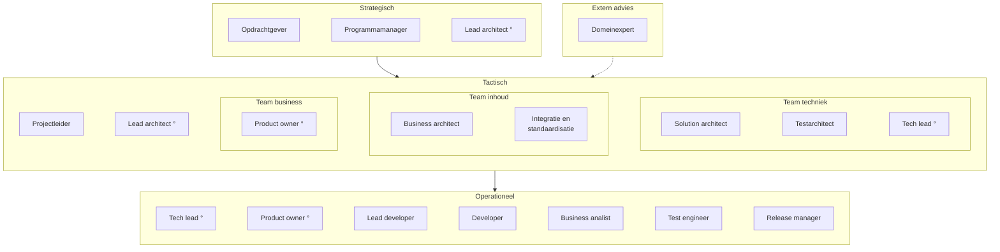
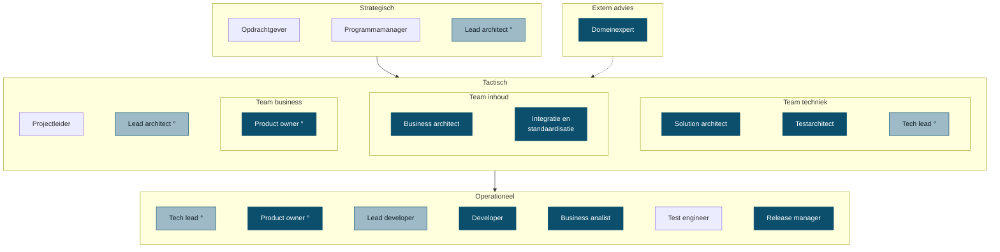

<!-- 1. TITEL -->

  <h1 style="font-size: 3rem; line-height: 1.15; margin-bottom: 0.6rem; color: var(--np-ink);">Rollen</h1>
  
Wat er bij een persoon ligt, en wat dat betekent

  
OKx &middot; september 2026

<!--
Los gesprek, geen besluitstuk. Doel: samen kijken hoe de rollen nu verdeeld zijn
en wat daarvan houdbaar is.
-->

---

<!-- 2. ORGANOGRAM -->

# Rollen in een IT-project

Normaal worden deze rollen door verschillende mensen ingevuld. De ring markeert een rol op twee niveaus.

De drie lagen volgen <a href="https://www.prince2.com/usa/blog/understanding-the-prince2-approach-to-organisation">PRINCE2</a> (directing, managing, delivering) en <a href="https://scaledagileframework.com/safe/">SAFe</a> (portfolio, program, team). De adviesrol buiten de lijn volgt de architecture board uit <a href="https://pubs.opengroup.org/togaf-standard/ea-capability-and-governance/chap04.html">TOGAF</a>.

<!--
Drie lagen, met subteams op de tactische laag en een adviesrol ernaast. De
onderbouwing staat op de volgende slide.
-->

---

<!-- 3. ONDERBOUWING -->

# Waar dit beeld op steunt

| Framework | Wat het zegt | Wat wij ervan overnemen |
|---|---|---|
| PRINCE2 | Drie niveaus: directing, managing en delivering, met project board, projectmanager en teammanager | De drie lagen zelf, en dat elk niveau eigen besluiten neemt |
| SAFe | Portfolio, program en team, met een enterprise architect op portfolio en een system architect op de trein | Dat de architectrol op twee niveaus voorkomt, en dat het team-niveau een eigen product owner heeft |
| TOGAF | Een architecture board als adviesorgaan buiten de lijn, dat richting geeft en conflicten beslecht | De domeinexpert als extern advies in plaats van als teamlid |
| ITIL 4 | Servicemanagement, geen projectorganisatie; kiest bewust voor flexibiliteit boven een vaste rolhierarchie | Geen organogram, wel de scheiding tussen richten, inrichten en verrichten |

<!--
ITIL geeft bewust geen projectorganogram; dat is servicemanagement. PRINCE2 en
SAFe doen dat wel, en die twee zijn het eens over drie lagen. De dubbele
architectrol komt letterlijk uit SAFe: enterprise architect op portfolio,
system architect op de trein.
-->

---

<!-- 3. VERANTWOORDELIJKHEDEN, STRATEGISCH EN TACTISCH -->

# Waar elke rol over gaat: richten

| Laag | Rol | Verantwoordelijk voor |
|---|---|---|
| Strategisch | Opdrachtgever | Doel, geld en scope; hakt de knopen door |
| Strategisch | Programmamanager | Samenhang tussen projecten, en voortgang naar de opdrachtgever |
| Strategisch | Lead architect | De architectuurlijn, over de teams heen |
| Extern advies | Domeinexpert | Vakinhoudelijk oordeel, ingeroepen als adviseur en niet in de lijn |
| Tactisch | Projectleider | Planning, capaciteit en voortgang |
| Team business | Product owner | Wat er gemaakt wordt en in welke volgorde |
| Team inhoud | Business architect | Hoe het werkveld in elkaar zit en wat het nodig heeft |
| Team inhoud | Integratie en standaardisatie | De aansluiting op bestaande standaarden en afsprakenstelsels |

<!--
Kort langslopen, niet voorlezen. Het gaat om het beeld dat dit los werk is dat
normaal bij verschillende mensen ligt.
-->

---

<!-- 4. VERANTWOORDELIJKHEDEN, OPERATIONEEL -->

# Waar elke rol over gaat: bouwen

| Laag | Rol | Verantwoordelijk voor |
|---|---|---|
| Team techniek | Solution architect | De vertaling naar afspraken tussen systemen |
| Team techniek | Testarchitect | Hoe je vaststelt dat het klopt |
| Team techniek | Tech lead | De technische lijn en de keuzes in de bouw |
| Operationeel | Lead developer | Gaat voor in de bouw en bewaakt de kwaliteit van het werk |
| Operationeel | Developer | Bouwen en onderhouden wat er geleverd wordt |
| Operationeel | Business analist | Behoeften uitwerken tot toetsbare eisen |
| Operationeel | Test engineer | De toetsen uitvoeren en bevindingen terugkoppelen |
| Operationeel | Release manager | Versies, en wat er wanneer naar buiten gaat |
| Operationeel | Product owner | Prioriteert binnen de uitvoering en accepteert het resultaat |

<!--
Lead developer en test engineer zijn bij OKx niet belegd. Dat is een ander soort
punt dan overbelasting: dat zijn gaten.
-->

---

<!-- WAT BIJ MIJ LIGT -->

# Bij OKx liggen ze bij mij

Donker is volledig, lichter is gedeeltelijk. De hele tactische laag op de projectleider na.

<!--
Gedeeltelijk bij lead architect, tech lead en lead developer: ik stuur
inhoudelijk en begeleid dagelijks, zonder dat het formeel belegd is. Wat niet
bij mij ligt: opdrachtgever, programmamanager, projectleider en test engineer.
-->

---

<!-- 4. OPGELEVERD, RICHTING -->

# Wat ik daarin heb opgeleverd

| Rol | Opgeleverd |
|---|---|
| Solution architect | De technische afspraken waarmee roostersystemen, leeromgevingen en studentadministraties gegevens uitwisselen, plus de onderbouwde keuze voor de landelijke standaard |
| Business architect | Het overzicht van hoe informatie door een instelling stroomt, en het vijflaags model waarmee scholen hun onderwijs beschrijven. Dit lag er niet |
| Product owner | De vertaling van programmadoel naar concrete eisen, in vier lagen, ter vervanging van het eerdere afbakeningsdocument. Inclusief prioritering en scope |
| Business analist | Studentreizen en leerroutes die laten zien hoe flexibel onderwijs er in de praktijk uitziet, vertaald naar tientallen functionele eisen |
| Beginnend leidinggevende | Profiel voor de tweede architectrol opgesteld, meebeslist over de kandidaat, en die collega ingewerkt en dagelijks begeleid |

<!--
Bij business architect: het vijflaags model was nodig om uberhaupt iets te
kunnen bouwen. Bij product owner: dit verving het afbakeningsdocument.
-->

---

<!-- 5. OPGELEVERD, REALISATIE -->

# Wat ik daarin heb opgeleverd

| Rol | Opgeleverd |
|---|---|
| Developer en engineer | De hele productiestraat: een openbare kennisbank die zichzelf op fouten controleert, documenten en presentaties genereert, en waar AI mee kan werken |
| Release manager | Versiebeheer en een releaseproces waarin elke wijziging herleidbaar is naar wie hem maakte en waarom. Twee releases uitgeleverd aan scholen en leveranciers |
| Integratie- en standaardisatiespecialist | Het gezamenlijke begrippenkader voor de sector, en de analyse hoe de landelijke onderwijsstandaard en het afsprakenstelsel zich tot elkaar verhouden |
| Testarchitect | De aanpak waarmee we onafhankelijk kunnen vaststellen of leveranciers zich aan de afspraken houden, in plaats van dat zij hun eigen werk beoordelen |
| Kennishouder | Aanspreekpunt voor de sector op standaarden en gegevensuitwisseling. Binnen Arlande workshops over AI-ondersteund werken en het experiment rond AI-personalisatie |

<!--
De productiestraat is de belangrijkste reden dat we sneller leveren dan
vergelijkbare trajecten. In te zien via de publieke omgeving en de werkomgeving.
-->

---

<!-- 6. HOE HET ZO GEKOMEN IS -->

  

    Een deel hiervan hoort aan het begin van een programma belegd te zijn bij analisten en beleidsmakers.
  

  

    Die kaders ontbraken, terwijl de bouwfase wel moest doorgaan. Ik heb dat opgepakt om de voortgang niet te blokkeren.
  

<!--
Dit is de kern van het gesprek. Niet: er is te veel gebeurd. Wel: dit is
vooraan blijven liggen en achteraan opgevangen, en dat is niet houdbaar.
-->

---

<!-- 7. DE CIJFERS -->

# Waar dat op neerkomt

| Afgelopen vier weken | Ik | Anderen |
|---|---|---|
| Issues op de werkomgeving | 39 | 2 |
| Pull requests op de werkomgeving | 27 | 0 |
| Issues op de publieke omgeving | 39 | 18 |
| Pull requests op de publieke omgeving | 15 | 7 |

- Intern komt vrijwel alles uit een hand
- Publiek begint het te lopen, vooral sinds de sessie van 1 september
- Het grootste deel van mijn eigen werk ging naar de werkwijze, niet naar de specificatie

<!--
Uit GitHub, 6 augustus tot 3 september. Vijftien van mijn interne issues gingen
over de productiestraat: investeren in hoe we werken, niet in wat we opleveren.
-->

---

<!-- 8. WAT IK ERVAN VIND -->

# Wat ik ervan vind

<strong style="color: #2e8b57;">Dit doe ik graag</strong>

- Structuur aanbrengen waar het nog vormloos is
- Inhoudelijk sparren met architecten en leveranciers
- De werkwijze zo bouwen dat werk herhaalbaar wordt

<strong style="color: #b3542f;">Dit kost me energie</strong>

- Het enige kanaal zijn waardoor werk binnenkomt
- Bewaken of anderen hun deel oppakken
- Opmaak en redactie van eindproducten

<strong>Hier wil ik mee stoppen</strong>: product owner zijn naast architect; de backlog voor iedereen vullen; presentaties zelf opmaken.

<!--
Deze drie lijstjes zijn een voorzet en moeten van mij zijn, niet van het deck.
Streep door wat niet klopt voordat dit het gesprek in gaat.
-->

---

<!-- 9. DE VRAAG -->

# Hoe pakken we dit op

- Welke rollen horen echt bij de sectorarchitect, en welke niet?
- Wie wordt product owner, en met welk mandaat?
- Wat is er nodig om werk ook van anderen te laten komen?
- Wat laten we los als er niemand voor is?

De laatste is de eerlijkste: rollen verdelen zonder mensen erbij is werk verplaatsen.

<!--
Open eindigen. Dit is een gesprek, geen voorstel dat ik erdoor wil hebben.
-->
