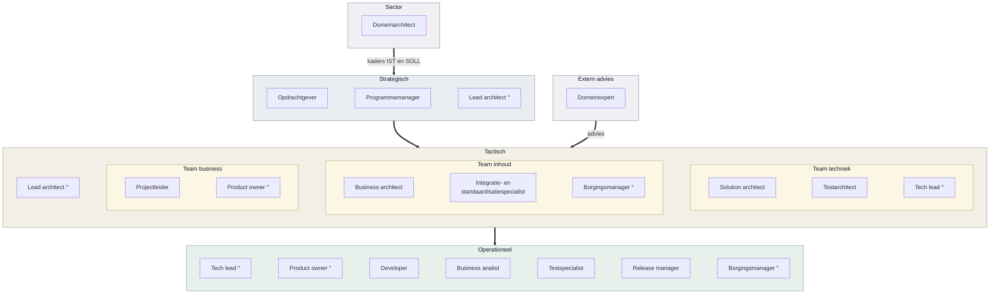
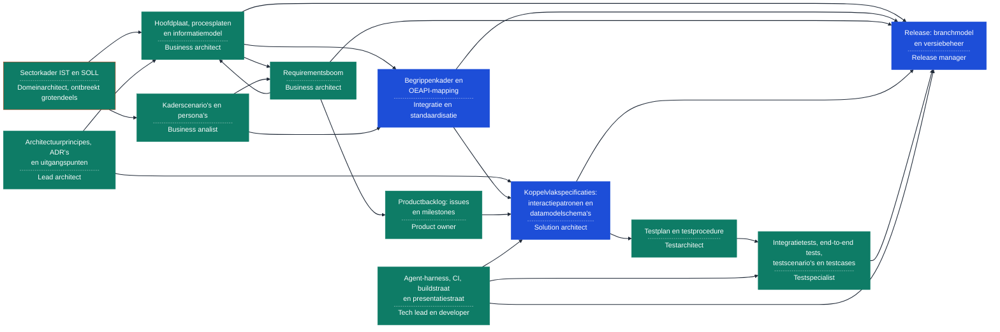
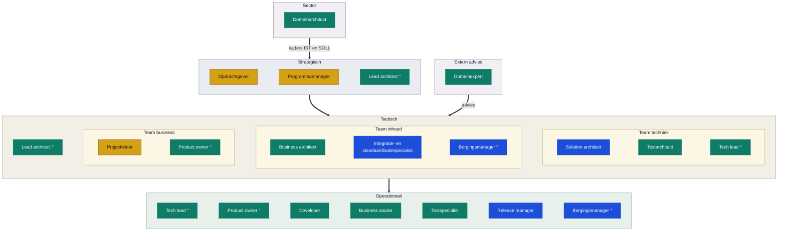
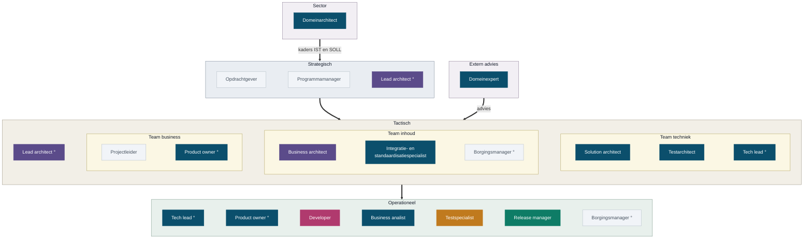
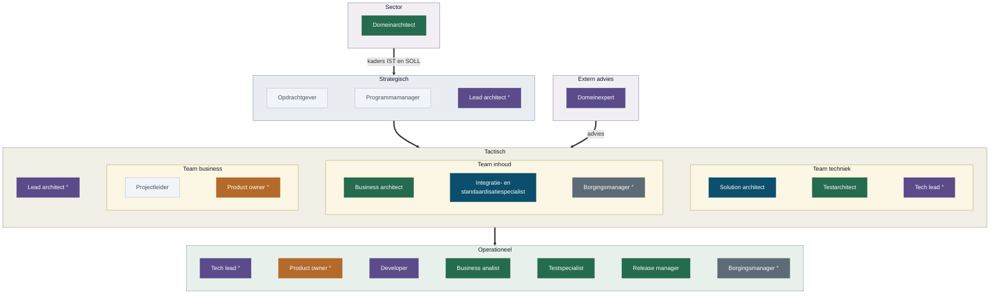

<!-- 1. TITEL -->

  <h1 style="font-size: 2.6rem; line-height: 1.15; margin-bottom: 0.7rem; color: var(--np-ink);">Rollen, producten en verantwoordelijkheden binnen OKx</h1>
  
Hulpvraag: hoe houden we focus?

  
Niek Derksen &middot; OKx &middot; 3-9-2026

<!--
Los gesprek, geen besluitstuk. Eerst de vraag, dan de onderbouwing.
-->

---

<!-- 2. WAAR HET OM GAAT -->

# Waar het om gaat

  

    
1

    
<strong style="color: #fff;">Mijn vraag</strong>: spreek me aan als ik te ver ga, en help me overtollige verantwoordelijkheden in het team te beleggen.

  

  
&#9660;

  

    
2

    
Wanneer ga ik te ver? Wanneer pak ik rollen, taken en producten op die niet binnen mijn verantwoordelijkheden vallen?

  

  
&#9660;

  

    
3

    
Wat zijn de rollen, verantwoordelijkheden en producten binnen OKx?

  

<!--
Hiermee openen, niet eindigen. Niels: dit is de opening, en niet vijf keer
herhalen. De twee vragen zijn de brug naar de rest van het deck; dat is de
onderbouwing, niet het doel.
-->

---

<!-- 3. WAT BIJ MIJ PAST -->

# Wat bij mij past, en wat niet

<strong style="color: #0B4F6C;">Geeft energie, past bij mijn profiel</strong>

- Lijnen leggen en verbanden zichtbaar maken, en mensen daarin meenemen
- Visie vertalen naar concrete deelproducten en werkpakketten, met oog voor onderlinge afhankelijkheden en risico's
- Sparren met architecten, leveranciers en instellingen, en de samenhang bewaken
- Omgaan met inhoudelijke weerstand
- De solution bouwen: van eis naar koppelvlak naar werkende afspraak

<strong style="color: #A8481F;">Kost energie, hoort bij een ander</strong>

- Het vangnet zijn voor werk dat blijft liggen
- Eindverantwoordelijk zijn voor elk eindproduct en elke pull request
- Kaderstelling en het businessvraagstuk zelf inkleuren: wat willen we nu eigenlijk? Vertel mij wat je wil, dan verdiep en realiseer ik het
- Mensen aansturen
- Business analyse: dat is een vak apart, ik pretendeer geen analist te zijn

Ik doe nu beide kolommen. Links maak ik verschil, rechts houd ik alleen gaten dicht.

<!--
De onderbouwing onder slide 2. Niet: kijk eens wat ik allemaal doe. Wel: dit is
waar ik op wil focussen en dit hoort ergens anders.
-->

---

<!-- 4. ROLLEN IN DE CONTEXT VAN OKX -->

# Rollen in de context van OKx

Vanuit mijn perspectief, afgestemd met Niels

De teams overlappen: de business architect werkt in inhoud en business, de product owner in business en techniek, de borgingsmanager in inhoud, business en operationeel. Een rol is geen persoon: iemand kan meerdere rollen vervullen, en een rol kan ook door een agent worden ingevuld.

De lagen volgen <a href="https://www.prince2.com/usa/blog/understanding-the-prince2-approach-to-organisation">PRINCE2</a> en <a href="https://scaledagileframework.com/safe/">SAFe</a>; de adviesrol buiten de lijn de architecture board uit <a href="https://pubs.opengroup.org/togaf-standard/ea-capability-and-governance/chap04.html">TOGAF</a>.

<!--
De ring markeert een rol die op meerdere plekken zit. Mermaid kan geen
overlappende kaders tekenen, dus de overlap staat in woorden onder de plaat.
-->

---

<!-- 5. ROL EN PRODUCT, RICHTEN -->

# Welk product hangt onder welke rol

| Rol | Wat de rol is | Voorbeeld OKx-product |
|---|---|---|
| Solution architect | Eindverantwoordelijk en meewerkend voorman voor de totale inhoudelijke oplossing: de koppelvlakspecificaties en alle onderliggende componenten om die volgens de eisen van de opdracht te realiseren | Koppelvlakspecificatie OC naar SIS |
| Business architect | Concretisering van de wensen en eisen van opdracht en stakeholders naar functionele eisen en capabilities, via architectuurproducten; managet de requirementsboom | Requirementsboom, informatiestromen-hoofdplaat, procesplaat, informatiemodel |
| Domeinarchitect | Kaderstelling vanuit de sector: het IST- en SOLL-beeld waarbinnen de oplossing moet passen | Sectorkader IST en SOLL |
| Product owner | Managet de productbacklog: van features en stories naar issues en milestones, en bewaakt scope en volgorde | Productbacklog: issues en milestones |
| Business analist | Werkt behoeften uit tot toetsbare eisen, per leerroute en per persona | Kaderscenario, persona, functionele eis |
| Lead architect | Eindverantwoordelijk voor de architectuurprincipes en de architectuurproducten, en voor de architectuurlijn over de lagen heen | Architectuurprincipe, ADR, uitgangspunt |

<!--
Dit maakt de zwaarte concreet: niet hoeveel rollen, maar welk product er per rol
onder hangt. Zonder deze twee slides is het een lijstje functietitels.
-->

---

<!-- 6. ROL EN PRODUCT, BOUWEN -->

# Welk product hangt onder welke rol

| Rol | Wat de rol is | Voorbeeld OKx-product |
|---|---|---|
| Tech lead | Leiding aan het developmentteam, mensen begeleiden en ontwikkelen, en de technische lijn op operationeel niveau uitzetten: werkafspraken en toolkeuze | Agent-harness, werkafspraken, CI-controles |
| Developer | Bouwt en onderhoudt de softwareoplossingen waarmee het team zijn producten realiseert | CI/CD, unittestscripts, controles op bronbestanden, buildstraat, presentatiegeneratie |
| Release manager | Bepaalt wat wanneer naar buiten gaat en beheert versies en branchmodel | Release v0.0.2, branchmodel |
| Integratie- en standaardisatiespecialist | Houdt de oplossing verbonden met bestaande standaarden en afsprakenstelsels | Begrippenkader met ankertabel, OEAPI-mapping |
| Testarchitect | Bepaalt hoe onafhankelijk wordt vastgesteld dat een implementatie de specificatie volgt | Testplan en testprocedure |
| Domeinexpert | Aanspreekpunt voor de sector op standaarden en gegevensuitwisseling | Sessie, presentatie, kennisoverdracht |

<!--
De agent-harness is de belangrijkste reden dat we sneller leveren dan
vergelijkbare trajecten. In te zien via de publieke omgeving en de werkomgeving.
-->

---

<!-- 7. PRODUCTBOOM -->

# Hoe de producten samenhangen

Blauw is direct gevraagd door stakeholders, groen is impliciet nodig om dat waar te maken; de pijlen zijn afhankelijkheden

Het sectorkader ontbreekt grotendeels. Alles rechts daarvan staat op aannames die we samen invullen. De release raakt vrijwel alles: model, boom, begrippen, specificatie en toetsen.

<!--
Hiermee wordt de zwaarte concreet: een rol zonder invulling laat niet een
product leeg, maar alles wat daarachter hangt.
-->

---

<!-- 8. WAT RAAKT OKX -->

# Wat raakt OKx

De directe vraag van stakeholders gaat over producten

<strong style="color: #1D4ED8;">Gevraagd door leveranciers en de architectuurboard</strong>

Het begrippenkader met de OEAPI-mapping en de koppelvlakspecificaties zelf &middot; publiek en vindbaar &middot; versioneerbaar op meerdere dimensies &middot; herleidbaar, ook waarom een keuze zo gemaakt is &middot; beheerbaar na het einde van Npuls &middot; en dat voor bijna het hele primaire proces van een instelling

<strong style="color: #0E7C66;">Impliciet nodig vanuit de oplossing om het blauwe waar te maken</strong>

De kaders, platen, boom en backlog die daaronder liggen &middot; machinaal controleerbaar: bij deze omvang, dit team en deze expertise is digitaliseren, automatiseren en integreren de enige manier om strategie, tactiek en operationele producten naar elkaar te laten verwijzen &middot; onafhankelijk toetsbaar, straks het werk van de testers

Goud volgt niet uit deze eisen, maar draagt wel het hele programma: opdrachtgever, programmamanager en projectleider.

<!--
De kleur draagt de boodschap: blauw is wat van buiten gevraagd wordt, groen is
wat ik erbij heb gezet om dat met dit team haalbaar te houden.
-->

---

<!-- 9. VERANTWOORDELIJKHEDEN, RICHTEN -->

# Waar elke rol over gaat: richten

De vraag naar rollen volgt daar indirect uit

| Laag | Rol | Verantwoordelijk voor | Product in de repo |
|---|---|---|---|
| Strategisch | Opdrachtgever | Doel, geld en scope | Scopebesluiten en milestones |
| Strategisch | Programmamanager | Samenhang en voortgang | Voortgang richting opdrachtgever |
| Strategisch | Lead architect | Architectuurprincipes en de lijn over de lagen heen | Architectuurprincipes, ADR's, uitgangspunten |
| Sector | Domeinarchitect | Kaderstelling IST en SOLL voor de sector | Sectorkader; ontbreekt nu |
| Extern advies | Domeinexpert | Vakinhoudelijk oordeel, buiten de lijn | Reviewcommentaar en sessies |
| Team business | Projectleider | Planning, capaciteit en voortgang | Milestones en issueplanning |
| Team business | Product owner | Wat er gemaakt wordt en in welke volgorde | Productbacklog: issues en milestones |
| Team inhoud | Business architect | Hoe het werkveld in elkaar zit | Requirementsboom, hoofdplaat, procesplaten |
| Team inhoud | Integratie- en standaardisatiespecialist | Aansluiting op standaarden en afsprakenstelsels | Begrippenkader en OEAPI-mapping |

<!--
Kort langslopen, niet voorlezen. De product owner is breder dan een regel: die
werkt nauw samen met projectleider, lead architect en de analisten.
-->

---

<!-- 10. VERANTWOORDELIJKHEDEN, BOUWEN -->

# Waar elke rol over gaat: bouwen

| Laag | Rol | Verantwoordelijk voor | Product in de repo |
|---|---|---|---|
| Team techniek | Solution architect | De vertaling naar afspraken tussen systemen | Koppelvlakspecificaties en datamodelschema's |
| Team techniek | Testarchitect | Hoe je vaststelt dat het gebouwde klopt | Testplan, testprocedure en acceptatiecriteria |
| Team techniek | Tech lead | De technische lijn op operationeel niveau, plus leiding aan het developmentteam: begeleiden, ontwikkelen, werkafspraken en toolkeuze | Agent-harness, werkafspraken, CI-controles |
| Operationeel | Developer | De software waarmee het team zijn producten maakt | CI/CD, controlescripts, buildstraat |
| Operationeel | Business analist | Behoeften uitwerken tot toetsbare eisen | Kaderscenario's, persona's, stories |
| Operationeel | Testspecialist | Testscenario's en testcases maken en uitvoeren | Integratietests en end-to-end tests |
| Operationeel | Release manager | Wat er wanneer naar buiten gaat | Releases, branchmodel, versiebeheer |
| Operationeel | Borgingsmanager | Hoe de oplossing landt en in beheer komt | Overdrachts- en beheerafspraken |

<!--
Lead developer is bij OKx geen eigen rol; die valt onder de solution architect.
Testarchitect is bij een specificatietraject cruciaal: die stelt vast of wat er
gebouwd wordt overeenkomt met wat we hebben afgesproken.
-->

---

<!-- 11. ZWAARTE EN COMBINATIES -->

# Omvang van de rollen

Fulltime
&nbsp;&nbsp;Vaak gecombineerd
&nbsp;&nbsp;Deeltijd of buiten de lijn

| Vaak in een persoon | Waarom dat werkt |
|---|---|
| Developer en business analist | Wie de eis uitwerkt, bouwt hem vaak ook |
| Testspecialist en business analist | Wie de eis schrijft, weet wat je moet toetsen |
| Tech lead en release manager | Releasen is een technische handeling; ligt al bij Garik |

<strong style="color: #A8481F;">Nooit in een persoon</strong>: developer en testspecialist. Wie bouwt, beoordeelt zijn eigen werk niet.

Product owner, business architect, solution architect en domeinarchitect zijn elk een baan op zich. Die vier liggen nu bij mij.

<!--
Mijn inschatting voor dit project, geen norm. Integratie en standaardisatie loopt
in de praktijk samen met business architectuur. Lead architect is nu niet belegd;
Niels ziet die rol eerder als een klein bordje naast de product owner.
-->

---

<!-- 12. HUIDIGE VERDELING -->

# Hoe het nu verdeeld is

   Doe ik zelf
   Deel ik met Niels
   Deel ik met Garik
   Deel ik met Garik en agents
   Doe ik met agents
   Pak ik niet op

Het testspecialisme draait grotendeels op agents en de developer deel ik met Garik en agents; dat is de reden dat dit tempo haalbaar was. Release management deel ik met Garik, de architectuurlijn met Niels.

<!--
Dit is de stand van vandaag, niet het voorstel. De volgende plaat laat zien waar
het naartoe moet.
-->

---

<!-- 13. WAT BIJ MIJ LIGT -->

# Waar ik naartoe wil

   Wil ik eventueel houden, met mandaat
   Blijft bij mij
   Deel ik
   Draag ik over
   Niet belegd
   Ligt bij een ander

<strong style="color: #5B4B8A;">Deel ik</strong>: tech lead met Garik, lead architect met Niels, developer met Garik en agents, domeinexpert met Garik en Niels. <strong style="color: #256B4E;">Draag ik over</strong>: business architectuur naar Niels, testspecialisme naar Werner, domeinarchitectuur naar de sector. Product owner wil ik eventueel houden, maar alleen met mandaat; die rol en lead architect worden groter zodra de architectuurboard ons gaat doorzagen.

<!--
De verdeling is mijn voorstel, geen vaststelling. Product owner houd ik, maar
alleen met mandaat en ruimte elders. Tech lead en developer bouw ik af.
Business architectuur, analyse, testarchitectuur en release draag ik over.
Test engineer en borging zijn niet belegd.
-->

---

<!-- 14. WAT ER VERANDERT -->

# Wat er verandert

Het verschil tussen de vorige twee platen

8 naar 3

rollen die ik alleen draag

4

rollen die ik ga delen

6

rollen die ik overdraag

| Rol | Product | Nu | Waar ik naartoe wil |
|---|---|---|---|
| Product owner | Productbacklog: issues en milestones | Doe ik zelf | Wil ik eventueel houden, met mandaat |
| Tech lead | Agent-harness, werkafspraken, CI | Doe ik zelf | Deel ik |
| Domeinexpert | Sessies en kennisoverdracht | Doe ik zelf | Deel ik |
| Business analist | Kaderscenario's en persona's | Doe ik zelf | Draag ik over |
| Testarchitect | Testplan en testprocedure | Doe ik zelf | Draag ik over |
| Domeinarchitect | Sectorkader IST en SOLL | Doe ik zelf | Draag ik over aan de sector |
| Business architect | Requirementsboom, hoofdplaat, informatiemodel | Deel ik | Draag ik over aan Niels |
| Release manager | Releases, branchmodel, versiebeheer | Deel ik | Draag ik over aan Garik |
| Testspecialist | Integratietests en testcases | Doe ik met agents | Draag ik over aan Werner |

Ongewijzigd: solution architect en integratie en standaardisatie blijven bij mij, lead architect en developer blijf ik delen. Borging is nog steeds niet belegd. Met wie ik deel is nog een open vraag.

<!--
Dit is de hele vraag in een plaatje: acht rollen die nu alleen bij mij liggen
worden er twee. Zes gaan weg, vijf blijf ik delen. Borging blijft open staan.
-->

---

<!-- 15. DE CIJFERS -->

# Overzicht van het verzette werk

| Sinds de start | Werkomgeving | Publieke omgeving |
|---|---|---|
| Issues van mij | 124 van 142 (87%) | 40 van 59 (68%) |
| Pull requests van mij | 51 van 58 (88%) | 21 van 30 (70%) |
| Commits van mij | 345 van 438 (79%) | 67 van 102 (66%) |

Werkomgeving vanaf 4 februari 2026, publieke omgeving vanaf 27 juli 2026. Peildatum 3 september 2026.

<strong style="color: #256B4E;">De trend sinds 1 september</strong>

Tot en met 31 augustus kwamen 40 van de 53 issues in de publieke omgeving van mij. Van de zes issues daarna: geen enkele. Alle zes komen van buiten het kernteam.

<strong style="color: #0B4F6C;">Waar dat werk in zit</strong>

- Drie koppelvlakspecificaties, met interactiepatronen en 25 datamodelschema's
- 28 architectuurbesluiten en de uitgangspunten
- De requirementsboom in vijf documenten
- Het ArchiMate-model: 89 views, 1708 elementen
- Twee uitgeleverde releases, v0.0.1 en v0.0.2
- De agent-harness en de controles die dit tempo mogelijk maken

<!--
De percentages zijn geen prestatielijst maar een signaal: dit is niet houdbaar
en het is niet overdraagbaar zolang het uit een koker komt. De trend sinds
1 september is het goede nieuws: de publieke omgeving begint te lopen op input
van anderen.
-->

---

<!-- 16. HOE LOSSEN WE DIT OP -->

# Hoe lossen we dit op?

Dit is mijn beeld. Ik ben benieuwd naar het jouwe

- Wie kan de product owner-rol dragen? En als ik hem houd, welk mandaat hoort daarbij?
- Waar beleggen we business architectuur en analyse?
- Met wie deel ik de rollen, producten en verantwoordelijkheden?
- Waar halen we de kaderstelling vanuit de sector vandaan?
- Wat doen we met testarchitectuur, release en borging: beleggen, of bewust laten liggen?
- Wie spreekt mij aan als ik werk weer naar me toe trek?

Ik heb hier geen kant-en-klaar antwoord op. Wat zou jij als eerste oppakken?

<!--
Sparren, geen besluitstuk. Eerst met Ruud doorlopen, daarna in het teamoverleg.
De laatste vraag is de belangrijkste.
-->
