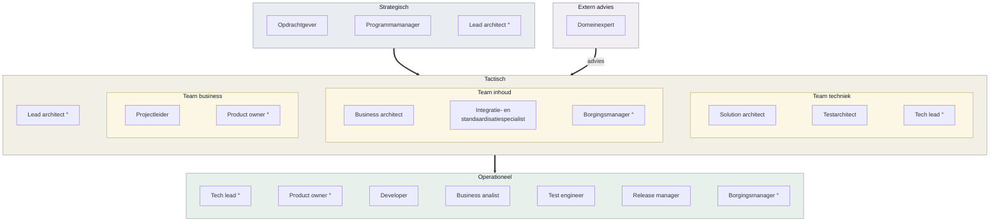
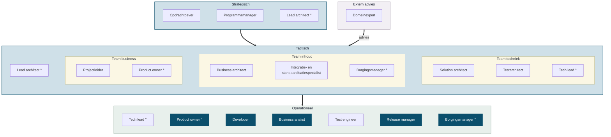

<!-- 1. TITEL -->

  <h1 style="font-size: 2.6rem; line-height: 1.15; margin-bottom: 0.7rem; color: var(--np-ink);">Rollen, producten en verantwoordelijkheden binnen OKx</h1>
  
Snel leveren door alles zelf te doen werkt, tot het moment dat het moet blijven werken zonder mij

  
OKx &middot; september 2026

<!--
Los gesprek, geen besluitstuk. Eerst de vraag, dan de onderbouwing.
-->

---

<!-- 2. WAAR HET OM GAAT -->

# Waar het om gaat

Ik kan de product owner-rol best oppakken. Ik kan niet alles oppakken. Als ik product owner blijf, heb ik mandaat nodig en ruimte op andere plekken.

<strong style="color: #A8481F;">De afspraak die ik met Niels maakte</strong>

"Niek, je doet het weer. Laat los." 
"Ik doe dit omdat ik bang ben dat het niet goed gaat." 
"En door alles maar naar me toe te trekken gebeurt dat straks ook."

Dat is de valkuil. Daar heb ik hulp bij nodig, en die hulp is dat iemand het benoemt op het moment dat het gebeurt.

<!--
Hiermee openen, niet eindigen. De rest van het deck is de onderbouwing van deze
vraag. Ruud eerst in stelling brengen voordat dit in het teamoverleg komt.
-->

---

<!-- 3. ROLLEN IN DE CONTEXT VAN OKX -->

# Rollen in de context van OKx

Vanuit mijn perspectief, afgestemd met Niels

De teams overlappen: de business architect werkt in inhoud en business, de product owner in business en techniek, de borgingsmanager in inhoud, business en operationeel. Een rol is geen persoon: iemand kan meerdere rollen vervullen, en een rol kan ook door een agent worden ingevuld.

De lagen volgen <a href="https://www.prince2.com/usa/blog/understanding-the-prince2-approach-to-organisation">PRINCE2</a> en <a href="https://scaledagileframework.com/safe/">SAFe</a>; de adviesrol buiten de lijn de architecture board uit <a href="https://pubs.opengroup.org/togaf-standard/ea-capability-and-governance/chap04.html">TOGAF</a>.

<!--
De ring markeert een rol die op meerdere plekken zit. Mermaid kan geen
overlappende kaders tekenen, dus de overlap staat in woorden onder de plaat.
-->

---

<!-- 4. WAT RAAKT OKX -->

# Wat raakt OKx

OKx raakt de strategische en tactische laag volledig, en van de operationele laag alleen product owner, business analist, developer, release manager en borging.

Dat komt door wat leveranciers en de architectuurboard vragen: **publiek en vindbaar**, **versioneerbaar per koppeling**, **herleidbaar**, **per regel reviewbaar**, **machinaal controleerbaar**, **onafhankelijk toetsbaar** en **beheerbaar na het project**.

<!--
De eisen aan de werkwijze verklaren waarom een specificatietraject toch
operationele rollen nodig heeft. Zonder release, development en borging kun je
niet publiek, versioneerbaar en herleidbaar leveren.
-->

---

<!-- 5. VERANTWOORDELIJKHEDEN, RICHTEN -->

# Waar elke rol over gaat: richten

| Laag | Rol | Verantwoordelijk voor |
|---|---|---|
| Strategisch | Opdrachtgever | Doel, geld en scope; hakt de knopen door |
| Strategisch | Programmamanager | Samenhang tussen projecten, en voortgang naar de opdrachtgever |
| Strategisch | Lead architect | De architectuurlijn, over de teams heen |
| Extern advies | Domeinexpert | Vakinhoudelijk oordeel, ingeroepen als adviseur en niet in de lijn |
| Team business | Projectleider | Planning, capaciteit en voortgang |
| Team business | Product owner | Wat er gemaakt wordt en in welke volgorde, in tandem met projectleider en architecten |
| Team inhoud | Business architect | Hoe het werkveld in elkaar zit en wat het nodig heeft |
| Team inhoud | Integratie- en standaardisatiespecialist | De aansluiting op bestaande standaarden en afsprakenstelsels |

<!--
Kort langslopen, niet voorlezen. De product owner is breder dan een regel: die
werkt nauw samen met projectleider, lead architect en de analisten.
-->

---

<!-- 6. VERANTWOORDELIJKHEDEN, BOUWEN -->

# Waar elke rol over gaat: bouwen

| Laag | Rol | Verantwoordelijk voor |
|---|---|---|
| Team techniek | Solution architect | De vertaling naar afspraken tussen systemen, en de bouw die daaruit volgt |
| Team techniek | Testarchitect | Hoe je vaststelt dat het gebouwde overeenkomt met de specificatie |
| Team techniek | Tech lead | De technische lijn en de keuzes in de bouw, en leiding aan het developmentteam |
| Operationeel | Developer | Bouwen en onderhouden wat er geleverd wordt |
| Operationeel | Business analist | Behoeften uitwerken tot toetsbare eisen |
| Operationeel | Test engineer | De toetsen uitvoeren en bevindingen terugkoppelen |
| Operationeel | Release manager | Versies, en wat er wanneer naar buiten gaat |
| Operationeel | Borgingsmanager | Hoe de oplossing landt bij instellingen en in beheer |

<!--
Lead developer is bij OKx geen eigen rol; die valt onder de solution architect.
Testarchitect is bij een specificatietraject cruciaal: die stelt vast of wat er
gebouwd wordt overeenkomt met wat we hebben afgesproken.
-->

---

<!-- 7. WAT BIJ MIJ LIGT -->

# Bij OKx liggen ze bij mij

```mermaid
flowchart TB
  subgraph EX["Extern advies"]
    direction LR
    DE["Domeinexpert"]
  end
  subgraph S["Strategisch"]
    direction LR
    OG["Opdrachtgever"] ~~~ PM["Programmamanager"] ~~~ LA1["Lead architect °"]
  end
  subgraph T["Tactisch"]
    direction LR
    LA2["Lead architect °"]
    subgraph TB2["Team business"]
      direction LR
      PL["Projectleider"] ~~~ PO1["Product owner °"]
    end
    subgraph TI["Team inhoud"]
      direction LR
      BAR["Business architect"] ~~~ IS["Integratie- en<br/>standaardisatiespecialist"] ~~~ BM1["Borgingsmanager °"]
    end
    subgraph TT["Team techniek"]
      direction LR
      SA["Solution architect"] ~~~ TA["Testarchitect"] ~~~ TL1["Tech lead °"]
    end
    LA2 ~~~ TB2 ~~~ TI ~~~ TT
  end
  subgraph O["Operationeel"]
    direction LR
    TL2["Tech lead °"] ~~~ PO2["Product owner °"] ~~~ DEV["Developer"] ~~~ BA["Business analist"] ~~~ TE["Test engineer"] ~~~ RM["Release manager"] ~~~ BM2["Borgingsmanager °"]
  end
  S ==> T
  T ==> O
  EX ==>|advies| T
  style TB2 fill:#fbf7e4,stroke:#b3a55f,color:#111827
  style TI fill:#fbf7e4,stroke:#b3a55f,color:#111827
  style TT fill:#fbf7e4,stroke:#b3a55f,color:#111827
  style EX fill:#f2eff4,stroke:#8c7e94,color:#111827
  style S fill:#e9edf2,stroke:#7d8a99,color:#111827
  style T fill:#f2efe7,stroke:#9a9280,color:#111827
  style O fill:#e8f0ec,stroke:#7f9a8c,color:#111827
  style LA1 fill:#0B4F6C,stroke:#0B4F6C,color:#fff
  style LA2 fill:#0B4F6C,stroke:#0B4F6C,color:#fff
  style SA fill:#0B4F6C,stroke:#0B4F6C,color:#fff
  style IS fill:#0B4F6C,stroke:#0B4F6C,color:#fff
  style DE fill:#0B4F6C,stroke:#0B4F6C,color:#fff
  style PO1 fill:#B36A2A,stroke:#B36A2A,color:#fff
  style PO2 fill:#B36A2A,stroke:#B36A2A,color:#fff
  style TL1 fill:#A8481F,stroke:#A8481F,color:#fff
  style TL2 fill:#A8481F,stroke:#A8481F,color:#fff
  style DEV fill:#A8481F,stroke:#A8481F,color:#fff
  style BAR fill:#256B4E,stroke:#256B4E,color:#fff
  style BA fill:#256B4E,stroke:#256B4E,color:#fff
  style TA fill:#256B4E,stroke:#256B4E,color:#fff
  style RM fill:#256B4E,stroke:#256B4E,color:#fff
  style TE fill:#5C6B75,stroke:#5C6B75,color:#fff
  style BM1 fill:#5C6B75,stroke:#5C6B75,color:#fff
  style BM2 fill:#5C6B75,stroke:#5C6B75,color:#fff
```

   Blijft bij mij
   Houd ik, met mandaat
   Afbouwen
   Overdragen
   Niet belegd

<!--
De verdeling is mijn voorstel, geen vaststelling. Product owner houd ik, maar
alleen met mandaat en ruimte elders. Tech lead en developer bouw ik af.
Business architectuur, analyse, testarchitectuur en release draag ik over.
Test engineer en borging zijn niet belegd.
-->

---

<!-- 8. ROL EN PRODUCT, RICHTEN -->

# Welk product hangt onder welke rol

| Rol | Product binnen OKx |
|---|---|
| Solution architect | De koppelvlakspecificaties OC naar SIS, OC naar P&R en OC naar LMS, plus de keuze voor OEAPI als landelijke standaard |
| Business architect | De informatiestromen-hoofdplaat en het vijflaags model waarmee scholen hun onderwijs beschrijven |
| Product owner | De requirementsboom: van programmadoel via epics en features naar stories en functionele eisen, met prioritering en scope |
| Business analist | De kaderscenario's en persona's per leerroute, vertaald naar functionele eisen bij de interactiepatronen |
| Lead architect | Het profiel voor de tweede architectrol, de kandidaatkeuze, en de dagelijkse inhoudelijke begeleiding |

<!--
Dit maakt de zwaarte concreet: niet hoeveel rollen, maar welk product er per rol
onder hangt. Zonder deze twee slides is het een lijstje functietitels.
-->

---

<!-- 9. ROL EN PRODUCT, BOUWEN -->

# Welk product hangt onder welke rol

| Rol | Product binnen OKx |
|---|---|
| Tech lead en developer | De agent-harness en de CI: controlescripts op verwijzingen, conventies en de requirementsboom, plus de presentatiestraat |
| Release manager | Het releaseproces met branchmodel en versiebeheer, en de twee uitgeleverde releases v0.0.1 en v0.0.2 |
| Integratie- en standaardisatiespecialist | Het begrippenkader met de ankertabel, en de mapping van de OKx-begrippen op OEAPI |
| Testarchitect | De aanpak om onafhankelijk vast te stellen of een implementatie de specificatie volgt, in plaats van dat een leverancier zijn eigen werk beoordeelt |
| Domeinexpert | Aanspreekpunt voor de sector op standaarden en gegevensuitwisseling, en de kennisoverdracht binnen Arlande |

<!--
De agent-harness is de belangrijkste reden dat we sneller leveren dan
vergelijkbare trajecten. In te zien via de publieke omgeving en de werkomgeving.
-->

---

<!-- 10. HOE HET ZO GEKOMEN IS -->

  

    Een deel hiervan hoort aan het begin van een programma belegd te zijn bij analisten en beleidsmakers.
  

  

    Die kaders ontbraken, terwijl de bouwfase wel moest doorgaan. Ik heb dat opgepakt om de voortgang niet te blokkeren.
  

<!--
Niet: er is te veel gebeurd. Wel: dit is vooraan blijven liggen en achteraan
opgevangen, en dat is niet houdbaar.
-->

---

<!-- 11. DE CIJFERS -->

# Waar dat op neerkomt

| Afgelopen vier weken | Ik | Anderen |
|---|---|---|
| Issues op de werkomgeving | 39 | 2 |
| Pull requests op de werkomgeving | 27 | 0 |
| Issues op de publieke omgeving | 39 | 18 |
| Pull requests op de publieke omgeving | 15 | 7 |

- Intern komt vrijwel alles uit een hand
- Publiek begint het te lopen, vooral sinds de sessie van 1 september
- Het grootste deel van mijn eigen werk ging naar de werkwijze, niet naar de specificatie

<!--
Uit GitHub, 6 augustus tot 3 september. Vijftien van mijn interne issues gingen
over de agent-harness. Die onderhouden is nodig, uitbreiden niet meer. Een apart
punt dat erbij hoort: GitHub wordt door een deel van het team als complex
ervaren, en dat is een drempel om mee te doen.
-->

---

<!-- 12. BEHOUDEN EN OVERDRAGEN -->

# Behouden en overdragen

<strong style="color: #A8481F;">Mijn valkuil</strong>: werk weer naar me toe trekken uit angst dat het anders niet goed gaat. Precies daardoor gaat het straks niet goed. Hier heb ik hulp bij nodig.

**Dit houd ik**

| Rol | Product |
|---|---|
| Lead architect | De architectuurlijn en het model |
| Solution architect | De drie koppelvlakspecificaties |
| Integratie- en standaardisatiespecialist | Begrippenkader en OEAPI-mapping |
| Domeinexpert | Aanspreekpunt voor de sector |
| Product owner | De requirementsboom, met mandaat |

**Dit moet eruit**

| Rol | Product |
|---|---|
| Business architect | Hoofdplaat en vijflaags model |
| Business analist | Kaderscenario's en persona's |
| Testarchitect | De toetsaanpak voor leveranciers |
| Release manager | Releaseproces en versiebeheer |
| Tech lead en developer | De agent-harness en de CI |

<!--
De valkuil bovenaan, want dat is de reden dat de rechterkolom niet vanzelf leeg
loopt. De indeling is mijn voorstel; streep door wat niet klopt.
-->

---

<!-- 13. WAT IK NODIG HEB -->

# Wat ik nodig heb

- Mandaat als product owner, of iemand anders in die rol
- Business architectuur en analyse bij een specialist
- Een besluit over testarchitectuur, release en borging: beleggen of loslaten
- Een afspraak wie mij aanspreekt als ik werk weer naar me toe trek

Rollen verdelen zonder mensen erbij is werk verplaatsen. Daarom hoort bij elke rol een naam, of een besluit om hem te laten liggen.

<!--
Afsluiten met de concrete vraag. Eerst met Ruud doorlopen, daarna in het
teamoverleg. Het laatste punt is de belangrijkste: "Niek, je doet het weer."
-->
