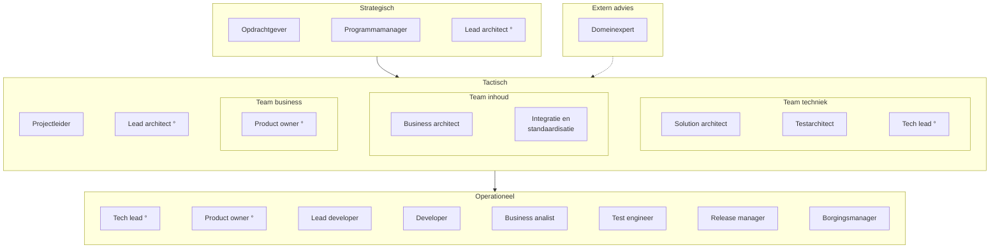
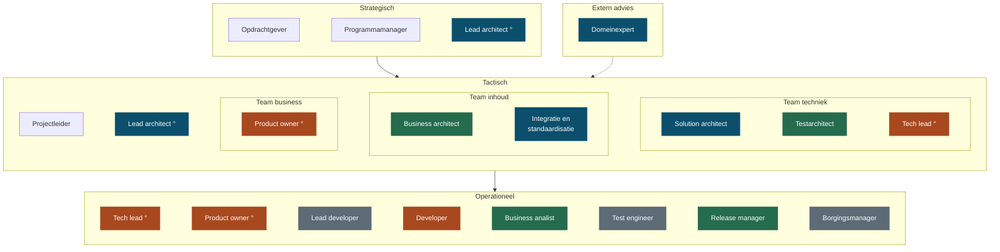

<!-- 1. TITEL -->

  <h1 style="font-size: 3rem; line-height: 1.15; margin-bottom: 0.6rem; color: var(--np-ink);">Rollen</h1>
  
Wat er bij een persoon ligt, en wat er belegd moet worden

  
OKx &middot; september 2026

<!--
Los gesprek, geen besluitstuk. Eerst de vraag, dan de onderbouwing.
-->

---

<!-- 2. DE VRAAG -->

# Waar het om gaat

Elf van de vijftien rollen in dit project liggen bij een persoon. Dat is de reden dat we snel leveren, en tegelijk de reden dat het stilvalt als die persoon wegvalt.

<strong>Wat ik vraag</strong>

- Beleg de product owner-rol bij iemand anders
- Neem business architectuur en analyse over
- Besluit wat we loslaten als er niemand voor is

<strong>Waar ik me op wil richten</strong>

- Architectuur en structuur
- De inhoudelijke lijn met leveranciers en de sector
- De werkwijze onderhouden, niet uitbreiden

<!--
Hiermee openen, niet eindigen. De rest van het deck is de onderbouwing van deze
vraag. Ruud eerst in stelling brengen voordat dit in het teamoverleg komt.
-->

---

<!-- 3. WAT WE OPLEVEREN -->

# Wat we in deze fase opleveren

- Een specificatie en een kennisstuk, geen werkend product
- Dat wordt straks de input voor het IT-project dat instellingen en leveranciers uitvoeren
- Een deel van de operationele laag ligt daarmee buiten ons bereik
- De rollen die richting geven moeten hier wel belegd zijn

Dat onderscheid bepaalt welke rollen wij zelf nodig hebben en welke pas verderop in de keten ontstaan.

<!--
Punt van Niels: we schrijven een specificatie en leveren geen product dat door
eigen mensen wordt geimplementeerd. Dat verandert welke rollen hier thuishoren.
-->

---

<!-- 4. ORGANOGRAM -->

# Rollen in een IT-project

Een rol is geen persoon: iemand kan meerdere rollen vervullen, en een rol kan ook door een agent worden ingevuld. De ring markeert een rol op twee niveaus.

De drie lagen volgen <a href="https://www.prince2.com/usa/blog/understanding-the-prince2-approach-to-organisation">PRINCE2</a> (directing, managing, delivering) en <a href="https://scaledagileframework.com/safe/">SAFe</a> (portfolio, program, team). De adviesrol buiten de lijn volgt de architecture board uit <a href="https://pubs.opengroup.org/togaf-standard/ea-capability-and-governance/chap04.html">TOGAF</a>.

<!--
Borgingsmanager toegevoegd op voorstel van Niels: die bewaakt hoe de oplossing
straks op de vloer landt. Bij OKE gaf het ontbreken daarvan hoofdpijn.
-->

---

<!-- 5. VERANTWOORDELIJKHEDEN, RICHTEN -->

# Waar elke rol over gaat: richten

| Laag | Rol | Verantwoordelijk voor |
|---|---|---|
| Strategisch | Opdrachtgever | Doel, geld en scope; hakt de knopen door |
| Strategisch | Programmamanager | Samenhang tussen projecten, en voortgang naar de opdrachtgever |
| Strategisch | Lead architect | De architectuurlijn, over de teams heen |
| Extern advies | Domeinexpert | Vakinhoudelijk oordeel, ingeroepen als adviseur en niet in de lijn |
| Tactisch | Projectleider | Planning, capaciteit en voortgang |
| Team business | Product owner | Wat er gemaakt wordt en in welke volgorde, in tandem met projectleider en architecten |
| Team inhoud | Business architect | Hoe het werkveld in elkaar zit en wat het nodig heeft |
| Team inhoud | Integratie en standaardisatie | De aansluiting op bestaande standaarden en afsprakenstelsels |

<!--
Kort langslopen, niet voorlezen. De product owner is breder dan een regel: die
werkt nauw samen met projectleider, lead architect en de analisten.
-->

---

<!-- 6. VERANTWOORDELIJKHEDEN, BOUWEN -->

# Waar elke rol over gaat: bouwen

| Laag | Rol | Verantwoordelijk voor |
|---|---|---|
| Team techniek | Solution architect | De vertaling naar afspraken tussen systemen |
| Team techniek | Testarchitect | Hoe je vaststelt dat het gebouwde overeenkomt met de specificatie |
| Team techniek | Tech lead | De technische lijn en de keuzes in de bouw, en leiding aan het developmentteam |
| Operationeel | Lead developer | Gaat voor in de bouw en bewaakt de kwaliteit van het werk |
| Operationeel | Developer | Bouwen en onderhouden wat er geleverd wordt |
| Operationeel | Business analist | Behoeften uitwerken tot toetsbare eisen |
| Operationeel | Test engineer | De toetsen uitvoeren en bevindingen terugkoppelen |
| Operationeel | Release manager | Versies, en wat er wanneer naar buiten gaat |
| Operationeel | Borgingsmanager | Hoe de oplossing landt bij instellingen en in beheer |

<!--
Testarchitect is bij een specificatietraject cruciaal: die stelt vast of wat er
gebouwd wordt overeenkomt met wat we hebben afgesproken.
-->

---

<!-- 7. WAT BIJ MIJ LIGT -->

# Bij OKx liggen ze bij mij

   Blijft bij mij
   Afbouwen
   Overdragen
   Niet belegd
  Ongemarkeerd: ligt bij iemand anders

<!--
De verdeling over afbouwen, overdragen en niet belegd is mijn voorstel, geen
vaststelling. Product owner en tech lead wil ik afbouwen; business architectuur
en analyse overdragen, wat Niels deels al oppakt. Lead developer, test engineer
en borgingsmanager zijn niet belegd.
-->

---

<!-- 8. ZWAARTE, RICHTEN -->

# Wat er per rol onder hangt

| Rol | Producten die eronder vallen |
|---|---|
| Solution architect | De technische afspraken waarmee roostersystemen, leeromgevingen en studentadministraties gegevens uitwisselen, plus de onderbouwde keuze voor de landelijke standaard |
| Business architect | Het overzicht van hoe informatie door een instelling stroomt, en het vijflaags model waarmee scholen hun onderwijs beschrijven. Dit lag er niet |
| Product owner | De vertaling van programmadoel naar concrete eisen, in vier lagen, ter vervanging van het eerdere afbakeningsdocument. Inclusief prioritering en scope |
| Business analist | Studentreizen en leerroutes die laten zien hoe flexibel onderwijs er in de praktijk uitziet, vertaald naar tientallen functionele eisen |
| Lead architect | Profiel voor de tweede architectrol opgesteld, meebeslist over de kandidaat, en die collega ingewerkt en dagelijks begeleid |

<!--
Dit maakt de zwaarte concreet: niet hoeveel rollen, maar wat er per rol onder
hangt. Zonder deze twee slides is het een lijstje functietitels.
-->

---

<!-- 9. ZWAARTE, BOUWEN -->

# Wat er per rol onder hangt

| Rol | Producten die eronder vallen |
|---|---|
| Tech lead en developer | De hele productiestraat: een openbare kennisbank die zichzelf op fouten controleert, documenten en presentaties genereert, en waar AI mee kan werken |
| Release manager | Versiebeheer en een releaseproces waarin elke wijziging herleidbaar is naar wie hem maakte en waarom. Twee releases uitgeleverd aan scholen en leveranciers |
| Integratie en standaardisatie | Het gezamenlijke begrippenkader voor de sector, en de analyse hoe de landelijke onderwijsstandaard en het afsprakenstelsel zich tot elkaar verhouden |
| Testarchitect | De aanpak waarmee we onafhankelijk kunnen vaststellen of leveranciers zich aan de afspraken houden, in plaats van dat zij hun eigen werk beoordelen |
| Domeinexpert | Aanspreekpunt voor de sector op standaarden en gegevensuitwisseling. Binnen Arlande workshops over AI-ondersteund werken en het experiment rond AI-personalisatie |

<!--
De productiestraat is de belangrijkste reden dat we sneller leveren dan
vergelijkbare trajecten. In te zien via de publieke omgeving en de werkomgeving.
-->

---

<!-- 10. HOE HET ZO GEKOMEN IS -->

  

    Een deel hiervan hoort aan het begin van een programma belegd te zijn bij analisten en beleidsmakers.
  

  

    Die kaders ontbraken, terwijl de bouwfase wel moest doorgaan. Ik heb dat opgepakt om de voortgang niet te blokkeren.
  

<!--
Niet: er is te veel gebeurd. Wel: dit is vooraan blijven liggen en achteraan
opgevangen, en dat is niet houdbaar.
-->

---

<!-- 11. DE CIJFERS -->

# Waar dat op neerkomt

| Afgelopen vier weken | Ik | Anderen |
|---|---|---|
| Issues op de werkomgeving | 39 | 2 |
| Pull requests op de werkomgeving | 27 | 0 |
| Issues op de publieke omgeving | 39 | 18 |
| Pull requests op de publieke omgeving | 15 | 7 |

- Intern komt vrijwel alles uit een hand
- Publiek begint het te lopen, vooral sinds de sessie van 1 september
- Het grootste deel van mijn eigen werk ging naar de werkwijze, niet naar de specificatie

<!--
Uit GitHub, 6 augustus tot 3 september. Vijftien van mijn interne issues gingen
over de productiestraat. Die onderhouden is nodig, uitbreiden niet meer. Een
apart punt dat erbij hoort: GitHub wordt door een deel van het team als complex
ervaren, en dat is een drempel om mee te doen.
-->

---

<!-- 12. WAT IK ERVAN VIND -->

# Wat ik ervan vind

<strong style="color: #256B4E;">Dit doe ik graag</strong>

- Structuur aanbrengen waar het nog vormloos is
- Inhoudelijk sparren met architecten en leveranciers
- De werkwijze onderhouden zodat werk herhaalbaar blijft

<strong style="color: #A8481F;">Dit kost me energie</strong>

- Het enige kanaal zijn waardoor werk binnenkomt
- Bewaken of anderen hun deel oppakken
- Opmaak en redactie van eindproducten

<strong>De valkuil</strong>: werk toch weer naar me toe trekken uit angst dat het anders niet gebeurt. Daar mag het team me op aanspreken.

<!--
De valkuil is de waarschuwing van Niels, hier in mijn eigen woorden. De drie
lijstjes zijn van mij; streep door wat niet klopt.
-->

---

<!-- 13. WAT IK NODIG HEB -->

# Wat ik nodig heb

- Een product owner, met mandaat om te prioriteren
- Business architectuur en analyse bij een specialist
- Een besluit over lead developer, test engineer en borging: beleggen of loslaten
- Een afspraak wie mij aanspreekt als ik werk weer naar me toe trek

Rollen verdelen zonder mensen erbij is werk verplaatsen. Daarom hoort bij elke rol een naam, of een besluit om hem te laten liggen.

<!--
Afsluiten met de concrete vraag. Eerst met Ruud doorlopen, daarna in het
teamoverleg.
-->
