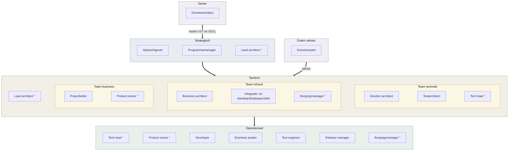
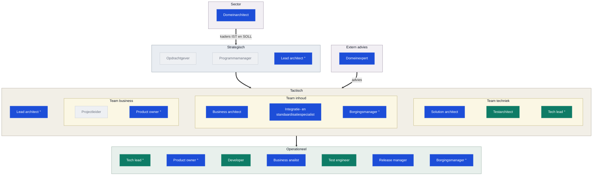
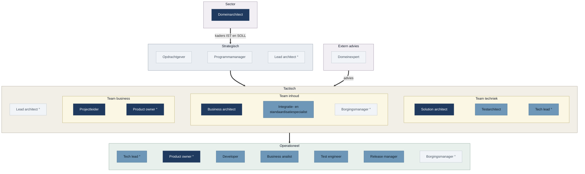
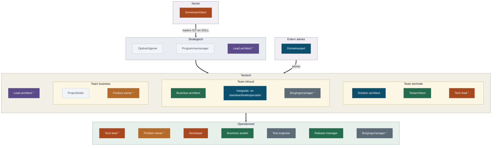

<!-- 1. TITEL -->

  <h1 style="font-size: 2.6rem; line-height: 1.15; margin-bottom: 0.7rem; color: var(--np-ink);">Rollen, producten en verantwoordelijkheden binnen OKx</h1>
  
Snel leveren door alles zelf te doen werkt, tot het moment dat het moet blijven werken zonder mij

  
OKx &middot; september 2026

<!--
Los gesprek, geen besluitstuk. Eerst de vraag, dan de onderbouwing.
-->

---

<!-- 2. WAAR HET OM GAAT -->

# Waar het om gaat

  

    
1

    
Ik heb een valkuil: ik pak te veel op. Als iets blijft liggen, doe ik het zelf.

  

  
&#9660;

  

    
2

    
Dat gaat goed tot ik mijn grens over ga. Daar heb ik hulp bij nodig, want zelf zie ik het te laat.

  

  
&#9660;

  

    
3

    
<strong style="color: #fff;">Mijn vraag</strong>: spreek me aan als ik te ver ga, en help me overtollige verantwoordelijkheden in het team te beleggen.

  

  
&#9660;

  

    
4

    
Wanneer ga ik te ver? Daarvoor moeten we weten waar die grens ligt. Hierna mijn kijk op de rollen en verantwoordelijkheden binnen OKx.

  

<!--
Hiermee openen, niet eindigen. Niels: deze zinnen zijn de opening, en niet vijf
keer herhalen. Stap 4 is de brug naar de rest van het deck; dat is de
onderbouwing, niet het doel.
-->

---

<!-- 3. WAT BIJ MIJ PAST -->

# Wat bij mij past, en wat niet

<strong style="color: #0B4F6C;">Geeft energie, past bij mijn profiel</strong>

- Structuur aanbrengen: lagen, verwijzingen, een boom waar alles in past
- Sparren met architecten, leveranciers en instellingen, en de samenhang bewaken
- De solution bouwen: van eis naar koppelvlak naar werkende afspraak
- Product ownen ligt me, maar dan als enige zware rol

<strong style="color: #A8481F;">Kost energie, hoort bij een ander</strong>

- Politieagent spelen: achter werk aan dat blijft liggen
- Eindverantwoordelijk zijn voor elk eindproduct en elke pull request
- Business analyse: dat is een vak apart, ik pretendeer geen analist te zijn
- Business architectuur: die hoort bij Niels

Ik doe nu beide kolommen. Links maak ik verschil, rechts houd ik alleen gaten dicht.

<!--
De onderbouwing onder slide 2. Niet: kijk eens wat ik allemaal doe. Wel: dit is
waar ik op wil focussen en dit hoort ergens anders.
-->

---

<!-- 4. ROLLEN IN DE CONTEXT VAN OKX -->

# Rollen in de context van OKx

Vanuit mijn perspectief, afgestemd met Niels

De teams overlappen: de business architect werkt in inhoud en business, de product owner in business en techniek, de borgingsmanager in inhoud, business en operationeel. Een rol is geen persoon: iemand kan meerdere rollen vervullen, en een rol kan ook door een agent worden ingevuld.

De lagen volgen <a href="https://www.prince2.com/usa/blog/understanding-the-prince2-approach-to-organisation">PRINCE2</a> en <a href="https://scaledagileframework.com/safe/">SAFe</a>; de adviesrol buiten de lijn de architecture board uit <a href="https://pubs.opengroup.org/togaf-standard/ea-capability-and-governance/chap04.html">TOGAF</a>.

<!--
De ring markeert een rol die op meerdere plekken zit. Mermaid kan geen
overlappende kaders tekenen, dus de overlap staat in woorden onder de plaat.
-->

---

<!-- 5. WAT RAAKT OKX -->

# Wat raakt OKx

<strong style="color: #1D4ED8;">Gevraagd door leveranciers en de architectuurboard</strong>

De omvang van de opdracht zelf: bijna het hele primaire proces van een instelling &middot; publiek en vindbaar &middot; versioneerbaar op meerdere dimensies &middot; herleidbaar, ook waarom een keuze zo gemaakt is &middot; beheerbaar na het einde van Npuls

<strong style="color: #0E7C66;">Impliciet nodig vanuit de oplossing om het blauwe waar te maken</strong>

Machinaal controleerbaar: bij deze omvang, dit team en deze expertise is digitaliseren, automatiseren en integreren de enige manier om strategie, tactiek en operationele producten naar elkaar te laten verwijzen &middot; onafhankelijk toetsbaar, straks het werk van de testers

Grijs is wat ik niet oppak. Een projectleider hebben we wel degelijk nodig.

<!--
De kleur draagt de boodschap: blauw is wat van buiten gevraagd wordt, groen is
wat ik erbij heb gezet om dat met dit team haalbaar te houden.
-->

---

<!-- 6. VERANTWOORDELIJKHEDEN, RICHTEN -->

# Waar elke rol over gaat: richten

| Laag | Rol | Verantwoordelijk voor | Product in de repo |
|---|---|---|---|
| Strategisch | Opdrachtgever | Doel, geld en scope | Scopebesluiten en milestones |
| Strategisch | Programmamanager | Samenhang en voortgang | Voortgang richting opdrachtgever |
| Strategisch | Lead architect | De architectuurlijn over de teams heen | ADR's en uitgangspunten |
| Sector | Domeinarchitect | Kaderstelling IST en SOLL voor de sector | Sectorkader; ontbreekt nu |
| Extern advies | Domeinexpert | Vakinhoudelijk oordeel, buiten de lijn | Reviewcommentaar en sessies |
| Team business | Projectleider | Planning, capaciteit en voortgang | Milestones en issueplanning |
| Team business | Product owner | Wat er gemaakt wordt en in welke volgorde | Requirementsboom: epics, features, stories |
| Team inhoud | Business architect | Hoe het werkveld in elkaar zit | Hoofdplaat, procesplaten, ArchiMate-model |
| Team inhoud | Integratie- en standaardisatiespecialist | Aansluiting op standaarden en afsprakenstelsels | Begrippenkader en OEAPI-mapping |

<!--
Kort langslopen, niet voorlezen. De product owner is breder dan een regel: die
werkt nauw samen met projectleider, lead architect en de analisten.
-->

---

<!-- 7. VERANTWOORDELIJKHEDEN, BOUWEN -->

# Waar elke rol over gaat: bouwen

| Laag | Rol | Verantwoordelijk voor | Product in de repo |
|---|---|---|---|
| Team techniek | Solution architect | De vertaling naar afspraken tussen systemen | Koppelvlakspecificaties en datamodelschema's |
| Team techniek | Testarchitect | Hoe je vaststelt dat het gebouwde klopt | Toetsaanpak en acceptatiecriteria |
| Team techniek | Tech lead | De technische lijn op operationeel niveau, plus leiding aan het developmentteam: begeleiden, ontwikkelen, werkafspraken en toolkeuze | Agent-harness, werkafspraken, CI-controles |
| Operationeel | Developer | Bouwen en onderhouden wat er geleverd wordt | Validatiescripts en presentatiestraat |
| Operationeel | Business analist | Behoeften uitwerken tot toetsbare eisen | Kaderscenario's, persona's, stories |
| Operationeel | Test engineer | Toetsen uitvoeren en bevindingen terugkoppelen | Bevindingen als issues |
| Operationeel | Release manager | Wat er wanneer naar buiten gaat | Releases, branchmodel, versiebeheer |
| Operationeel | Borgingsmanager | Hoe de oplossing landt en in beheer komt | Overdrachts- en beheerafspraken |

<!--
Lead developer is bij OKx geen eigen rol; die valt onder de solution architect.
Testarchitect is bij een specificatietraject cruciaal: die stelt vast of wat er
gebouwd wordt overeenkomt met wat we hebben afgesproken.
-->

---

<!-- 8. ZWAARTE EN COMBINATIES -->

# Omvang van de rollen

Fulltime
&nbsp;&nbsp;Vaak gecombineerd
&nbsp;&nbsp;Deeltijd of buiten de lijn

| Vaak in een persoon | Waarom dat werkt |
|---|---|
| Developer en business analist | Wie de eis uitwerkt, bouwt hem vaak ook |
| Test engineer en business analist | Wie de eis schrijft, weet wat je moet toetsen |
| Tech lead en release manager | Releasen is een technische handeling; ligt al bij Garik |

<strong style="color: #A8481F;">Nooit in een persoon</strong>: developer en test engineer. Wie bouwt, beoordeelt zijn eigen werk niet.

Product owner, business architect, solution architect en domeinarchitect zijn elk een baan op zich. Die vier liggen nu bij mij.

<!--
Mijn inschatting voor dit project, geen norm. Integratie en standaardisatie loopt
in de praktijk samen met business architectuur. Lead architect is nu niet belegd;
Niels ziet die rol eerder als een klein bordje naast de product owner.
-->

---

<!-- 9. WAT BIJ MIJ LIGT -->

# Welke rollen nu bij mij liggen

   Blijft bij mij
   Houd ik, met mandaat
   Afbouwen
   Overdragen
   Niet belegd
   Deel ik met Niels
   Ligt bij een ander

Lead architect deel ik met Niels. Die rol wordt naar verwachting groter: de architectuurboard gaat ons doorzagen op de gemaakte keuzes, en iemand moet die lijn daar verantwoorden.

<!--
De verdeling is mijn voorstel, geen vaststelling. Product owner houd ik, maar
alleen met mandaat en ruimte elders. Tech lead en developer bouw ik af.
Business architectuur, analyse, testarchitectuur en release draag ik over.
Test engineer en borging zijn niet belegd.
-->

---

<!-- 10. ROL EN PRODUCT, RICHTEN -->

# Welk product hangt onder welke rol

| Rol | Wat de rol is | Voorbeeld OKx-product |
|---|---|---|
| Solution architect | Eindverantwoordelijk en meewerkend voorman voor de totale inhoudelijke oplossing: de koppelvlakspecificaties en alle onderliggende componenten om die volgens de eisen van de opdracht te realiseren | Koppelvlakspecificatie OC naar SIS |
| Business architect | Concretisering van de wensen en eisen van opdracht en stakeholders naar functionele eisen en capabilities, via architectuurproducten | Informatiestromen-hoofdplaat, procesplaat, informatiemodel |
| Domeinarchitect | Kaderstelling vanuit de sector: het IST- en SOLL-beeld waarbinnen de oplossing moet passen | Sectorkader IST en SOLL |
| Product owner | Bepaalt wat er gemaakt wordt en in welke volgorde, en bewaakt scope en prioritering | Requirementsboom: epics, features, stories |
| Business analist | Werkt behoeften uit tot toetsbare eisen, per leerroute en per persona | Kaderscenario, persona, functionele eis |
| Lead architect | Bewaakt de architectuurlijn over de teams heen en verantwoordt die richting de architectuurboard | ADR, uitgangspunt |

<!--
Dit maakt de zwaarte concreet: niet hoeveel rollen, maar welk product er per rol
onder hangt. Zonder deze twee slides is het een lijstje functietitels.
-->

---

<!-- 11. ROL EN PRODUCT, BOUWEN -->

# Welk product hangt onder welke rol

| Rol | Wat de rol is | Voorbeeld OKx-product |
|---|---|---|
| Tech lead | Leiding aan het developmentteam, mensen begeleiden en ontwikkelen, en de technische lijn op operationeel niveau uitzetten: werkafspraken en toolkeuze | Agent-harness, werkafspraken, CI-controles |
| Developer | Bouwt en onderhoudt wat er geleverd wordt | Validatiescript, presentatiestraat |
| Release manager | Bepaalt wat wanneer naar buiten gaat en beheert versies en branchmodel | Release v0.0.2, branchmodel |
| Integratie- en standaardisatiespecialist | Houdt de oplossing verbonden met bestaande standaarden en afsprakenstelsels | Begrippenkader met ankertabel, OEAPI-mapping |
| Testarchitect | Bepaalt hoe onafhankelijk wordt vastgesteld dat een implementatie de specificatie volgt | Toetsaanpak voor leveranciers |
| Domeinexpert | Aanspreekpunt voor de sector op standaarden en gegevensuitwisseling | Sessie, presentatie, kennisoverdracht |

<!--
De agent-harness is de belangrijkste reden dat we sneller leveren dan
vergelijkbare trajecten. In te zien via de publieke omgeving en de werkomgeving.
-->

---

<!-- 12. HOE HET ZO GEKOMEN IS -->

  

    Een deel hiervan hoort aan het begin van een programma belegd te zijn bij analisten en beleidsmakers.
  

  

    Die kaders ontbraken, terwijl de bouwfase wel moest doorgaan. Ik heb dat opgepakt om de voortgang niet te blokkeren. Zo kwam ook de rol van tech lead bij mij te liggen toen Garik startte.
  

<!--
Niet: er is te veel gebeurd. Wel: dit is vooraan blijven liggen en achteraan
opgevangen, en dat is niet houdbaar.
-->

---

<!-- 13. DE CIJFERS -->

# Waar dat op neerkomt

| Afgelopen vier weken | Ik | Anderen |
|---|---|---|
| Issues op de werkomgeving | 39 | 2 |
| Pull requests op de werkomgeving | 27 | 0 |
| Issues op de publieke omgeving | 39 | 18 |
| Pull requests op de publieke omgeving | 15 | 7 |

- Intern komt vrijwel alles uit een hand
- Publiek begint het te lopen, vooral sinds de sessie van 1 september
- Het grootste deel van mijn eigen werk ging naar de werkwijze, niet naar de specificatie

<!--
Uit GitHub, 6 augustus tot 3 september. Vijftien van mijn interne issues gingen
over de agent-harness. Die onderhouden is nodig, uitbreiden niet meer. Een apart
punt dat erbij hoort: GitHub wordt door een deel van het team als complex
ervaren, en dat is een drempel om mee te doen.
-->

---

<!-- 14. BEHOUDEN EN OVERDRAGEN -->

# Behouden en overdragen

<strong style="color: #A8481F;">Mijn valkuil</strong>: werk weer naar me toe trekken uit angst dat het anders niet goed gaat. Precies daardoor gaat het straks niet goed. Hier heb ik hulp bij nodig.

**Dit houd ik**

| Rol | Product |
|---|---|
| Lead architect | De architectuurlijn en het model |
| Solution architect | De drie koppelvlakspecificaties |
| Integratie- en standaardisatiespecialist | Begrippenkader en OEAPI-mapping |
| Domeinexpert | Aanspreekpunt voor de sector |
| Product owner | De requirementsboom, met mandaat |

**Dit moet eruit**

| Rol | Product |
|---|---|
| Business architect | Hoofdplaat en vijflaags model |
| Domeinarchitect | Kaderstelling IST en SOLL |
| Business analist | Kaderscenario's en persona's |
| Testarchitect | De toetsaanpak voor leveranciers |
| Release manager | Releaseproces en versiebeheer |
| Tech lead en developer | De agent-harness en de CI |

<!--
De valkuil bovenaan, want dat is de reden dat de rechterkolom niet vanzelf leeg
loopt. De indeling is mijn voorstel; streep door wat niet klopt.
-->

---

<!-- 15. WAT IK NODIG HEB -->

# Wat ik nodig heb

- Mandaat als product owner, of iemand anders in die rol
- Business architectuur en analyse bij een specialist
- Kaderstelling vanuit de sector: zonder IST- en SOLL-kader kan ik de domeinarchitectrol niet loslaten
- Een besluit over testarchitectuur, release en borging: beleggen of loslaten
- Een afspraak wie mij aanspreekt als ik werk weer naar me toe trek

Rollen verdelen zonder mensen erbij is werk verplaatsen. Daarom hoort bij elke rol een naam, of een besluit om hem te laten liggen.

<!--
Afsluiten met de concrete vraag. Eerst met Ruud doorlopen, daarna in het
teamoverleg. Het laatste punt is de belangrijkste: "Niek, je doet het weer."
-->
