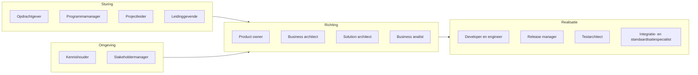

<!-- 1. TITEL -->

  <h1 style="font-size: 3rem; line-height: 1.15; margin-bottom: 0.6rem; color: var(--np-ink);">Rollen</h1>
  
Wat er bij een persoon ligt, en wat dat betekent

  
OKx &middot; september 2026

<!--
Los gesprek, geen besluitstuk. Doel: samen kijken hoe de rollen nu verdeeld zijn
en wat daarvan houdbaar is.
-->

---

<!-- 2. ROLLEN IN EEN PROGRAMMA -->

# Rollen in een programma van deze omvang

Normaal worden deze rollen door verschillende mensen ingevuld.

<!--
Mijn beeld van een programmateam, niet een norm. Vier groepen: wie stuurt, wie
bepaalt de richting, wie maakt, en wie houdt de omgeving erbij.
-->

---

<!-- 3. WAT BIJ MIJ LIGT -->

# Bij OKx liggen ze bij mij

```mermaid
flowchart LR
  subgraph sturing["Sturing"]
    OG["Opdrachtgever"]
    PM["Programmamanager"]
    PL["Projectleider"]
    LG["Leidinggevende"]
  end
  subgraph richting["Richting"]
    PO["Product owner"]
    BAR["Business architect"]
    SA["Solution architect"]
    BA["Business analist"]
  end
  subgraph realisatie["Realisatie"]
    EN["Developer en engineer"]
    RM["Release manager"]
    TA["Testarchitect"]
    IS["Integratie- en standaardisatiespecialist"]
  end
  subgraph omgeving["Omgeving"]
    KH["Kennishouder"]
    SM["Stakeholdermanager"]
  end
  sturing --> richting
  richting --> realisatie
  omgeving --> richting
  style LG fill:#0B4F6C,stroke:#0B4F6C,color:#fff
  style PO fill:#0B4F6C,stroke:#0B4F6C,color:#fff
  style BAR fill:#0B4F6C,stroke:#0B4F6C,color:#fff
  style SA fill:#0B4F6C,stroke:#0B4F6C,color:#fff
  style BA fill:#0B4F6C,stroke:#0B4F6C,color:#fff
  style EN fill:#0B4F6C,stroke:#0B4F6C,color:#fff
  style RM fill:#0B4F6C,stroke:#0B4F6C,color:#fff
  style TA fill:#0B4F6C,stroke:#0B4F6C,color:#fff
  style IS fill:#0B4F6C,stroke:#0B4F6C,color:#fff
  style KH fill:#0B4F6C,stroke:#0B4F6C,color:#fff
```

Tien van de veertien. Richting en realisatie volledig.

<!--
Niet als klacht, wel als constatering. De rollen zijn organisch zo gegroeid;
niemand heeft dit zo bedacht. Release manager deel ik inmiddels met Garik.
-->

---

<!-- 4. OPGELEVERD, RICHTING -->

# Wat ik daarin heb opgeleverd

| Rol | Opgeleverd |
|---|---|
| Solution architect | De technische afspraken waarmee roostersystemen, leeromgevingen en studentadministraties gegevens uitwisselen, plus de onderbouwde keuze voor de landelijke standaard |
| Business architect | Het overzicht van hoe informatie door een instelling stroomt, en het vijflaags model waarmee scholen hun onderwijs beschrijven. Dit lag er niet |
| Product owner | De vertaling van programmadoel naar concrete eisen, in vier lagen, ter vervanging van het eerdere afbakeningsdocument. Inclusief prioritering en scope |
| Business analist | Studentreizen en leerroutes die laten zien hoe flexibel onderwijs er in de praktijk uitziet, vertaald naar tientallen functionele eisen |
| Beginnend leidinggevende | Profiel voor de tweede architectrol opgesteld, meebeslist over de kandidaat, en die collega ingewerkt en dagelijks begeleid |

<!--
Bij business architect: het vijflaags model was nodig om uberhaupt iets te
kunnen bouwen. Bij product owner: dit verving het afbakeningsdocument.
-->

---

<!-- 5. OPGELEVERD, REALISATIE -->

# Wat ik daarin heb opgeleverd

| Rol | Opgeleverd |
|---|---|
| Developer en engineer | De hele productiestraat: een openbare kennisbank die zichzelf op fouten controleert, documenten en presentaties genereert, en waar AI mee kan werken |
| Release manager | Versiebeheer en een releaseproces waarin elke wijziging herleidbaar is naar wie hem maakte en waarom. Twee releases uitgeleverd aan scholen en leveranciers |
| Integratie- en standaardisatiespecialist | Het gezamenlijke begrippenkader voor de sector, en de analyse hoe de landelijke onderwijsstandaard en het afsprakenstelsel zich tot elkaar verhouden |
| Testarchitect | De aanpak waarmee we onafhankelijk kunnen vaststellen of leveranciers zich aan de afspraken houden, in plaats van dat zij hun eigen werk beoordelen |
| Kennishouder | Aanspreekpunt voor de sector op standaarden en gegevensuitwisseling. Binnen Arlande workshops over AI-ondersteund werken en het experiment rond AI-personalisatie |

<!--
De productiestraat is de belangrijkste reden dat we sneller leveren dan
vergelijkbare trajecten. In te zien via de publieke omgeving en de werkomgeving.
-->

---

<!-- 6. HOE HET ZO GEKOMEN IS -->

  

    Een deel hiervan hoort aan het begin van een programma belegd te zijn bij analisten en beleidsmakers.
  

  

    Die kaders ontbraken, terwijl de bouwfase wel moest doorgaan. Ik heb dat opgepakt om de voortgang niet te blokkeren.
  

<!--
Dit is de kern van het gesprek. Niet: er is te veel gebeurd. Wel: dit is
vooraan blijven liggen en achteraan opgevangen, en dat is niet houdbaar.
-->

---

<!-- 7. DE CIJFERS -->

# Waar dat op neerkomt

| Afgelopen vier weken | Ik | Anderen |
|---|---|---|
| Issues op de werkomgeving | 39 | 2 |
| Pull requests op de werkomgeving | 27 | 0 |
| Issues op de publieke omgeving | 39 | 18 |
| Pull requests op de publieke omgeving | 15 | 7 |

- Intern komt vrijwel alles uit een hand
- Publiek begint het te lopen, vooral sinds de sessie van 1 september
- Het grootste deel van mijn eigen werk ging naar de werkwijze, niet naar de specificatie

<!--
Uit GitHub, 6 augustus tot 3 september. Vijftien van mijn interne issues gingen
over de productiestraat: investeren in hoe we werken, niet in wat we opleveren.
-->

---

<!-- 8. WAT IK ERVAN VIND -->

# Wat ik ervan vind

<strong style="color: #2e8b57;">Dit doe ik graag</strong>

- Structuur aanbrengen waar het nog vormloos is
- Inhoudelijk sparren met architecten en leveranciers
- De werkwijze zo bouwen dat werk herhaalbaar wordt

<strong style="color: #b3542f;">Dit kost me energie</strong>

- Het enige kanaal zijn waardoor werk binnenkomt
- Bewaken of anderen hun deel oppakken
- Opmaak en redactie van eindproducten

<strong>Hier wil ik mee stoppen</strong>: product owner zijn naast architect; de backlog voor iedereen vullen; presentaties zelf opmaken.

<!--
Deze drie lijstjes zijn een voorzet en moeten van mij zijn, niet van het deck.
Streep door wat niet klopt voordat dit het gesprek in gaat.
-->

---

<!-- 9. DE VRAAG -->

# Hoe pakken we dit op

- Welke rollen horen echt bij de sectorarchitect, en welke niet?
- Wie wordt product owner, en met welk mandaat?
- Wat is er nodig om werk ook van anderen te laten komen?
- Wat laten we los als er niemand voor is?

De laatste is de eerlijkste: rollen verdelen zonder mensen erbij is werk verplaatsen.

<!--
Open eindigen. Dit is een gesprek, geen voorstel dat ik erdoor wil hebben.
-->
