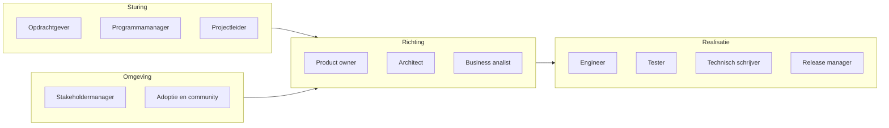
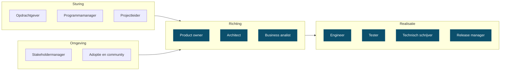

<!-- 1. TITEL -->

  <h1 style="font-size: 3rem; line-height: 1.15; margin-bottom: 0.6rem; color: var(--np-ink);">Rollen</h1>
  
Wie doet wat in dit project, en wat betekent dat

  
OKx &middot; september 2026

<!--
Los gesprek, geen besluitstuk. Doel: samen kijken hoe de rollen nu verdeeld zijn
en wat daarvan houdbaar is.
-->

---

<!-- 2. ROLLEN IN EEN PROJECTTEAM -->

# Rollen in een projectteam

<!--
Geen norm, mijn beeld van een gemiddeld projectteam. Vier groepen: wie stuurt,
wie bepaalt de richting, wie maakt, en wie houdt de omgeving erbij.
-->

---

<!-- 3. WAT IK NU INVUL -->

# Wat ik nu invul

Zeven van de dertien. Release manager deel ik met Garik.

<!--
Niet als klacht bedoeld, wel als constatering. De rollen zijn organisch zo
gegroeid; niemand heeft dit zo bedacht.
-->

---

<!-- 4. WAT DAT OPLEVERT -->

# Wat dat oplevert

| Rol | Waaraan te zien |
|---|---|
| Product owner | Milestones en backlog in beide repositories, tweewekelijkse prioritering |
| Architect | Hoofdplaat, ArchiMate-model, architectuurbesluiten |
| Business analist | Requirementsboom: doelen, epics, features, stories, functionele eisen |
| Engineer | Controlescripts, CI, agent-harness, presentatiestraat |
| Tester | Testgevallen bij de scripts, reviewpersona's als kwaliteitspoort |
| Technisch schrijver | Koppelvlakspecificaties, README's, decks voor drie gremia |
| Release manager | Releaseproces en branchmodel, samen met Garik |

<!--
Elk van deze rollen levert echt werk op. De vraag is niet of het gebeurt, maar
of het houdbaar is dat het uit een hand komt.
-->

---

<!-- 5. IN CIJFERS -->

# De afgelopen vier weken

| | Ik | Anderen |
|---|---|---|
| Issues op meta | 39 | 2 |
| Pull requests op meta | 27 | 0 |
| Issues op Public | 39 | 18 |
| Pull requests op Public | 15 | 7 |

- Op de interne omgeving komt vrijwel alles uit een hand
- Op Public begint het te lopen, vooral sinds de sessie van 1 september
- Van mijn eigen werk ging het grootste deel naar de werkwijze zelf, niet naar de specificatie

<!--
Cijfers uit GitHub, periode 6 augustus tot 3 september. Het punt van de derde
bullet: vijftien van mijn meta-issues gingen over de agent-harness. Dat is
investeren in hoe we werken, niet in wat we opleveren.
-->

---

<!-- 6. WAT IK ERVAN VIND -->

# Wat ik ervan vind

<strong style="color: #2e8b57;">Dit doe ik graag</strong>

- Structuur aanbrengen waar het nog vormloos is
- Inhoudelijk sparren met architecten en leveranciers
- De werkwijze zo bouwen dat werk herhaalbaar wordt

<strong style="color: #b3542f;">Dit kost me energie</strong>

- Het enige kanaal zijn waardoor werk binnenkomt
- Bewaken of anderen hun deel oppakken
- Opmaak en redactie van eindproducten

<strong>Hier wil ik mee stoppen</strong>: product owner zijn naast architect; de backlog voor iedereen vullen; presentaties zelf opmaken.

<!--
De drie lijstjes zijn een voorzet en moeten van mij zijn, niet van het deck.
Streep door wat niet klopt voordat dit de zaal in gaat.
-->

---

<!-- 7. DE VRAAG -->

# Hoe pakken we dit op

- Welke rollen horen echt bij de sectorarchitect, en welke niet?
- Wie wordt product owner, en met welk mandaat?
- Wat is er nodig om werk ook van anderen te laten komen?
- Wat laten we los als er niemand voor is?

De laatste is de eerlijkste: rollen verdelen zonder mensen erbij is werk verplaatsen.

<!--
Open eindigen. Dit is een gesprek, geen voorstel dat ik erdoor wil hebben.
-->
