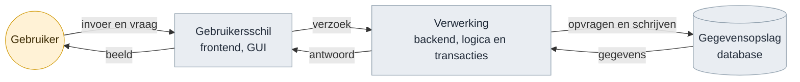
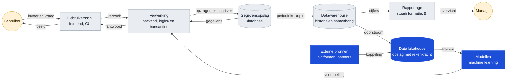
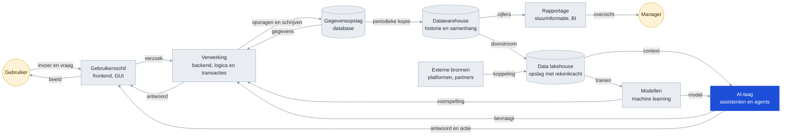

<!-- 1. TITEL -->

  <h1 style="font-size: 2.6rem; line-height: 1.15; margin-bottom: 0.7rem; color: var(--np-ink);">Hoe weten we of we het juiste bouwen?</h1>
  
Dertig jaar technologietrend, en het traject van OKx daarnaast gelegd

  
Niek Derksen &middot; OKx &middot; 4-9-2026

<!--
De vraag komt van de opdrachtgever, maar het deck is geen verdediging. Het is
een onderzoek: welke kant wijst de historie op, en ligt ons traject op die
lijn. Zo brengen.
-->

---

<!-- 2. AANLEIDING -->

# Aanleiding

Bouwen we geen stoomtrein door koppelvlakken te standaardiseren? Zeker met de opkomst van AI. Hebben we straks geen vliegende auto's?

Een terechte vraag. Een standaardisatietraject duurt jaren, en de wereld eromheen verandert snel. Wie in 1995 het perfecte faxprotocol standaardiseerde, had gelijk en verloor toch.

<!--
De vraag van de opdrachtgever, kort. Niet meteen tegenspreken; het faxvoorbeeld
erkent dat de zorg hout snijdt.
-->

---

<!-- 3. HOE WE HET UITZOEKEN -->

# Hoe we dat uitzoeken

  

    
1

    
<strong style="color: #2E86C1;">Historie volgen.</strong> Welke lagen kwamen er in dertig jaar bij?

  

  

    
2

    
<strong style="color: #0E9E7E;">Trend eruit halen.</strong> Wat vroeg elke golf?

  

  

    
3

    
<strong style="color: #E8912B;">Ons traject ernaast leggen.</strong> Welke kansen en risico's levert dat op?

  

<strong style="color: #7a5dba;">De uitkomst</strong>: de trend wijst een kant op, en ons traject ligt op die lijn.

<!--
Drie stappen, en de uitkomst er alvast bij. De rest van het deck is de
onderbouwing en hoeft niet lineair.
-->

---

<!-- 4. LAAG 1 -->

# Fundament IT-applicaties, jaren 80 en 90

Drie blokken en een kringloop. De gebruiker geeft invoer of stelt een vraag aan de gebruikersschil, die stuurt een verzoek naar de verwerking, die haalt of schrijft in de gegevensopslag en stuurt het antwoord terug. Alles binnen een organisatie.

<!--
De pijlen zijn het punt, niet de blokken. Elke pijl is een informatiestroom met
een vraag en een antwoord.
-->

---

<!-- 5. LAAG 2 -->

# Systeem in de jaren 2000

```mermaid
flowchart LR
  U(("Gebruiker"))
  GUI["Gebruikersschil<br/>frontend, GUI"]
  BE["Verwerking<br/>backend, logica en transacties"]
  DB[("Gegevensopslag<br/>database")]
  U -- "invoer en vraag" --> GUI
  GUI -- "verzoek" --> BE
  BE -- "opvragen en schrijven" --> DB
  DB -- "gegevens" --> BE
  BE -- "antwoord" --> GUI
  GUI -- "beeld" --> U
  DWH[("Datawarehouse<br/>historie en samenhang")]
  BI["Rapportage<br/>stuurinformatie, BI"]
  M(("Manager"))
  DB -- "periodieke kopie" --> DWH
  DWH -- "cijfers" --> BI
  BI -- "overzicht" --> M
  style U fill:#fff2d6,stroke:#D4A017,color:#3b2a02
  style GUI fill:#e9edf2,stroke:#94a3b0,color:#1f2937
  style BE fill:#e9edf2,stroke:#94a3b0,color:#1f2937
  style DB fill:#e9edf2,stroke:#94a3b0,color:#1f2937
  style DWH fill:#1D4ED8,stroke:#1D4ED8,color:#ffffff
  style BI fill:#1D4ED8,stroke:#1D4ED8,color:#ffffff
  style M fill:#fff2d6,stroke:#D4A017,color:#3b2a02
```

Er komt een tweede kringloop bij. De gegevensopslag levert periodiek een kopie aan het datawarehouse, dat daar historie en samenhang uit haalt, en de rapportage levert een overzicht aan een tweede gebruiker. Nieuwe laag, nieuwe stromen.

<!--
Hier begint het patroon: elke nieuwe laag leunt op gegevens uit de laag
eronder, dus de vraag naar uitwisseling wordt groter.
-->

---

<!-- 6. LAAG 3 -->

# Systeem in de jaren 2010

Opslag en rekenkracht komen samen in het lakehouse, gevoed door het datawarehouse en door bronnen van buiten de organisatie. Daarop worden modellen getraind, en die sturen een voorspelling terug de verwerking in. De kringloop loopt nu ook buiten de eigen muren.

<!--
Twee dingen tegelijk: de stapel wordt hoger en hij wordt breder. Externe
bronnen betekenen dat uitwisseling niet meer alleen intern is.
-->

---

<!-- 7. LAAG 4 -->

# Systeem nu

Elke laag van dertig jaar staat er nog. Wat ze verbindt zijn de pijlen: <strong>informatiestromen, vastgelegd in afspraken</strong>. De AI-laag heeft zelf geen opslag en bestaat volledig bij de gratie van wat die pijlen aanleveren.

<!--
Dit is het kantelpunt. De AI-laag heeft zelf geen opslag: hij bestaat bij de
gratie van wat de pijlen aanleveren.
-->

---

<!-- 8. DE TREND -->

# De trend achter dertig jaar lagen

| Periode | Wat erbij kwam | Wat dat vroeg van uitwisseling |
|---|---|---|
| Jaren negentig | Datawarehouse en rapportage | Gegevens uit bronsystemen halen, periodiek |
| Dot-com en daarna | Webkoppelingen tussen organisaties | Afspraken tussen partijen in plaats van binnen een organisatie |
| Cloud en platformen | Externe bronnen en rekenkracht op afstand | Continu, over organisatiegrenzen heen |
| Machine learning | Modellen die op veel bronnen tegelijk leunen | Meer bronnen, betere kwaliteit, herleidbaar |
| AI-assistenten en agents | Een laag die alles wil kunnen bevragen | Alles hierboven, plus vindbaar en interpreteerbaar zonder mens |

Elke golf maakte de vraag naar gegevensuitwisseling groter. Geen enkele maakte hem kleiner. AI is de eerste laag die niets eigens opslaat en dus volledig afhankelijk is van wat de lagen eronder aanleveren.

<!--
Dit is de richting die uit de historie komt. Wie hem betwist, moet uitleggen
waarom deze golf de eerste is die het patroon omkeert.
-->

---

<!-- 9. ONS TRAJECT ERNAAST -->

# Ons traject ernaast gelegd

OKx werkt niet aan een laag. OKx werkt aan de verbinding tussen de lagen: welke gegevens tussen systemen gaan, wat ze betekenen, en wie waarvan de bron is. Dat is precies het element dat in alle vier de platen voorkomt en dat elke golf overleefde.

| De trend vraagt | Wat OKx daarvoor maakt |
|---|---|
| Afspraken tussen partijen, niet binnen een organisatie | Koppelingen tussen referentiecomponenten, met een eigenaar per gegeven |
| Bronnen van betere kwaliteit, herleidbaar | Een begrippenkader waarin vastligt wat een leeruitkomst is |
| Vindbaar en interpreteerbaar zonder mens | 24 datamodelschema's, meegeleverd bij elke release |

Een instelling met losse systemen en onduidelijke begrippen heeft niets aan een AI-laag: die kan alleen bevragen wat ontsloten en gedefinieerd is. Meer interconnectie levert sterkere bronnen op, en sterkere bronnen zijn waar AI op aanhaakt.

<!--
Dit is het antwoord op de vraag, maar dan als bevinding en niet als
verdediging. De tabel koppelt elke trendeis aan iets dat aantoonbaar bestaat.
-->

---

<!-- 10. KANSEN -->

# Vier kansen

| Kans | Waar die vandaan komt |
|---|---|
| De sector als eerste met een specificatie die een agent kan gebruiken | De payloads zijn al machineleesbaar. Wie ook de interactie zo uitgeeft, levert iets dat elders nog niet bestaat |
| Ons eigen tempo als voorbeeld | Twee releases in twee weken, mediaan 9 dagen per issue, met AI in de keten. Dat is een werkwijze die andere standaardisatietrajecten missen |
| De verschuiving werkt in ons voordeel | Bouwen wordt goedkoop, het eens worden over betekenis niet. Precies dat laatste is wat OKx maakt |
| Laat zijn heeft een voordeel | Andere sectoren zijn ons voor. Hun keuzes zijn over te nemen in plaats van uit te vinden |

De eerste twee zijn een positie die we kunnen innemen. De laatste twee zijn meewind die er sowieso is.

<!--
Deze slide ontbrak eerst helemaal; het deck signaleerde alleen gaten. De eerste
kans is de interessantste voor de opdrachtgever: dat is iets om over te
vertellen buiten de sector.
-->

---

<!-- 11. RISICO'S -->

# Vier risico's

| Risico | Stand van zaken | Wat er gebeurt als het blijft |
|---|---|---|
| Doorlooptijd tot een gedragen afspraak | Binnen het project gaat het snel. De tijd tot een afspraak die de sector draagt is niet gemeten; de eerste toets is de review van v0.1.0 | De uitkomst van die review overvalt ons |
| Interactie niet machineleesbaar | De 24 datamodelschema's wel, de interactiepatronen en endpoints niet | Kans 1 gaat naar een andere sector |
| Binding naar OEAPI open | Payloads zijn Nederlandstalig en wijken bewust af; het afleveringsmechanisme is niet belegd | Twee partijen die beide aan de specificatie voldoen, kunnen alsnog niet koppelen |
| Beheerpartij na Npuls | De route ligt vast via AMIGO richting Edustandaard. De partij niet | Alles in dit deck verloopt op de dag dat het programma stopt |

Drie van de vier staan los van AI en waren al bekend. Alleen het tweede wordt door de AI-ontwikkeling urgenter.

<!--
Signalering, geen aanklacht. De derde kolom maakt duidelijk waarom het ertoe
doet zonder er een verwijt van te maken.
-->

---

<!-- 12. WAT DE SECTOR MERKT -->

# Wat instellingen en leveranciers hiervan merken

<strong style="color: #0B4F6C;">Instellingen</strong>

Een student kan alleen over systemen heen kiezen als die systemen het eens zijn over wat een leeruitkomst is. Dat is wat OKx vastlegt. Wordt de interactie machineleesbaar, dan kan een instelling straks controleren of haar leveranciers zich eraan houden, in plaats van het te moeten geloven.

<strong style="color: #A8481F;">Leveranciers</strong>

Zij bouwen tegen het koppelvlak van de onderwijscatalogus, met drie koppelingen: naar planning en roostering, naar het studentinformatiesysteem en naar het leermanagementsysteem. Zolang de interactie alleen in tekst staat, kunnen zij niet automatisch valideren.

<strong style="color: #D4A017;">Wat hier niet ter discussie staat</strong>: het detailniveau dat leveranciers toegezegd hebben gekregen voor v0.1.0. Wordt daaraan getornd, dan is dat een apart gesprek met elke leverancier, gevoerd door de projectleiding.

<!--
De onderste kaart voorkomt dat een inzetkeuze op de volgende slide gelezen
wordt als het terugdraaien van een toezegging.
-->

---

<!-- 13. WAAR ZETTEN WE OP IN -->

# Waar zetten we op in?

Drie richtingen waar de kansen en de risico's samenkomen. Ze kunnen niet alle drie tegelijk voorrang krijgen.

| Inzet | Wat het oplevert | Wat het vraagt |
|---|---|---|
| **Tempo** | Een gedragen afspraak voordat de praktijk verder is. Dekt risico 1 | Een norm op doorlooptijd en sturing erop, bij de projectleiding |
| **Machineleesbaar** | Kans 1 verzilveren en risico 2 wegnemen | 3 tot 4 weken werk, plus onderhoud per release. Inschatting |
| **Borging** | Alles behouden na afloop van het programma. Dekt risico 4 | Een gesprek met Edustandaard en Npuls, met de langste doorlooptijd van de drie |

<strong>Gevraagd</strong>: welke van deze drie voorrang krijgt richting v0.1.0, en of borging daar los van alvast in gang gezet wordt. De binding naar OEAPI hoort bij de technische werkgroep en staat hier daarom niet als keuze.

<!--
Geen aanbeveling met ja en nee, want dat is niet aan mij. Wel de drie
richtingen met wat ze kosten, zodat de keuze te maken is. Borging staat er
apart bij omdat die de langste doorlooptijd heeft.
-->

---

<!-- 14. AFSLUITER -->

<!--
Einde. Npuls-afsluiter met logo en licentie.
-->
