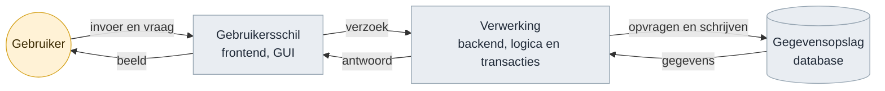
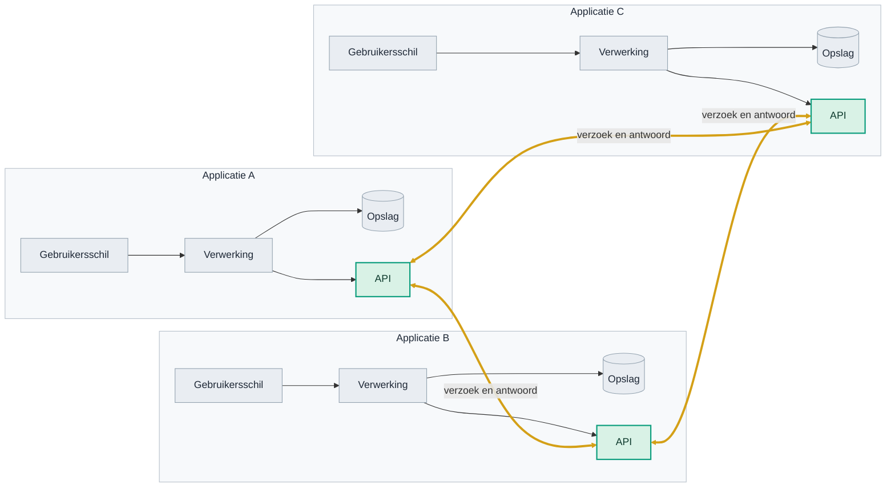
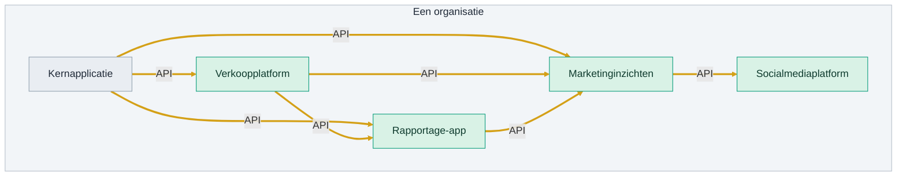
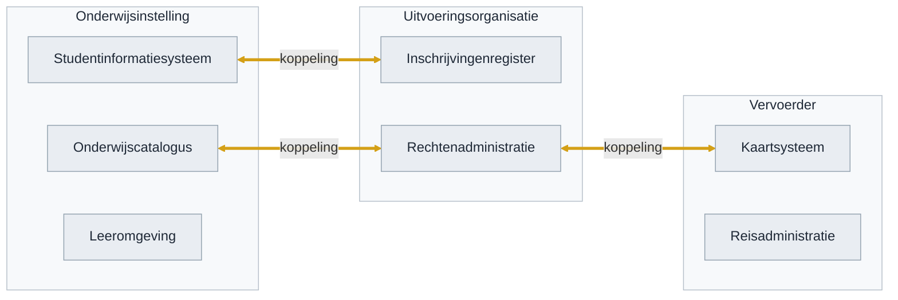
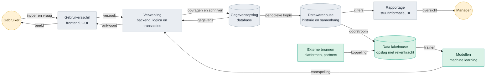
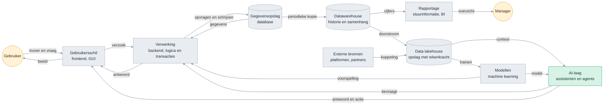
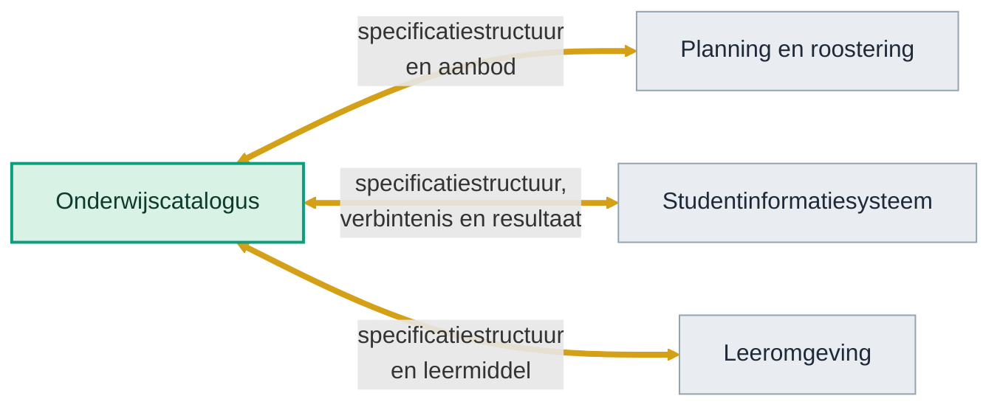

<!-- 1. TITEL -->

  <h1 style="font-size: 2.6rem; line-height: 1.15; margin-bottom: 0.7rem; color: var(--np-ink);">Hoe weten we of we het juiste bouwen?</h1>
  
Dertig jaar technologietrend, en het traject van OKx daarnaast gelegd

  
Niek Derksen &middot; OKx &middot; 4-9-2026

<!--
Geen verdediging maar een onderzoek: welke kant wijst de historie op, en ligt
ons traject op die lijn.
-->

---

<!-- 2. AANLEIDING -->

# Aanleiding

  
Bouwen we geen stoomtrein door koppelvlakken te standaardiseren?

  
Zeker met de opkomst van AI. Hebben we straks geen vliegende auto's?

<!--
De vraag van de opdrachtgever, in twee blokken. Het verhaal eromheen vertel ik:
een standaardisatietraject duurt jaren en de wereld verandert snel; wie in 1995
het perfecte faxprotocol standaardiseerde had gelijk en verloor toch.
-->

---

<!-- 3. CONCLUSIE -->

# Conclusie

Ja, wij leggen spoor, terwijl de markt aan zelfrijdende auto's werkt.

Maar spoor is geen stoomtrein. Het is wat elke volgende trein nodig heeft.

En zodra het spoor er ligt, versnelt alles wat erover gaat.

stoomtrein

hogesnelheidstrein

wat hierna komt

Dezelfde spoorbreedte, afgesproken in de negentiende eeuw, draagt de trein van vandaag.

<!--
De transcontinentale spoorlijn maakte van losse markten een markt, en dat werkte
alleen omdat de spoorbreedte overal gelijk was. Waar die verschilde moest alles
worden overgeladen: dat is de puntkoppeling van nu. De rest van het deck is de
onderbouwing en hoeft niet lineair doorlopen te worden.
-->

---

<!-- 4. ONDERBOUWING -->

# Onderbouwing

  
<strong>Historie volgen.</strong> Welke lagen kwamen er in dertig jaar bij?

  
<strong>Trend eruit halen.</strong> Wat vroeg elke golf?

  
<strong>Ons traject ernaast leggen.</strong> Welke kansen en risico's levert dat op?

<!--
De leeswijzer voor de rest van het deck.
-->

---

<!-- 5. LAAG 1 -->

# Fundament IT-applicaties, jaren 80 en 90

Drie blokken en een kringloop. De gebruiker geeft invoer of stelt een vraag aan de gebruikersschil, die stuurt een verzoek naar de verwerking, die haalt of schrijft in de gegevensopslag en stuurt het antwoord terug. Alles binnen een organisatie.

  
Voorbeeld

  
De schooladministratie op een server in de kelder. Een applicatie, een gebruiker, een gebouw.

<!--
De pijlen zijn het punt, niet de blokken. Elke pijl is een informatiestroom met
een vraag en een antwoord.
-->

---

<!-- 6. INTERNET -->

# Het internet: systemen aan elkaar

  
Voorbeeld

  
iDEAL. De webwinkel praat met je bank, zonder dat die twee ooit samen zijn gebouwd.

<!--
De API is de rand van de applicatie en praat met de API van een ander. Drie
applicaties leveren drie koppelingen op; bij tien zijn het er vijfenveertig.
Elke lijn is een afspraak.
-->

---

<!-- 7. LAAG 2 -->

# Systeem in de jaren 2000

```mermaid
flowchart LR
  U(("Gebruiker"))
  GUI["Gebruikersschil<br/>frontend, GUI"]
  BE["Verwerking<br/>backend, logica en transacties"]
  DB[("Gegevensopslag<br/>database")]
  U -- "invoer en vraag" --> GUI
  GUI -- "verzoek" --> BE
  BE -- "opvragen en schrijven" --> DB
  DB -- "gegevens" --> BE
  BE -- "antwoord" --> GUI
  GUI -- "beeld" --> U
  DWH[("Datawarehouse<br/>historie en samenhang")]
  BI["Rapportage<br/>stuurinformatie, BI"]
  M(("Manager"))
  DB -- "periodieke kopie" --> DWH
  DWH -- "cijfers" --> BI
  BI -- "overzicht" --> M
  style U fill:#fff2d6,stroke:#D4A017,color:#3b2a02
  style GUI fill:#e9edf2,stroke:#94a3b0,color:#1f2937
  style BE fill:#e9edf2,stroke:#94a3b0,color:#1f2937
  style DB fill:#e9edf2,stroke:#94a3b0,color:#1f2937
  style DWH fill:#d9f2e6,stroke:#0E9E7E,color:#0f3b2e
  style BI fill:#d9f2e6,stroke:#0E9E7E,color:#0f3b2e
  style M fill:#fff2d6,stroke:#D4A017,color:#3b2a02
```

  
Voorbeeld

  
De bonuskaart. De supermarkt weet wat er verkocht is en stuurt daarop bij.

<!--
Hier begint het patroon: elke nieuwe laag leunt op gegevens uit de laag
eronder, dus de vraag naar uitwisseling wordt groter.
-->

---

<!-- 8. ECOSYSTEEM -->

# Van applicatie naar ecosysteem van applicaties

Vijf applicaties, zeven koppelingen. Niet meer een applicatie met een paar lagen, maar tientallen applicaties naast elkaar, elk met eigen verwerking en opslag.

  
Voorbeeld

  
Een instelling met tientallen pakketten naast elkaar: rooster, leeromgeving, studentinformatie, aanmeldportaal, wallet.

<!--
Dit is inmiddels het normale beeld bij een instelling, en het is de
voedingsbodem voor de laag die hierna komt: het lakehouse voedt zich uit dit
ecosysteem.
-->

---

<!-- 9. TWEE WERELDEN -->

# Ecosystemen koppelen aan ecosystemen

  
Voorbeeld

  
Het studentenreisproduct. Instelling, uitvoeringsorganisatie en vervoerder moeten het eens zijn over wie student is en vanaf wanneer.

<!--
Niet meer twee applicaties, maar drie ecosystemen uit drie verschillende
domeinen die elkaars gegevens nodig hebben. Elk heeft zijn eigen taal, eigen
regels en eigen belangen.
-->

---

<!-- 10. HETZELFDE WOORD -->

# Hetzelfde woord, een andere betekenis

  

    
Onderwijsontwerper

    
groep

    
Studenten die samen dezelfde leeruitkomst nastreven, ongeacht waar en wanneer.

  

  
&ne;

  

    
Planner

    
groep

    
Het aantal studenten dat op dat tijdstip in dat lokaal past.

  

Twee systemen die allebei werken, en toch niet samenwerken. De leiding leggen is techniek. Het eens worden over wat het woord betekent, is dat niet.

<!--
Dit is het hele probleem in een plaatje. Het werkt met elk woord: klant,
deelnemer, periode, resultaat. Zolang dit niet vastligt, levert elke koppeling
een nieuw misverstand op.
-->

---

<!-- 11. LAAG 3 -->

# Systeem in de jaren 2010

  
Voorbeeld

  
Spotify. Wat je te horen krijgt komt uit modellen die op miljarden luisterbeurten zijn getraind.

<!--
Twee dingen tegelijk: de stapel wordt hoger en hij wordt breder. Externe
bronnen betekenen dat uitwisseling niet meer alleen intern is.
-->

---

<!-- 12. LAAG 4 -->

# Systeem nu

Elke laag van dertig jaar staat er nog. Wat ze verbindt zijn de pijlen: <strong>informatiestromen, vastgelegd in afspraken</strong>. De AI-laag heeft zelf geen opslag en bestaat volledig bij de gratie van wat die pijlen aanleveren.

  
Voorbeeld

  
Een assistent die je hele reis boekt terwijl jij een zin typt.

<!--
Dit is het kantelpunt. De AI-laag heeft zelf geen opslag: hij bestaat bij de
gratie van wat de pijlen aanleveren.
-->

---

<!-- 13. DE TREND -->

# Steeds meer lagen om te verbinden

Geteld in de vier platen hiervoor: het aantal blokken groeide, maar het aantal informatiestromen ertussen groeide harder.

  

    
Jaren 80 en 90

    
4 blokken

    

      

      
6 stromen

    

  

  

    
Jaren 2000

    
7 blokken

    

      

      
9 stromen

    

  

  

    
Jaren 2010

    
10 blokken

    

      

      
13 stromen

    

  

  

    
Nu, met AI

    
11 blokken

    

      

      
17 stromen

    

  

En dat is nog binnen een organisatie. Zet er de koppelingen tussen organisaties naast en het loopt hard op. AI verwerkt informatie makkelijker dan ooit, en vergroot daarmee de vraag naar wat er te verwerken valt.

<!--
De aantallen komen uit de platen hiervoor, dus ze zijn na te tellen. De
boodschap is de verhouding: blokken maal ruim twee, stromen maal bijna drie.
-->

---

<!-- 14. WAAR OKX ZIT -->

# Wat OKx doet

Van al die stromen leggen we er nu drie vast, tussen vier systemen.

Spoor, geen draad

Per instelling en per leverancier opnieuw bedacht is een draad. Met een afspraak eronder is het spoor waar iedereen op aansluit, en mag veranderen wat erover rijdt.

En daar leeft AI van

Een agent verzint geen betekenis, die leest wat de systemen aanleveren. Rommel erin is rommel eruit.

<!--
De gouden lijnen zijn het werk: drie koppelingen op een koppelvlak, dat van de
onderwijscatalogus. Hier valt de lijn samen: het spoor uit de conclusie, de
stromen die op de vorige plaat hard opliepen, en de voorwaarde voor AI. Shit in,
shit out, als je het zo wilt zeggen.
-->

---

<!-- 15. WAT DAT MOGELIJK MAAKT -->

# Wat dat straks mogelijk maakt

  

    
Onderwijsontwerp

vraag naast aanbod

    

Ons aanbod in leeruitkomsten

Gevraagde vaardigheden uit de markt

    
&#9660;

    
Agent

    
&#9660;

    
Waar sluit ons aanbod niet aan op de markt, en wat ontwikkelen we bij

  

  

    
Ori&euml;ntatie en leerroute

tussen instellingen en sectoren

    

Behaalde en gewenste leeruitkomsten

Aanbod van meerdere instellingen

    
&#9660;

    
Agent

    
&#9660;

    
Welke volgende stap past bij jouw doelen, ook bij een andere instelling

  

  

    
Lesopzet

binnen de instelling

    

Onderwijsspecificatie

Leermiddelen in het LMS

    
&#9660;

    
Agent

    
&#9660;

    
Een concept-lesopzet bij de specificatie

  

<strong>Drie schalen, hetzelfde raamwerk eronder.</strong> De agent moet bij die informatie kunnen en weten wat ze betekent. Het eerste is een koppeling. Het tweede is een afspraak.

<!--
Drie gevallen, elk met dezelfde vorm: bronnen, agent, resultaat. Wat verschilt
is de schaal waarop vergeleken wordt: vraag naast aanbod, tussen instellingen
en over mbo, hbo en wo heen, en binnen een instelling. Wat gelijk blijft is de
sleutel eronder. Zonder dat raamwerk moet elke vergelijking apart gebouwd
worden, met raamwerk is het telkens dezelfde beweging.
-->

---

<!-- 16. KANSEN -->

# Drie kansen

Wat er kan zodra het spoor er ligt

Flexibel onderwijs wordt uitvoerbaar

Modulair en flexibel onderwijs staat al jaren in plannen. Een van de blokkades is dat systemen elkaars leeruitkomsten niet kennen. Die blokkade haalt de afspraak weg.

Vandaag

Elke instelling regelt het in eigen systemen, en bij de grens houdt het op.

Onderwijs kan meebewegen met de arbeidsmarkt

Aanbod dat in leeruitkomsten staat, is te leggen naast de vaardigheden die gevraagd worden. Bijstellen wordt daarmee een cyclus in plaats van een herziening.

Vandaag

Met de hand, per opleiding, per herziening.

Leren over instellingen en sectoren heen

Wat een student elders heeft gehaald, is te herkennen in plaats van opnieuw uit te zoeken. Dat geldt binnen het mbo en straks richting het hbo.

Vandaag

Per instelling opnieuw uitzoeken, vaak op papier.

OKx bouwt deze drie dingen niet zelf. OKx legt het spoor waarop een ander ze kan bouwen. <strong>Daar zit de kans: katalysator zijn voor onderwijsinnovatie.</strong>

<!--
Drie dingen die de sector al jaren wil en die stuklopen op hetzelfde punt.
Niet ons tempo als kans, want snelheid zegt nog niets over kwaliteit. Wel wat
er aan de andere kant van de afspraak vrijkomt.
-->

---

<!-- 17. RISICO'S -->

# Twee risico's

De afspraak komt te laat

De praktijk koppelt al. Elke maand zonder gedragen afspraak is een maand waarin systemen op eigen houtje aan elkaar geknoopt worden.

Wat we al doen

&bull;Platform staat, er wordt op gebouwd

&bull;89 issues, acht deelnemers, ook een leverancier

&bull;Draagvlak traag, beweging meetbaar

Specificeren in een standaard in plaats van in eisen

Leggen we alleen vast hoe het in OEAPI moet, dan verdwijnt de eis erachter uit beeld. Bij een nieuwe versie of een ander protocol begint het specificeren opnieuw.

Hier bouw je de stoomtrein, in plaats van het spoor waar de vliegende auto ook op past.

Wat we al doen

&bull;Uitlijnen met MORA en HORA

&bull;OKx-kader in het businesskader

&bull;Wat bouwen we, voor wie, onder welke omstandigheden

<!--
Het tweede risico is de vraag van de opdrachtgever, maar dan van binnenuit: de
stoomtrein ontstaat niet door de techniekkeuze, maar doordat de eis alleen nog
in de vorm van die techniek bestaat.
-->

---

<!-- 18. WAT DE AFSPRAAK OP GANG BRENGT -->

# Wat de afspraak op gang brengt

1

De afspraak staat

&#9654;

2

Systemen koppelen erop

&#9654;

3

Meer data van hoge kwaliteit, volgens de OKx-standaard

&#9654;

4

Voedingsbodem voor AI

Elke fase levert de eisen op voor de volgende.

<strong style="color: #0E9E7E;">Daarmee versnelt de doorontwikkeling</strong> naar de volgende fase van integratie in het onderwijsecosysteem: meer aanbod dat te vergelijken is, meer resultaten die meetellen, meer ondersteuning die op echte gegevens staat. Dat helpt de student, de instelling en de leverancier tegelijk.

<!--
De afspraak is geen eindpunt maar een startpunt. Zonder die eerste stap komt de
data niet op gang, en zonder data blijft AI-ondersteuning gokwerk.
-->

---

<!-- 19. WAAR ZETTEN WE OP IN -->

# Waar zetten we op in?

Drie richtingen waar de kansen en de risico's samenkomen. Ze kunnen niet alle drie tegelijk voorrang krijgen.

| Inzet | Wat het oplevert | Wat het vraagt |
|---|---|---|
| **Tempo** | Vragen uit de sector snel beantwoorden: herleiden, versioneren en uitwerken kan nu | Focus en capaciteit voor het uitwerken van de specificatie |
| **Standaardonafhankelijk vastleggen** | De eis blijft staan als de techniek wisselt | De eisen in een referentiekader vastleggen, de vertaling naar OEAPI apart houden |
| **Meer dan een document** | Klaar voor de vliegende auto's: de specificatie werkt nu al met AI en draagt de doorontwikkeling | Adoptie en onderhoud van het GitHub-platform in het team |

<!--
Geen aanbeveling met ja en nee; die keuze is niet aan de opsteller. Wel de drie
richtingen met wat ze kosten, zodat de keuze te maken is.
-->

---

<!-- 20. AFSLUITER -->

<!--
Einde. Npuls-afsluiter met logo en licentie.
-->
