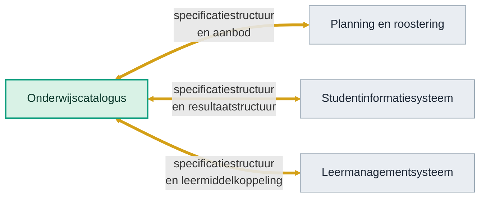

<!-- 1. TITEL -->

  <h1 style="font-size: 2.6rem; line-height: 1.15; margin-bottom: 0.7rem; color: var(--np-ink);">Hoe weten we of we het juiste bouwen?</h1>
  
Veertig jaar technologietrend, en het traject van OKx daarnaast gelegd

  
Niek Derksen &middot; OKx &middot; 4-9-2026

<!--
Geen verdediging maar een onderzoek: welke kant wijst de historie op, en ligt
ons traject op die lijn.
-->

---

<!-- 2. AANLEIDING -->

# Aanleiding

  
Bouwen we geen stoomtrein door koppelvlakken te standaardiseren?

  
Zeker met de opkomst van AI. Hebben we straks geen vliegende auto's?

<!--
De vraag van de opdrachtgever, in twee blokken. Het verhaal eromheen vertel ik:
een standaardisatietraject duurt jaren en de wereld verandert snel; wie in 1995
het perfecte faxprotocol standaardiseerde had gelijk en verloor toch.
-->

---

<!-- 3. CONCLUSIE -->

# Conclusie

Ja, er rijdt een stoomtrein. Wij bouwen de rails, waar de hogesnelheidstrein en de magneettrein ook op passen.

Dat spoor ontwerpen en robuust en flexibel maken is mensenwerk. Daar is OKx op zijn sterkst; AI draagt daar maar beperkt aan bij.

En we leggen het zo vast dat AI er straks los op kan.

stoomtrein

hogesnelheidstrein

magneettrein

wat hierna komt

Dezelfde spoorbreedte, afgesproken in de negentiende eeuw, draagt de trein van vandaag.

<!--
De aanklacht wordt overgenomen in plaats van weersproken. De eerste trein die
erover rijdt is de huidige generatie systemen; de rails gaan langer mee. Bij
navraag over wie de rails legt: OKx ontwerpt de maat en het spoorontwerp,
instellingen en leveranciers leggen hun eigen stuk spoor (U1), en de
standaardisatie loopt via AMIGO onder Edustandaard (AP03).
-->

---

<!-- 4. HOE EEN SYSTEEM GROEIDE -->

# Waarop werkt AI?

Elke golf zette er een laag bij. Geen enkele haalde er een weg.

Jaren 80 en 90

Gebruikersschil

Verwerking

Opslag

Jaren 2000

Gebruikersschil

Verwerking

Opslag

Koppelvlak

Ander systeem

Jaren 2010

Web en mobiel

Verwerking

Opslag

Koppelvlak

Clouddienst

Ander ecosysteem

Nu, met AI

Agent (slaat niets op)

Web en mobiel

Verwerking

Opslag

Koppelvlak

Cloud en andere ecosystemen

<svg viewBox="0 0 960 112" preserveAspectRatio="none" style="width:100%; height:8.6rem;"><path d="M 120 106 C 300 104, 430 102, 550 99 C 660 96, 750 93, 840 89" fill="none" stroke="#94a3b0" stroke-width="5" stroke-linecap="round"/><path d="M 120 108 C 330 107, 480 105, 600 100 C 680 96, 728 88, 764 74 C 800 59, 822 34, 840 3" fill="none" stroke="#E8912B" stroke-width="7" stroke-linecap="round"/><circle cx="840" cy="3" r="10" fill="#E8912B"/><circle cx="840" cy="89" r="7" fill="#94a3b0"/></svg>
koppelingen en datavraagonderdelen in een systeem

<!--
Vier tijdvakken op een plaat, want de geschiedenis is de aanloop en niet het
onderwerp. De lijnen zijn de verhouding, geen meting: onderdelen erbij is
lineair, verbindingen ertussen loopt harder op, en de datavraag van AI komt daar
nog bovenop. Absolute aantallen staan er bewust niet, die zijn niet na te tellen.
-->

---

<!-- 5. WIJ KUNNEN ZO'N GIANT ZIJN -->

# Wat er gebeurde toen de afspraak er kwam

Drie keer bestond de techniek al. Wat ontbrak was de maat.

<strong>Spoorbreedte</strong> Verenigde Staten, 1886

<svg viewBox="0 0 240 80" style="width:100%; height:4.6rem;" preserveAspectRatio="xMidYMid meet"><line x1="10" y1="52" x2="10" y2="74" stroke="#b98b63" stroke-width="4"/><line x1="23" y1="52" x2="23" y2="74" stroke="#b98b63" stroke-width="4"/><line x1="36" y1="52" x2="36" y2="74" stroke="#b98b63" stroke-width="4"/><line x1="49" y1="52" x2="49" y2="74" stroke="#b98b63" stroke-width="4"/><line x1="62" y1="52" x2="62" y2="74" stroke="#b98b63" stroke-width="4"/><line x1="75" y1="52" x2="75" y2="74" stroke="#b98b63" stroke-width="4"/><line x1="88" y1="52" x2="88" y2="74" stroke="#b98b63" stroke-width="4"/><line x1="4" y1="56" x2="96" y2="56" stroke="#5b6670" stroke-width="3"/><line x1="4" y1="70" x2="96" y2="70" stroke="#5b6670" stroke-width="3"/><line x1="150" y1="55" x2="150" y2="71" stroke="#b98b63" stroke-width="4"/><line x1="163" y1="55" x2="163" y2="71" stroke="#b98b63" stroke-width="4"/><line x1="176" y1="55" x2="176" y2="71" stroke="#b98b63" stroke-width="4"/><line x1="189" y1="55" x2="189" y2="71" stroke="#b98b63" stroke-width="4"/><line x1="202" y1="55" x2="202" y2="71" stroke="#b98b63" stroke-width="4"/><line x1="215" y1="55" x2="215" y2="71" stroke="#b98b63" stroke-width="4"/><line x1="228" y1="55" x2="228" y2="71" stroke="#b98b63" stroke-width="4"/><line x1="144" y1="59" x2="236" y2="59" stroke="#5b6670" stroke-width="3"/><line x1="144" y1="67" x2="236" y2="67" stroke="#5b6670" stroke-width="3"/><line x1="120" y1="40" x2="120" y2="78" stroke="#A8481F" stroke-width="2" stroke-dasharray="4 3"/><path d="M96 48 Q120 6 144 48" fill="none" stroke="#8a5a12" stroke-width="2" stroke-dasharray="4 3"/><rect x="108" y="6" width="24" height="18" rx="2" fill="#ffeed9" stroke="#8a5a12" stroke-width="2"/><circle cx="214" cy="22" r="11" fill="#fff" stroke="#A8481F" stroke-width="2"/><path d="M214 16 V22 L219 25" stroke="#A8481F" stroke-width="2" fill="none" stroke-linecap="round"/></svg>
overladen bij elke overgang

de afspraak
&#9654;

<svg viewBox="0 0 240 80" style="width:100%; height:4.6rem;" preserveAspectRatio="xMidYMid meet"><line x1="10" y1="52" x2="10" y2="74" stroke="#b98b63" stroke-width="4"/><line x1="23" y1="52" x2="23" y2="74" stroke="#b98b63" stroke-width="4"/><line x1="36" y1="52" x2="36" y2="74" stroke="#b98b63" stroke-width="4"/><line x1="49" y1="52" x2="49" y2="74" stroke="#b98b63" stroke-width="4"/><line x1="62" y1="52" x2="62" y2="74" stroke="#b98b63" stroke-width="4"/><line x1="75" y1="52" x2="75" y2="74" stroke="#b98b63" stroke-width="4"/><line x1="88" y1="52" x2="88" y2="74" stroke="#b98b63" stroke-width="4"/><line x1="101" y1="52" x2="101" y2="74" stroke="#b98b63" stroke-width="4"/><line x1="114" y1="52" x2="114" y2="74" stroke="#b98b63" stroke-width="4"/><line x1="127" y1="52" x2="127" y2="74" stroke="#b98b63" stroke-width="4"/><line x1="140" y1="52" x2="140" y2="74" stroke="#b98b63" stroke-width="4"/><line x1="153" y1="52" x2="153" y2="74" stroke="#b98b63" stroke-width="4"/><line x1="166" y1="52" x2="166" y2="74" stroke="#b98b63" stroke-width="4"/><line x1="179" y1="52" x2="179" y2="74" stroke="#b98b63" stroke-width="4"/><line x1="192" y1="52" x2="192" y2="74" stroke="#b98b63" stroke-width="4"/><line x1="205" y1="52" x2="205" y2="74" stroke="#b98b63" stroke-width="4"/><line x1="218" y1="52" x2="218" y2="74" stroke="#b98b63" stroke-width="4"/><line x1="231" y1="52" x2="231" y2="74" stroke="#b98b63" stroke-width="4"/><line x1="4" y1="56" x2="236" y2="56" stroke="#5b6670" stroke-width="3"/><line x1="4" y1="70" x2="236" y2="70" stroke="#5b6670" stroke-width="3"/><rect x="86" y="26" width="68" height="26" rx="3" fill="#d9f5ec" stroke="#0E9E7E" stroke-width="2"/><path d="M160 39 H206" stroke="#0E9E7E" stroke-width="3"/><path d="M200 33 L208 39 L200 45 Z" fill="#0E9E7E"/></svg>
doorgaand over het hele net

<strong>Zeecontainer</strong> ISO, jaren 60

<svg viewBox="0 0 240 80" style="width:100%; height:4.6rem;" preserveAspectRatio="xMidYMid meet"><line x1="4" y1="72" x2="236" y2="72" stroke="#5b6670" stroke-width="3"/><rect x="10" y="48" width="34" height="22" rx="2" fill="#eef4fa" stroke="#5b6670" stroke-width="2"/><rect x="48" y="56" width="22" height="14" rx="2" fill="#eef4fa" stroke="#5b6670" stroke-width="2"/><rect x="74" y="42" width="28" height="28" rx="2" fill="#eef4fa" stroke="#5b6670" stroke-width="2"/><rect x="150" y="52" width="26" height="18" rx="2" fill="#eef4fa" stroke="#5b6670" stroke-width="2"/><rect x="180" y="44" width="32" height="26" rx="2" fill="#eef4fa" stroke="#5b6670" stroke-width="2"/><rect x="216" y="58" width="18" height="12" rx="2" fill="#eef4fa" stroke="#5b6670" stroke-width="2"/><line x1="120" y1="6" x2="120" y2="30" stroke="#5b6670" stroke-width="3"/><line x1="104" y1="6" x2="136" y2="6" stroke="#5b6670" stroke-width="3"/><line x1="120" y1="30" x2="120" y2="38" stroke="#8a5a12" stroke-width="2" stroke-dasharray="3 3"/><rect x="108" y="38" width="24" height="18" rx="2" fill="#ffeed9" stroke="#8a5a12" stroke-width="2"/><circle cx="214" cy="20" r="11" fill="#fff" stroke="#A8481F" stroke-width="2"/><path d="M214 14 V20 L219 23" stroke="#A8481F" stroke-width="2" fill="none" stroke-linecap="round"/></svg>
elke rederij een eigen maat

de afspraak
&#9654;

<svg viewBox="0 0 240 80" style="width:100%; height:4.6rem;" preserveAspectRatio="xMidYMid meet"><line x1="4" y1="72" x2="236" y2="72" stroke="#5b6670" stroke-width="3"/><rect x="14" y="48" width="30" height="22" rx="2" fill="#d9f5ec" stroke="#0E9E7E" stroke-width="2"/><rect x="48" y="48" width="30" height="22" rx="2" fill="#d9f5ec" stroke="#0E9E7E" stroke-width="2"/><rect x="82" y="48" width="30" height="22" rx="2" fill="#d9f5ec" stroke="#0E9E7E" stroke-width="2"/><rect x="150" y="48" width="30" height="22" rx="2" fill="#d9f5ec" stroke="#0E9E7E" stroke-width="2"/><rect x="184" y="48" width="30" height="22" rx="2" fill="#d9f5ec" stroke="#0E9E7E" stroke-width="2"/><line x1="128" y1="6" x2="128" y2="26" stroke="#5b6670" stroke-width="3"/><line x1="112" y1="6" x2="144" y2="6" stroke="#5b6670" stroke-width="3"/><rect x="113" y="26" width="30" height="22" rx="2" fill="#d9f5ec" stroke="#0E9E7E" stroke-width="2"/><path d="M150 16 H196" stroke="#0E9E7E" stroke-width="3"/><path d="M190 10 L198 16 L190 22 Z" fill="#0E9E7E"/></svg>
past op schip, trein en truck

<strong>TCP/IP</strong> jaren 80

<svg viewBox="0 0 240 80" style="width:100%; height:4.6rem;" preserveAspectRatio="xMidYMid meet"><rect x="6" y="28" width="86" height="40" rx="5" fill="#eef4fa" stroke="#5b6670" stroke-width="2"/><path d="M92 38 L106 33 L106 63 L92 58 Z" fill="#eef4fa" stroke="#5b6670" stroke-width="2"/><rect x="148" y="28" width="86" height="40" rx="5" fill="#eef4fa" stroke="#5b6670" stroke-width="2"/><path d="M148 38 a10 10 0 0 0 0 20 Z" fill="#fff" stroke="#5b6670" stroke-width="2"/><circle cx="126" cy="48" r="13" fill="#ffeed9" stroke="#8a5a12" stroke-width="2"/><circle cx="126" cy="48" r="4" fill="#fff" stroke="#8a5a12" stroke-width="2"/><line x1="126" y1="48" x2="143.0" y2="48.0" stroke="#8a5a12" stroke-width="3"/><line x1="126" y1="48" x2="134.5" y2="62.722431864335455" stroke="#8a5a12" stroke-width="3"/><line x1="126" y1="48" x2="117.5" y2="62.72243186433546" stroke="#8a5a12" stroke-width="3"/><line x1="126" y1="48" x2="109.0" y2="48.0" stroke="#8a5a12" stroke-width="3"/><line x1="126" y1="48" x2="117.5" y2="33.27756813566455" stroke="#8a5a12" stroke-width="3"/><line x1="126" y1="48" x2="134.5" y2="33.277568135664545" stroke="#8a5a12" stroke-width="3"/><circle cx="216" cy="16" r="11" fill="#fff" stroke="#A8481F" stroke-width="2"/><path d="M216 10 V16 L221 19" stroke="#A8481F" stroke-width="2" fill="none" stroke-linecap="round"/></svg>
per koppeling een vertaalslag

de afspraak
&#9654;

<svg viewBox="0 0 240 80" style="width:100%; height:4.6rem;" preserveAspectRatio="xMidYMid meet"><rect x="6" y="28" width="98" height="40" rx="5" fill="#d9f5ec" stroke="#0E9E7E" stroke-width="2"/><rect x="136" y="28" width="98" height="40" rx="5" fill="#d9f5ec" stroke="#0E9E7E" stroke-width="2"/><rect x="104" y="42" width="32" height="12" fill="#d9f5ec" stroke="#0E9E7E" stroke-width="2"/><path d="M40 14 H190" stroke="#0E9E7E" stroke-width="3"/><path d="M184 8 L192 14 L184 20 Z" fill="#0E9E7E"/></svg>
netwerken lezen elkaar

Overladen kost tijd, en tijd is waar de groei op stukliep. <strong style="color:#0E9E7E;">AI komt straks op zulke afspraken te staan. Wij kunnen die afspraak zijn.</strong>

<!--
Bewust geen groeigrafiek van spoorwegen naast het BNP. Fogel prikte dat verband
in 1964 door en kwam op ongeveer drie procent; die claim houdt geen tegenspraak.
Wat wel houdt is de maatvoering: het spoor lag er al, de afspraak kwam erbij, en
pas daarna reed er iets doorheen. Tegenwerping om voor te zijn: spoorbreedte is
in de literatuur het schoolvoorbeeld van padafhankelijkheid, en in Spanje,
Rusland, India en Ierland werd de vroege maat juist het probleem. Het antwoord
staat op de risicoslide: wie de eis alleen in een techniek vastlegt zit vast,
wie de eis los vastlegt niet.
-->

---

<!-- 6. WAT ALS AI ALLES ANDERS DOET -->

# Maar wat als AI alles anders gaat doen?

Overal ligt ander spoor
<svg viewBox="0 0 240 96" style="width:100%; height:5.4rem;" preserveAspectRatio="xMidYMid meet"><line x1="10" y1="12" x2="10" y2="36" stroke="#b98b63" stroke-width="4"/><line x1="23" y1="12" x2="23" y2="36" stroke="#b98b63" stroke-width="4"/><line x1="36" y1="12" x2="36" y2="36" stroke="#b98b63" stroke-width="4"/><line x1="49" y1="12" x2="49" y2="36" stroke="#b98b63" stroke-width="4"/><line x1="62" y1="12" x2="62" y2="36" stroke="#b98b63" stroke-width="4"/><line x1="75" y1="12" x2="75" y2="36" stroke="#b98b63" stroke-width="4"/><line x1="4" y1="16" x2="78" y2="16" stroke="#5b6670" stroke-width="3"/><line x1="4" y1="32" x2="78" y2="32" stroke="#5b6670" stroke-width="3"/><line x1="102" y1="46" x2="102" y2="64" stroke="#b98b63" stroke-width="4"/><line x1="115" y1="46" x2="115" y2="64" stroke="#b98b63" stroke-width="4"/><line x1="128" y1="46" x2="128" y2="64" stroke="#b98b63" stroke-width="4"/><line x1="141" y1="46" x2="141" y2="64" stroke="#b98b63" stroke-width="4"/><line x1="154" y1="46" x2="154" y2="64" stroke="#b98b63" stroke-width="4"/><line x1="167" y1="46" x2="167" y2="64" stroke="#b98b63" stroke-width="4"/><line x1="96" y1="50" x2="170" y2="50" stroke="#5b6670" stroke-width="3"/><line x1="96" y1="60" x2="170" y2="60" stroke="#5b6670" stroke-width="3"/><line x1="156" y1="74" x2="156" y2="96" stroke="#b98b63" stroke-width="4"/><line x1="169" y1="74" x2="169" y2="96" stroke="#b98b63" stroke-width="4"/><line x1="182" y1="74" x2="182" y2="96" stroke="#b98b63" stroke-width="4"/><line x1="195" y1="74" x2="195" y2="96" stroke="#b98b63" stroke-width="4"/><line x1="208" y1="74" x2="208" y2="96" stroke="#b98b63" stroke-width="4"/><line x1="221" y1="74" x2="221" y2="96" stroke="#b98b63" stroke-width="4"/><line x1="234" y1="74" x2="234" y2="96" stroke="#b98b63" stroke-width="4"/><line x1="150" y1="78" x2="236" y2="78" stroke="#5b6670" stroke-width="3"/><line x1="150" y1="92" x2="236" y2="92" stroke="#5b6670" stroke-width="3"/><line x1="86" y1="10" x2="86" y2="38" stroke="#A8481F" stroke-width="2" stroke-dasharray="4 3"/><line x1="178" y1="44" x2="178" y2="66" stroke="#A8481F" stroke-width="2" stroke-dasharray="4 3"/><line x1="140" y1="72" x2="140" y2="96" stroke="#A8481F" stroke-width="2" stroke-dasharray="4 3"/></svg>
Elke instelling en elke leverancier legt zijn eigen maat.

Wij ontwerpen de afspraak
<svg viewBox="0 0 240 96" style="width:100%; height:5.4rem;" preserveAspectRatio="xMidYMid meet"><line x1="10" y1="36" x2="10" y2="70" stroke="#b98b63" stroke-width="4"/><line x1="23" y1="36" x2="23" y2="70" stroke="#b98b63" stroke-width="4"/><line x1="36" y1="36" x2="36" y2="70" stroke="#b98b63" stroke-width="4"/><line x1="49" y1="36" x2="49" y2="70" stroke="#b98b63" stroke-width="4"/><line x1="62" y1="36" x2="62" y2="70" stroke="#b98b63" stroke-width="4"/><line x1="75" y1="36" x2="75" y2="70" stroke="#b98b63" stroke-width="4"/><line x1="88" y1="36" x2="88" y2="70" stroke="#b98b63" stroke-width="4"/><line x1="101" y1="36" x2="101" y2="70" stroke="#b98b63" stroke-width="4"/><line x1="114" y1="36" x2="114" y2="70" stroke="#b98b63" stroke-width="4"/><line x1="127" y1="36" x2="127" y2="70" stroke="#b98b63" stroke-width="4"/><line x1="140" y1="36" x2="140" y2="70" stroke="#b98b63" stroke-width="4"/><line x1="153" y1="36" x2="153" y2="70" stroke="#b98b63" stroke-width="4"/><line x1="166" y1="36" x2="166" y2="70" stroke="#b98b63" stroke-width="4"/><line x1="179" y1="36" x2="179" y2="70" stroke="#b98b63" stroke-width="4"/><line x1="192" y1="36" x2="192" y2="70" stroke="#b98b63" stroke-width="4"/><line x1="205" y1="36" x2="205" y2="70" stroke="#b98b63" stroke-width="4"/><line x1="218" y1="36" x2="218" y2="70" stroke="#b98b63" stroke-width="4"/><line x1="231" y1="36" x2="231" y2="70" stroke="#b98b63" stroke-width="4"/><line x1="4" y1="40" x2="236" y2="40" stroke="#0E9E7E" stroke-width="3"/><line x1="4" y1="66" x2="236" y2="66" stroke="#0E9E7E" stroke-width="3"/><line x1="46" y1="40" x2="46" y2="66" stroke="#A8481F" stroke-width="2"/><path d="M42 46 L46 40 L50 46" fill="none" stroke="#A8481F" stroke-width="2"/><path d="M42 60 L46 66 L50 60" fill="none" stroke="#A8481F" stroke-width="2"/><path d="M196 86 q30 0 30 -24" fill="none" stroke="#0E9E7E" stroke-width="3" stroke-dasharray="5 4"/></svg>
breedtebochtenonderhouduitbouw

Wij leggen vast hoe die maat werkt.

AI bouwt om, veel sneller

Agent
<svg viewBox="0 0 240 96" style="width:100%; height:5.4rem;" preserveAspectRatio="xMidYMid meet"><line x1="10" y1="42" x2="10" y2="60" stroke="#b98b63" stroke-width="4"/><line x1="23" y1="42" x2="23" y2="60" stroke="#b98b63" stroke-width="4"/><line x1="36" y1="42" x2="36" y2="60" stroke="#b98b63" stroke-width="4"/><line x1="49" y1="42" x2="49" y2="60" stroke="#b98b63" stroke-width="4"/><line x1="62" y1="42" x2="62" y2="60" stroke="#b98b63" stroke-width="4"/><line x1="75" y1="42" x2="75" y2="60" stroke="#b98b63" stroke-width="4"/><line x1="88" y1="42" x2="88" y2="60" stroke="#b98b63" stroke-width="4"/><line x1="4" y1="46" x2="96" y2="46" stroke="#5b6670" stroke-width="3"/><line x1="4" y1="56" x2="96" y2="56" stroke="#5b6670" stroke-width="3"/><line x1="138" y1="36" x2="138" y2="70" stroke="#b98b63" stroke-width="4"/><line x1="151" y1="36" x2="151" y2="70" stroke="#b98b63" stroke-width="4"/><line x1="164" y1="36" x2="164" y2="70" stroke="#b98b63" stroke-width="4"/><line x1="177" y1="36" x2="177" y2="70" stroke="#b98b63" stroke-width="4"/><line x1="190" y1="36" x2="190" y2="70" stroke="#b98b63" stroke-width="4"/><line x1="203" y1="36" x2="203" y2="70" stroke="#b98b63" stroke-width="4"/><line x1="216" y1="36" x2="216" y2="70" stroke="#b98b63" stroke-width="4"/><line x1="229" y1="36" x2="229" y2="70" stroke="#b98b63" stroke-width="4"/><line x1="132" y1="40" x2="236" y2="40" stroke="#0E9E7E" stroke-width="3"/><line x1="132" y1="66" x2="236" y2="66" stroke="#0E9E7E" stroke-width="3"/><rect x="98" y="30" width="32" height="46" rx="4" fill="#ffeed9" stroke="#8a5a12" stroke-width="2"/><path d="M104 53 H124" stroke="#8a5a12" stroke-width="3"/><path d="M119 47 L126 53 L119 59 Z" fill="#8a5a12"/><circle cx="212" cy="18" r="12" fill="#fff" stroke="#0E9E7E" stroke-width="2"/><path d="M212 11 V18 L217 21" stroke="#0E9E7E" stroke-width="2" fill="none" stroke-linecap="round"/><path d="M188 12 V24" stroke="#0E9E7E" stroke-width="3"/><path d="M183 20 L188 26 L193 20 Z" fill="#0E9E7E"/></svg>
Omspoorwerk dat mensenwerk was, wordt machinewerk.

<strong style="color:#A8481F;">Wat AI niet overneemt</strong>: komen tot een afspraak, en de verantwoordelijkheid dragen voor die afspraak.

OKx is die afspraak. AI rijdt erover, maar legt hem niet.

Mensen maken de afspraak. Systemen en agents gebruiken hem.

<!--
Hier valt de tegenwerping van de vliegende trein om: ook wie vliegt heeft een
afspraak nodig, en de luchtvaart is strenger gestandaardiseerd dan het spoor.
AI verandert niet of er een maat nodig is, maar hoe snel iedereen erop
overgaat. De grens zit niet in wat AI snapt maar in wat AI mag: een afspraak
tussen instellingen bindt rechtspersonen, en een agent kan daar niet aan
gehouden worden. Een diploma blijft een rechtsfeit. Daarom telt machine-interpreteerbaar, en daarom telt borging.
-->

---

<!-- 7. WAAR OKX ZIT -->

# Wat OKx doet

Van al die stromen leggen we er nu drie vast, tussen vier systemen.

Onderwijsspecificatie

Wat een opleiding inhoudt, uitgedrukt in leeruitkomsten

Onderwijsaanbod

Wanneer het draait, hoeveel plekken, met wie

Onderwijsverbintenis

Welke relatie een student met dat aanbod heeft

Onderwijsresultaat

Wat die student heeft behaald

Vier begrippen die in elk systeem hetzelfde moeten betekenen. Anders kan een student niet kiezen, inschrijven, leren en een resultaat halen over die systemen heen.

<!--
De gouden lijnen zijn het werk: drie koppelingen op een koppelvlak, dat van de
onderwijscatalogus. De vier begrippen eronder zijn waar het echt over gaat;
de koppeling is het vervoermiddel, de betekenis is de lading.
-->

---

<!-- 8. WAT DE AFSPRAAK OP GANG BRENGT -->

# Wat de afspraak op gang brengt

Boven wat er gebeurt, onder wat AI eraan toevoegt

<svg viewBox="0 0 960 120" preserveAspectRatio="none" style="width:100%; height:100%;"><line x1="120" y1="0" x2="120" y2="120" stroke="#d5dee7" stroke-width="1" stroke-dasharray="3 4"/><line x1="360" y1="0" x2="360" y2="120" stroke="#d5dee7" stroke-width="1" stroke-dasharray="3 4"/><line x1="600" y1="0" x2="600" y2="120" stroke="#d5dee7" stroke-width="1" stroke-dasharray="3 4"/><line x1="840" y1="0" x2="840" y2="120" stroke="#d5dee7" stroke-width="1" stroke-dasharray="3 4"/><path d="M 16 115 C 260 114, 440 112, 620 108 C 680 106, 715 103, 742 97 C 800 84, 852 46, 928 5 L 928 120 L 16 120 Z" fill="#E8912B" opacity="0.14"/><path d="M 16 115 C 260 114, 440 112, 620 108 C 680 106, 715 103, 742 97 C 800 84, 852 46, 928 5" fill="none" stroke="#E8912B" stroke-width="6" stroke-linecap="round"/><circle cx="928" cy="5" r="10" fill="#E8912B"/></svg>
impact en doorontwikkeling

exponenti&euml;le groei

1

De afspraak maken

mensenwerk

AI

sneller en meer vastleggen

&#9654;

2

Systemen implementeren

leveranciers

AI

koppeling grotendeels genereren en bouwen

&#9654;

3

Meer informatie uitgewisseld

het landschap

AI

hogere datadichtheid om mee te werken

&#9654;

4

Nieuwe toepassingen

de sector

AI

niet alleen gebouwd <em>met</em> AI, maar bedacht <em>door</em> AI

<strong style="color: #E8912B;">De echte winst komt in fase 4</strong>: functionaliteit die niet alleen met AI wordt gebouwd, maar door AI wordt bedacht, uit datagedreven en geextrapoleerd inzicht binnen gekoppelde ecosystemen. Daarvoor is eenduidige betekenis nodig: minder interpretatieruimte, minder hallucinatie.

<!--
De curve is de boodschap: fase 1 tot 3 leveren gestage winst, fase 4 is waar
het door het dak gaat. Daar bouwt AI niet alleen wat wij bedenken, maar komt
het zelf met de volgende toepassing op basis van wat de gekoppelde data laat
zien. De afspraak zelf blijft mensenwerk; alles daarna versnelt.
-->

---

<!-- 9. WAT DAT MOGELIJK MAAKT -->

# Wat dat straks mogelijk maakt

  

    
Onderwijsontwerp

vraag naast aanbod

    

Ons aanbod in leeruitkomsten

Gevraagde vaardigheden uit de markt

    
&#9660;

    
Agent

    
&#9660;

    
Waar sluit ons aanbod niet aan op de markt, en wat ontwikkelen we bij

  

  

    
Ori&euml;ntatie en leerroute

tussen instellingen en sectoren

    

Behaalde en gewenste leeruitkomsten

Aanbod van meerdere instellingen

    
&#9660;

    
Agent

    
&#9660;

    
Welke volgende stap past bij jouw doelen, ook bij een andere instelling

  

  

    
Lesopzet

binnen de instelling

    

Onderwijsspecificatie

Leermiddelen in het LMS

    
&#9660;

    
Agent

    
&#9660;

    
Een concept-lesopzet bij de specificatie

  

<strong>Drie schalen, hetzelfde raamwerk eronder.</strong> OKx bouwt deze dingen niet zelf, maar haalt de blokkade weg waar ze nu op stuklopen. <strong style="color:#A8481F;">Dat is de katalysatorrol.</strong>

<!--
Drie gevallen, elk met dezelfde vorm: bronnen, agent, resultaat. Wat verschilt
is de schaal waarop vergeleken wordt: vraag naast aanbod, tussen instellingen
en over mbo, hbo en wo heen, en binnen een instelling. Wat gelijk blijft is de
sleutel eronder. Zonder dat raamwerk moet elke vergelijking apart gebouwd
worden, met raamwerk is het telkens dezelfde beweging.
-->

---

<!-- 10. WAAR ZETTEN WE OP IN -->

# Wat wij leveren, en wat AI daarmee kan

Onze bijdrage zit niet in de koppeling, maar in de betekenis eronder

Eenduidig vastgelegd

Elk systeem weet wat het van een ander kan verwachten, en wat het betekent.

OC

SIS

LMS

<svg viewBox="0 0 200 20" preserveAspectRatio="none" style="width:100%; height:0.9rem;"><path d="M33 0 V7 H100 V20" fill="none" stroke="#0E9E7E" stroke-width="2"/><path d="M100 0 V20" fill="none" stroke="#0E9E7E" stroke-width="2"/><path d="M167 0 V7 H100 V20" fill="none" stroke="#0E9E7E" stroke-width="2"/></svg>
dezelfde betekenis

&#9654;

Machine-interpreteerbaar

Die betekenis leggen we vast in een vorm die een agent kan lezen.

<svg viewBox="0 0 52 60" style="width:1.9rem; height:2.2rem;"><rect x="6" y="4" width="40" height="52" rx="3" fill="#fff" stroke="#5b6670" stroke-width="2"/><rect x="12" y="12" width="28" height="4" rx="2" fill="#2E86C1"/><line x1="12" y1="26" x2="40" y2="26" stroke="#94a3b0" stroke-width="2"/><line x1="12" y1="34" x2="40" y2="34" stroke="#94a3b0" stroke-width="2"/><line x1="12" y1="42" x2="32" y2="42" stroke="#94a3b0" stroke-width="2"/></svg>&#123;&nbsp;&#125;&#9654;<svg viewBox="0 0 40 52" style="width:1.5rem; height:2rem;"><line x1="20" y1="4" x2="20" y2="12" stroke="#5b6670" stroke-width="2"/><circle cx="20" cy="4" r="3" fill="#5b6670"/><rect x="6" y="12" width="28" height="22" rx="5" fill="#fff" stroke="#5b6670" stroke-width="2"/><circle cx="15" cy="23" r="3" fill="#5b6670"/><circle cx="25" cy="23" r="3" fill="#5b6670"/><rect x="10" y="38" width="20" height="10" rx="2" fill="#fff" stroke="#5b6670" stroke-width="2"/></svg>

&#9654;

Sneller uitwerken

Met AI erbij gaat het uitwerken sneller en completer.

AImeedenkensamenvattenvoorstelvoorbeeld

<svg viewBox="0 0 960 46" preserveAspectRatio="none" style="width:100%; height:100%;"><path d="M820 2 V26 H130 V8" fill="none" stroke="#94a3b0" stroke-width="3" stroke-dasharray="7 5"/><path d="M122 14 L130 2 L138 14 Z" fill="#94a3b0"/></svg>
en elke ronde levert sneller een voorstel waarover mensen kunnen besluiten

<strong style="color:#0E9E7E;">Elke ronde maakt de volgende sneller.</strong> De afspraak zelf blijft mensenwerk; AI versnelt het werk eromheen.

<!--
Een lus in plaats van drie losse pijlers: eenduidige betekenis maakt
machine-interpreteerbaar vastleggen mogelijk, dat maakt het uitwerken sneller en
completer, en dat brengt de volgende afspraak eerder binnen bereik. De laatste
pijl is bewust voorzichtig geformuleerd: AI levert sneller een voorstel, mensen
maken er een afspraak van. Anders spreekt deze slide de vorige tegen.
-->

---

<!-- 11. RISICO'S -->

# Twee risico's uitgelicht

De afspraak komt te laat

De praktijk koppelt al. En de techniek wisselt mogelijk zo snel dat er geen tijd is om ertussen te bouwen.

<svg viewBox="0 0 240 62" style="width:100%; height:2.6rem;" preserveAspectRatio="xMidYMid meet"><rect x="6" y="20" width="66" height="28" rx="3" fill="#eef4fa" stroke="#94a3b0" stroke-width="2"/><rect x="168" y="20" width="66" height="28" rx="3" fill="#eef4fa" stroke="#94a3b0" stroke-width="2"/><path d="M72 34 q14 -12 28 0 t28 0 t28 0 t12 0" fill="none" stroke="#8a5a12" stroke-width="3" stroke-dasharray="5 4"/><circle cx="120" cy="12" r="10" fill="#fff" stroke="#C0392B" stroke-width="2"/><path d="M120 5 V12 L125 15" stroke="#C0392B" stroke-width="2" fill="none" stroke-linecap="round"/></svg>
Zolang de afspraak er niet is, knoopt de praktijk het zelf aan elkaar

Wat we al doen

&bull;Platform staat, er wordt op gebouwd

&bull;60 issues in Public, van acht auteurs

&bull;Eerste leverancier haakt aan

De eis bestaat straks alleen nog in OEAPI-vorm

Het uitgangspunt is OEAPI, tenzij. Het risico is niet die keuze, maar dat de eis erachter nergens los is opgeschreven.

Dan leg je de maat vast in een spoortype, in plaats van in de maat zelf.

<svg viewBox="0 0 40 52" style="width:1.7rem; height:2.2rem;"><circle cx="20" cy="14" r="9" fill="#fff" stroke="#5b6670" stroke-width="2"/><path d="M5 48 a15 15 0 0 1 30 0" fill="#fff" stroke="#5b6670" stroke-width="2"/></svg>?<svg viewBox="0 0 52 60" style="width:2.2rem; height:2.5rem;"><rect x="6" y="4" width="40" height="52" rx="3" fill="#fff" stroke="#5b6670" stroke-width="2"/><rect x="12" y="12" width="28" height="4" rx="2" fill="#8a5a12"/><line x1="12" y1="26" x2="40" y2="26" stroke="#94a3b0" stroke-width="2"/><line x1="12" y1="34" x2="40" y2="34" stroke="#94a3b0" stroke-width="2"/><line x1="12" y1="42" x2="32" y2="42" stroke="#94a3b0" stroke-width="2"/></svg>?<svg viewBox="0 0 40 52" style="width:1.7rem; height:2.2rem;"><line x1="20" y1="4" x2="20" y2="12" stroke="#5b6670" stroke-width="2"/><circle cx="20" cy="4" r="3" fill="#5b6670"/><rect x="6" y="12" width="28" height="22" rx="5" fill="#fff" stroke="#5b6670" stroke-width="2"/><circle cx="15" cy="23" r="3" fill="#5b6670"/><circle cx="25" cy="23" r="3" fill="#5b6670"/><rect x="10" y="38" width="20" height="10" rx="2" fill="#fff" stroke="#5b6670" stroke-width="2"/></svg>

De eis staat nergens los: mens noch machine kan nalezen wat er bedoeld is

Wat we al doen

&bull;Uitlijnen met MORA en HORA

&bull;OKx-kader in het businesskader

&bull;Wat bouwen we, voor wie, onder welke omstandigheden

?Zien jullie nog andere risico's?

<!--
Twee uitgelicht, niet de hele lijst: dit zijn de twee die met deze vraag te
maken hebben, en de vraag rechtsonder haalt op wat er in de zaal leeft.
Het tweede risico is de vraag van de opdrachtgever, maar dan van binnenuit: het
vastlopen ontstaat niet door de techniekkeuze, maar doordat de eis alleen nog in
de vorm van die techniek bestaat. Bij een nieuwe versie of een ander protocol
begint het specificeren dan opnieuw. Bij navraag: AP09 vraagt minimaal twee
instellingen en twee leveranciers voordat iets richting standaard gaat. Die
drempel is nog niet gehaald, en 40 van de 60 issues komen van een auteur.
-->

---

<!-- 11a. HOE EEN AGENT MET EEN KOPPELVLAK PRAAT -->

# Hoe een agent met een koppelvlak praat

1

Mens

Stelt een vraag in gewone taal: <em>regel mijn inschrijving</em>

&#8594;

2

Agent

Een AI die niet alleen antwoordt maar handelt, en zelf kiest welk gereedschap hij nodig heeft

&#8594;

3

Gereedschapskist

Functies met een beschrijving in gewone taal: <em>inschrijven</em>, <em>rooster ophalen</em>. Alleen hiermee kan de agent iets doen

&#8594;

4

Koppelvlak

Hetzelfde endpoint dat een website of app ook gebruikt

&#8594;

5

Systeem

Onderwijscatalogus, SIS, rooster

&#8592; het antwoord loopt dezelfde weg terug, en de agent vertelt wat er geregeld is

<strong>MCP is de afspraak over stap 3.</strong> Het Model Context Protocol legt vast hoe een gereedschapskist wordt aangeboden, zodat elke agent hem kan gebruiken, of het nu Claude, ChatGPT of Copilot is. <strong style="color:#0E9E7E;">Straks een verdiepende set afspraken voor agents, bovenop de basis die OKx nu legt.</strong>

<!--
Uitleg voor wie MCP niet kent. Vijf stappen, van links naar rechts, en het antwoord loopt
terug. Het punt voor een bestuurder: een agent kan alleen handelen met gereedschap dat hem
is aangereikt, en dat gereedschap gebruikt onder de motorkap gewoon het koppelvlak. MCP
verandert dus niets aan wat OKx afspreekt; het is straks een verdiepende set afspraken en
duiding voor agents, bovenop de basis die OKx nu legt.
Bron: modelcontextprotocol.io. MCP is een open standaard, in november 2024 gestart door
Anthropic. Een server biedt tools (uitvoerbare functies), resources (gegevens als context) en
prompts aan; een host zoals Claude, ChatGPT of een eigen applicatie verbindt ermee en laat een
model ze gebruiken. In de spec heet de gereedschapskist "tools"; "gereedschapskist" is de
vertaling uit de teammeeting van 9 september.
-->

---

<!-- 11b. MCP -->

# MCP: een gereedschapskist op het koppelvlak

Nu: REST

een endpoint per vraag

Student

&#9660;

Website of app

&#9660;

Endpoint

&#9660;

Specificatie van een school ophalen

Zo werken scholen nu. Hier begint OKx.

Straks: MCP

een gereedschapskist bovenop het koppelvlak

Student

&#9660;

Agent

&#9660;

Specificatie ophalen

Inschrijven

Rooster ophalen

&#9660;

Dezelfde endpoints als links

"Ik moet 1 september beginnen met studeren, ik heb een studie gekozen. Zorg dat alles geregeld is."

<strong>Dezelfde afspraak, een laag erbovenop.</strong> De agent gebruikt via MCP dezelfde koppelvlakken; omdat de betekenis los staat van de techniek is die laag een vervolg, geen herontwerp. <strong style="color:#0E9E7E;">Nog niet in de bouwfase; wel klaar zodra instellingen erom vragen.</strong>

<!--
Toegevoegd op verzoek van Hans na de teammeeting van 9 september, om mee te nemen binnen Npuls.
Bron: de discussie in die meeting na de risico's. Garik: "Wij gaan nu wel een beetje hard in op
REST-endpoints. En ik zie dat wel clashen met bijvoorbeeld MCP straks. Misschien is het handig om
niet REST-endpoints te noemen, maar meer functies. Om AI-proof te zijn, maar ook techniek-proof."
Antwoord: MCP, het Model Context Protocol, stelt een gereedschapskist beschikbaar aan een agent zoals Claude of ChatGPT, die daar handelingen mee verricht: niet alleen
de specificatie ophalen, maar inschrijven en het rooster ophalen. We beginnen met REST omdat scholen
nu zo functioneren; de vraag "kunnen we dit ook voor MCP doen" gaat komen, ook voor agentic
koppelingen. Nog niet in de bouwfase opnemen: de cyclus is of instellingen dit willen en er geld
voor beschikbaar stellen, dan bouwen leveranciers het. Juist omdat de businesskant los staat van
de techniekkant is die vertaling later goed te maken. Hans vatte samen: zo techniekonafhankelijk
mogelijk voorbereiden, want de twintig procent die we nog niet kunnen inschatten komt.
Een nuance ten opzichte van de meeting: MCP komt niet in plaats van de endpoints maar erbovenop.
Een MCP-server vertaalt de aanroep van een tool naar de onderliggende koppelvlakken; het
koppelvlak blijft dus nodig (bron: modelcontextprotocol.io, architectuur).
Dit is de derde conclusiezin uitgewerkt: we leggen het zo vast dat AI er straks los op kan.
-->

---

<!-- 12. CONCLUSIE HERHAALD -->

# Conclusie

Ja, er rijdt een stoomtrein. Wij bouwen de rails, waar de hogesnelheidstrein en de magneettrein ook op passen.

Dat spoor ontwerpen en robuust en flexibel maken is mensenwerk. Daar is OKx op zijn sterkst; AI draagt daar maar beperkt aan bij.

En we leggen het zo vast dat AI er straks los op kan.

stoomtrein

hogesnelheidstrein

magneettrein

wat hierna komt

<!--
Dezelfde drie regels als aan het begin, zodat het deck sluit waar het opende.
Het paarse blok haalt de vraag van de vorige slide terug in een zin, zodat de
laatste inhoudelijke plaat de conclusie en de vraag tegelijk draagt.
-->

---

<!-- 13. VRAGEN -->

# Is de hoofdvraag beantwoord?

Bouwen we geen stoomtrein door koppelvlakken te standaardiseren? Zeker met de opkomst van AI. Hebben we straks geen vliegende auto's?

?

?

?

?

En wat is er nog niet beantwoord?

<!--
De vraag van de opdrachtgever staat er nog een keer, zodat de zaal kan toetsen
of het deck hem beantwoordt. Geen besluit gevraagd in deze ronde; de vraag over
richting en capaciteit komt in een apart gesprek.
-->

---

<!-- 14. AFSLUITER -->

<!--
Einde. Npuls-afsluiter met logo en licentie.
-->
