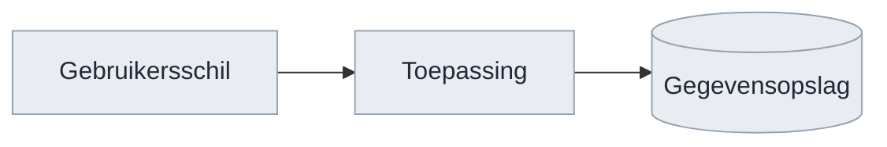
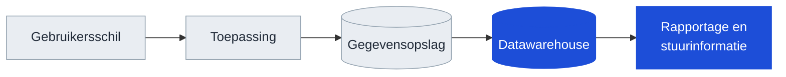
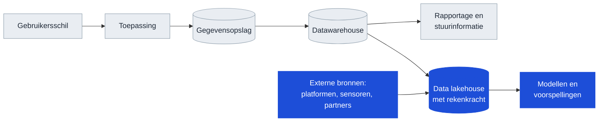
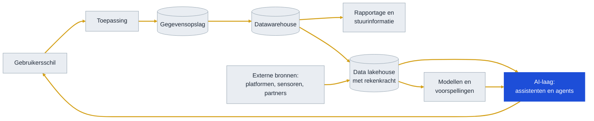

<!-- 1. TITEL -->

  <h1 style="font-size: 2.6rem; line-height: 1.15; margin-bottom: 0.7rem; color: var(--np-ink);">Bouwen we het verkeerde?</h1>
  
Geen koerswijziging in de richting, wel een keuze over welke gaten voor v0.1.0 dicht moeten

  
Niek Derksen &middot; OKx &middot; 4-9-2026

<!--
De vraag komt van de opdrachtgever: bouwen we een stoomtrein terwijl de
AI-ontwikkeling straks om vliegtuigen vraagt. De ondertitel is het antwoord.
Twee besluiten aan het eind; die zijn het doel van dit gesprek.
-->

---

<!-- 2. AANLEIDING -->

# Aanleiding

De opdrachtgever stelde een vraag die het waard is om serieus te nemen.

Bouwen we geen stoomtrein door koppelvlakken te standaardiseren? Zeker met de opkomst van AI. Hebben we straks geen vliegende auto's?

Achter die vraag zit een reele zorg: een standaardisatietraject duurt jaren, en de wereld eromheen verandert sneller dan ooit. Wie in 1995 het perfecte faxprotocol standaardiseerde, had gelijk en verloor toch.

Dit deck beantwoordt de vraag in twee stappen. Eerst wat AI werkelijk doet met een IT-ecosysteem, aan de hand van dertig jaar lagen die erbij kwamen. Daarna waar OKx in dat beeld staat.

<!--
Kort houden en de vraag laten staan zoals hij gesteld is. Niet meteen
verdedigen; de zorg is terecht. Het faxvoorbeeld maakt duidelijk dat de vraag
niet flauw is.
-->

---

<!-- 3. CONCLUSIE -->

# Conclusie

  

    Geen stoomtrein. OKx maakt afspraken over betekenis en eigenaarschap. Die overleven een technologiewissel; de techniek eromheen is vervangbaar.
  

  

    Ook de verhouding klopt: het zwaartepunt van het werk ligt al op de betekenislaag, niet op de technische uitwerking. Dat is precies de laag die zijn waarde houdt.
  

  

    Wat de vraag wel blootlegt zijn vier gaten. Drie ervan staan los van AI en zijn al bekend. Het vierde wordt door AI wel urgenter.
  

<strong style="color: #A8481F;">Twee besluiten gevraagd</strong>: welke gaten voor de release-PR van v0.1.0 dicht moeten, en bij wie het beheer na Npuls komt te liggen. Aanbeveling en opties op slide 8 en 9.

<!--
Conclusie voorop. Let op de tweede regel: die weerspreekt de aanname dat het
gewicht verkeerd ligt. Dat is gemeten, niet aangenomen; de cijfers staan op
slide 5. Niet defensief brengen, wel feitelijk.
-->

---

<!-- 4. LAAG 1 -->

# Een systeem, jaren negentig

Drie delen. Een scherm waarmee iemand werkt, een toepassing die de logica draait, en een plek waar de gegevens staan. Alles binnen een organisatie, alles onder een dak.

<!--
Bewust simpel beginnen. Iedereen in de zaal herkent dit beeld. De volgende
slides voegen er laag voor laag iets aan toe.
-->

---

<!-- 5. LAAG 2 -->

# Wat de dot-comjaren toevoegden

Organisaties wilden weten wat er in hun gegevens zat. Er kwam een datawarehouse bij, en daarbovenop rapportage en stuurinformatie. Een nieuwe laag, met een nieuwe vraag: hoe komen gegevens uit de bronsystemen daarin terecht?

<!--
Dit is het patroon dat door het hele verhaal loopt: elke nieuwe laag leunt op
gegevens uit de laag eronder. De vraag naar uitwisseling werd dus groter, niet
kleiner.
-->

---

<!-- 6. LAAG 3 -->

# Wat cloud, platformen en machine learning toevoegden

De hoeveelheid gegevens groeide, en de rekenkracht verhuisde naar de cloud. Het datawarehouse kreeg een opvolger die ook ongestructureerde gegevens aankan en er rekenkracht naast zet. Daarbovenop kwamen modellen en voorspellingen. En er kwamen bronnen bij van buiten de eigen organisatie.

<!--
Twee dingen tegelijk: de stapel wordt hoger en hij wordt breder. Externe
bronnen betekenen dat uitwisseling niet meer alleen intern is.
-->

---

<!-- 7. LAAG 4 -->

# Wat AI toevoegt

Elke laag in dertig jaar is erbij gekomen, geen enkele is verdwenen. En elke nieuwe laag leunt zwaarder op de laag eronder. Wat al die lagen verbindt, is <strong>gegevensuitwisseling</strong>: nog altijd via afspraken over wat er heen en weer gaat.

<!--
De pijlen zijn hier goudkleurig: dat is de gegevensuitwisseling, en dat is het
enige element dat in alle vier de plaatjes voorkomt. Dit is het kantelpunt van
het verhaal.
-->

---

<!-- 8. DE TREND -->

# De trend achter dertig jaar lagen

| Periode | Wat erbij kwam | Wat dat vroeg van uitwisseling |
|---|---|---|
| Jaren negentig | Datawarehouse en rapportage | Gegevens uit bronsystemen halen, periodiek |
| Dot-com en daarna | Webkoppelingen tussen organisaties | Afspraken tussen partijen in plaats van binnen een organisatie |
| Cloud en platformen | Externe bronnen en rekenkracht op afstand | Continu, over organisatiegrenzen heen |
| Machine learning | Modellen die op veel bronnen tegelijk leunen | Meer bronnen, betere kwaliteit, herleidbaar |
| AI-assistenten en agents | Een laag die alles wil kunnen bevragen | Alles hierboven, plus vindbaar en interpreteerbaar zonder mens |

Elke golf maakte de vraag naar gegevensuitwisseling groter. Geen enkele maakte hem kleiner. AI is de eerste laag die niets eigens opslaat en dus volledig afhankelijk is van wat de lagen eronder aanleveren.

<!--
Dit is de kern van het antwoord op de vraag. De geschiedenis wijst een kant op
en die kant is meer uitwisseling, niet minder. Wie dat betwist, moet uitleggen
waarom deze golf de eerste is die het patroon omkeert.
-->

---

<!-- 9. WAAR OKX ZIT -->

# Waar OKx in dit beeld staat

OKx werkt niet aan een laag. OKx werkt aan de verbinding tussen de lagen: welke gegevens tussen systemen gaan, wat ze betekenen, en wie waarvan de bron is. Dat is precies het element dat in alle vier de plaatjes voorkomt.

<strong style="color: #0E7C66;">Wat dit voor de vraag betekent</strong>

Een instelling met losse systemen en onduidelijke begrippen heeft niets aan een AI-laag: die kan alleen bevragen wat ontsloten en gedefinieerd is. Meer interconnectie levert sterkere bronnen op, en sterkere bronnen zijn waar AI op aanhaakt.

<strong style="color: #A8481F;">Waar de zorg wel terecht is</strong>

Wij zijn laat. Andere sectoren hebben deze afspraken al. Dat is geen argument om het niet te doen, maar wel om er tempo op te zetten en om de uitwisseling zo vast te leggen dat een machine hem kan lezen.

<!--
Hier komen de twee helften bij elkaar: de trend rechtvaardigt het werk, en de
zorg over tempo blijft staan. Niet doorslaan naar zelffelicitatie.
-->

---

<!-- 10. WAT STANDHOUDT -->

# Wat standhoudt, en wat niet

| Onderdeel | Blijft | Waarom |
|---|---|---|
| Wat begrippen betekenen | Ja | Een model kan een voorstel doen; de sector moet het vaststellen. Dat blijft een bestuurlijk besluit |
| Welk systeem bron is van welk gegeven | Ja | Een onderwijsverbintenis en een waardedocument zijn administratief bindend. Daar hoort vastlegging bij, geen inschatting |
| De inhoud van een bericht, los van het kanaal waarover het gaat | Ja | Vastgelegd als uitgangspunt. Een ander kanaal raakt de inhoud niet |
| De keuze voor OEAPI en voor OAuth 2.0 | Nee | Dit zijn expliciete keuzes met een tenzij-clausule. Ze zijn vervangbaar; dat is bewust zo opgezet |
| Het detailniveau per koppeling | Nee | Groeit mee met wat leveranciers nodig hebben om te bouwen |

Alle genoemde afspraken hebben op dit moment de status voorstel. Ze zijn vastgelegd in de principes en uitgangspunten, en nog niet formeel bekrachtigd.

<!--
De laatste regel is belangrijk: eerder stond hier dat het staande afspraken
zijn. Dat is niet zo, alles staat op status voorstel. Wie dat controleert en
het anders aantreft, gelooft de rest van het deck ook niet meer.
-->

---

<!-- 11. DE VIER GATEN -->

# Vier gaten die de vraag blootlegt

| Gat | Stand van zaken | Door AI urgenter |
|---|---|---|
| Doorlooptijd tot een gedragen afspraak | Binnen het project gaat het snel: mediaan 9 dagen per issue, twee releases in twee weken. Wat niet gemeten is, is de tijd tot een afspraak die de sector draagt. De eerste echte toets is de review van v0.1.0 | Nee |
| Machineleesbaar op interactieniveau | De 24 datamodelschema's zijn machineleesbaar en worden meegeleverd. De interactiepatronen en de endpoints zijn dat niet | **Ja** |
| Binding naar OEAPI | De payloads zijn Nederlandstalig en wijken bewust af van de OEAPI-sleutelnamen. Ook het afleveringsmechanisme tussen partijen is nog niet belegd | Nee |
| Beheerpartij na Npuls | De route ligt vast: standaardiseren via AMIGO, richting Edustandaard. Welke partij het overneemt is niet belegd | Nee |

Alleen het tweede gat wordt door de AI-ontwikkeling groter: wie met een agent wil bouwen, kan de payloads gebruiken maar moet de interactie nog zelf uit tekst halen.

<!--
Dit is de eerlijkste slide. Let op de eerste rij: het tempo binnen het project
is aantoonbaar hoog. Wat we niet weten is de doorlooptijd naar draagvlak; dat
is een risico, geen vastgestelde tekortkoming. Zo ook brengen.
-->

---

<!-- 12. WAT DE SECTOR MERKT -->

# Wat instellingen en leveranciers hiervan merken

<strong style="color: #0B4F6C;">Instellingen</strong>

Een student kan alleen over systemen heen kiezen als die systemen het eens zijn over wat een leeruitkomst is. Dat is wat OKx vastlegt. Sluit gat 2 en 3, dan kan een instelling straks controleren of haar leveranciers zich eraan houden, in plaats van het te moeten geloven.

<strong style="color: #A8481F;">Leveranciers</strong>

Zij bouwen tegen het koppelvlak van de onderwijscatalogus, met drie koppelingen: naar planning en roostering, naar het studentinformatiesysteem en naar het leermanagementsysteem. Zolang gat 2 openstaat, leest een leverancier de interactie uit tekst en kan hij niet automatisch valideren.

<strong style="color: #D4A017;">Wat geen enkele optie verandert</strong>: het detailniveau dat leveranciers toegezegd hebben gekregen voor v0.1.0. Wordt daaraan getornd, dan is dat een apart gesprek met elke leverancier, gevoerd door de projectleiding, en geen bijvangst van dit besluit.

<!--
Deze slide is toegevoegd op verzoek: het deck ging alleen over OKx zelf.
De onderste kaart is de belangrijkste: eerder stond "leveranciers krijgen later
detail" verstopt in een kostenkolom. Dat is nu expliciet uitgesloten.
-->

---

<!-- 13. WAT WE DOEN -->

# De vier gaten dichten

| Gat | Wat er gebeurt | Inschatting | Hoort bij |
|---|---|---|---|
| Doorlooptijd | Norm afspreken van eerste concept naar gedragen afspraak, en erop rapporteren | 1 week, projectleiding | Sowieso |
| Beheerpartij | Gesprek met Edustandaard en Npuls over overname na afloop | Maanden doorlooptijd, opdrachtgever | Sowieso |
| Machineleesbare interactie | Interactiepatronen en endpoints ook als schema uitgeven, naast de leesbare versie | 3 tot 4 weken, plus onderhoud per release | Besluit 1 |
| OEAPI-binding | Sleutelnamen en afleveringsmechanisme vastleggen | 4 tot 6 weken, samen met de technische werkgroep | Besluit 1 |

De eerste twee gebeuren ongeacht de uitkomst; ze staan los van de AI-vraag en zijn al langer bekend. De laatste twee zijn het onderwerp van besluit 1. De doorlooptijden zijn een inschatting, geen toezegging.

<!--
De kolom "Hoort bij" is toegevoegd omdat eerder onduidelijk was wat er met een
besluit meekwam. Twee regels gebeuren sowieso; die niet als onderhandelbaar
presenteren.
-->

---

<!-- 14. BESLUIT 1 -->

# Besluit 1: volgorde richting v0.1.0

<strong>Besluit nodig op:</strong> of de machineleesbare interactie en de OEAPI-binding voor v0.1.0 af moeten 
<strong>Door:</strong> opdrachtgever en programmamanagement. De kaderstelling zelf wordt bij v0.1.0 door de kerngroep techniek beoordeeld; dat blijft hun gate 
<strong>Voor:</strong> de release-PR van v0.1.0, datum uit de projectplanning

| Optie | Gevolg voor v0.1.0 | Gevolg voor de sector | Aanbeveling |
|---|---|---|---|
| **A.** Beide gaten dicht voor v0.1.0 | Schuift met 4 tot 6 weken | Leveranciers kunnen bij de review meteen automatisch valideren | Nee |
| **B.** Beide gaten in de 0.1.x-reeks daarna | v0.1.0 op de geplande datum, gaten benoemd in de release notes | De kerngroep techniek weet wat er nog komt en wanneer | **Ja** |
| **C.** Beide gaten niet plannen | v0.1.0 op datum | De kerngroep techniek vindt de gaten zelf bij de review, zonder antwoord van ons | Nee |

Zonder besluit geldt C. Dat is de enige uitkomst waarin een bevinding van de kerngroep techniek ons overvalt.

<!--
A en C zijn allebei reeel: A is verdedigbaar als de review zwaar weegt, C is
wat er gebeurt bij uitstel. Bij B hoort dat de gaten in de release notes staan;
dat is de mitigatie en die niet vergeten te noemen.
-->

---

<!-- 15. BESLUIT 2 -->

# Besluit 2: beheer na Npuls

<strong>Besluit nodig op:</strong> welke partij de afspraken overneemt als het programma stopt 
<strong>Door:</strong> opdrachtgever, met Npuls-programmamanagement 
<strong>Voor:</strong> zo snel mogelijk. Dit besluit heeft de langste doorlooptijd van alles in dit deck en staat los van de AI-vraag

De route ligt al vast: standaardiseren volgens AMIGO, richting Edustandaard, dat de OKE-standaard al beheert. Wat niet belegd is, is de partij die het daadwerkelijk overneemt, met mensen en geld erbij.

Zolang dat open staat, verliest elke afspraak in dit deck geldigheid op de dag dat het programma stopt. Dat is geen AI-vraagstuk; het zou ook zonder deze discussie opgelost moeten worden.

Gevraagd: een eigenaar en een datum waarop het gesprek met Edustandaard gevoerd is.

<!--
Dit stond eerder als voetnoot onder besluit 1. Het hoort er los van: beheer
speelt bij elke uitkomst en heeft de langste doorlooptijd. Als er vandaag maar
een ding besloten wordt, dan dit.
-->

---

<!-- 16. AFSLUITER -->

<!--
Einde. Npuls-afsluiter met logo en licentie.
-->
