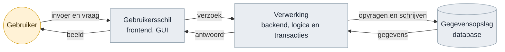
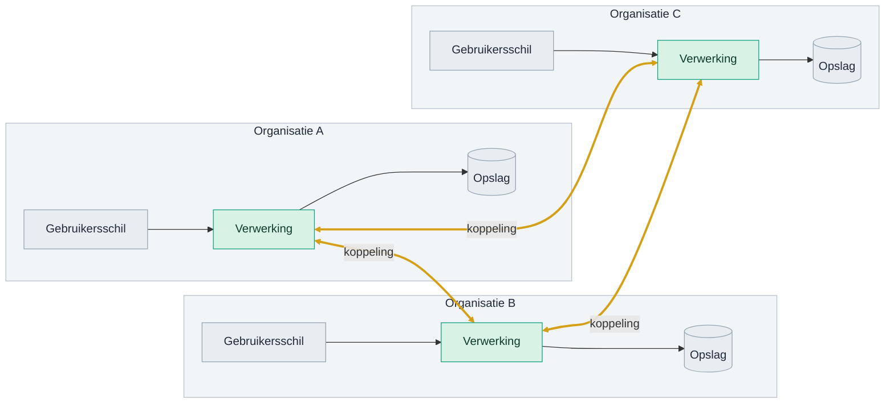
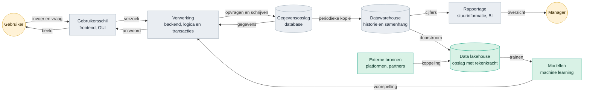
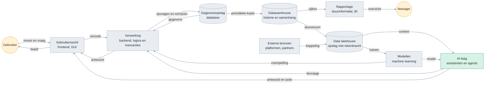
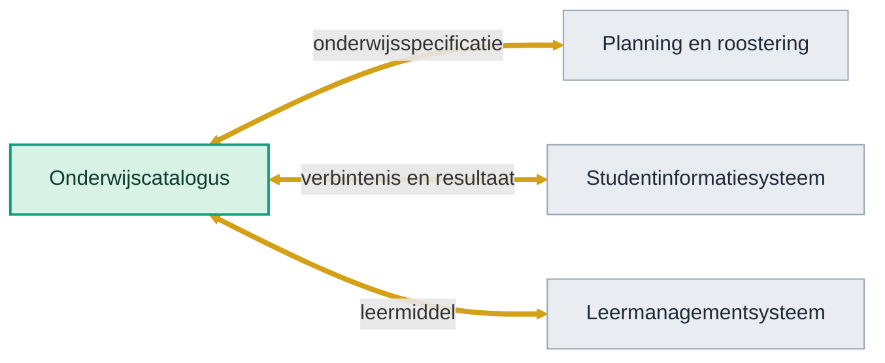

<!-- 1. TITEL -->

  <h1 style="font-size: 2.6rem; line-height: 1.15; margin-bottom: 0.7rem; color: var(--np-ink);">Hoe weten we of we het juiste bouwen?</h1>
  
Dertig jaar technologietrend, en het traject van OKx daarnaast gelegd

  
Niek Derksen &middot; OKx &middot; 4-9-2026

<!--
Geen verdediging maar een onderzoek: welke kant wijst de historie op, en ligt
ons traject op die lijn.
-->

---

<!-- 2. AANLEIDING -->

# Aanleiding

  
Bouwen we geen stoomtrein door koppelvlakken te standaardiseren?

  
Zeker met de opkomst van AI. Hebben we straks geen vliegende auto's?

<!--
De vraag van de opdrachtgever, in twee blokken. Het verhaal eromheen vertel ik:
een standaardisatietraject duurt jaren en de wereld verandert snel; wie in 1995
het perfecte faxprotocol standaardiseerde had gelijk en verloor toch.
-->

---

<!-- 3. CONCLUSIE -->

# Conclusie

  
Elke technologiegolf van dertig jaar maakte gegevensuitwisseling belangrijker. Geen enkele maakte hem kleiner.

  
AI is de eerste laag die zelf niets opslaat. Die leunt volledig op wat de lagen eronder aanleveren.

  
OKx werkt precies daar: aan de afspraken over wat er tussen systemen gaat en wat het betekent.

<!--
Conclusie voorop, drie regels. De rest van het deck is de onderbouwing en hoeft
niet lineair doorlopen te worden.
-->

---

<!-- 4. ONDERBOUWING -->

# Onderbouwing

  
<strong>Historie volgen.</strong> Welke lagen kwamen er in dertig jaar bij?

  
<strong>Trend eruit halen.</strong> Wat vroeg elke golf?

  
<strong>Ons traject ernaast leggen.</strong> Welke kansen en risico's levert dat op?

<!--
De leeswijzer voor de rest van het deck.
-->

---

<!-- 5. LAAG 1 -->

# Fundament IT-applicaties, jaren 80 en 90

Drie blokken en een kringloop. De gebruiker geeft invoer of stelt een vraag aan de gebruikersschil, die stuurt een verzoek naar de verwerking, die haalt of schrijft in de gegevensopslag en stuurt het antwoord terug. Alles binnen een organisatie.

<!--
De pijlen zijn het punt, niet de blokken. Elke pijl is een informatiestroom met
een vraag en een antwoord.
-->

---

<!-- 6. INTERNET -->

# Het internet: systemen aan elkaar

<!--
Backends aan elkaar hangen. Vanaf hier is het geen systeem meer maar een
ecosysteem van applicaties, en elke verbinding vraagt een afspraak. Drie
organisaties leveren al drie koppelingen op; bij tien zijn het er
vijfenveertig.
-->

---

<!-- 7. LAAG 2 -->

# Systeem in de jaren 2000

```mermaid
flowchart LR
  U(("Gebruiker"))
  GUI["Gebruikersschil<br/>frontend, GUI"]
  BE["Verwerking<br/>backend, logica en transacties"]
  DB[("Gegevensopslag<br/>database")]
  U -- "invoer en vraag" --> GUI
  GUI -- "verzoek" --> BE
  BE -- "opvragen en schrijven" --> DB
  DB -- "gegevens" --> BE
  BE -- "antwoord" --> GUI
  GUI -- "beeld" --> U
  DWH[("Datawarehouse<br/>historie en samenhang")]
  BI["Rapportage<br/>stuurinformatie, BI"]
  M(("Manager"))
  DB -- "periodieke kopie" --> DWH
  DWH -- "cijfers" --> BI
  BI -- "overzicht" --> M
  style U fill:#fff2d6,stroke:#D4A017,color:#3b2a02
  style GUI fill:#e9edf2,stroke:#94a3b0,color:#1f2937
  style BE fill:#e9edf2,stroke:#94a3b0,color:#1f2937
  style DB fill:#e9edf2,stroke:#94a3b0,color:#1f2937
  style DWH fill:#d9f2e6,stroke:#0E9E7E,color:#0f3b2e
  style BI fill:#d9f2e6,stroke:#0E9E7E,color:#0f3b2e
  style M fill:#fff2d6,stroke:#D4A017,color:#3b2a02
```

<!--
Hier begint het patroon: elke nieuwe laag leunt op gegevens uit de laag
eronder, dus de vraag naar uitwisseling wordt groter.
-->

---

<!-- 8. LAAG 3 -->

# Systeem in de jaren 2010

<!--
Twee dingen tegelijk: de stapel wordt hoger en hij wordt breder. Externe
bronnen betekenen dat uitwisseling niet meer alleen intern is.
-->

---

<!-- 9. LAAG 4 -->

# Systeem nu

Elke laag van dertig jaar staat er nog. Wat ze verbindt zijn de pijlen: <strong>informatiestromen, vastgelegd in afspraken</strong>. De AI-laag heeft zelf geen opslag en bestaat volledig bij de gratie van wat die pijlen aanleveren.

<!--
Dit is het kantelpunt. De AI-laag heeft zelf geen opslag: hij bestaat bij de
gratie van wat de pijlen aanleveren.
-->

---

<!-- 10. DE TREND -->

# Steeds meer lagen om te verbinden

Geteld in de vier platen hiervoor: het aantal blokken groeide, maar het aantal informatiestromen ertussen groeide harder.

  

    
Jaren 80 en 90

    
4 blokken

    

      

      
6 stromen

    

  

  

    
Jaren 2000

    
7 blokken

    

      

      
9 stromen

    

  

  

    
Jaren 2010

    
10 blokken

    

      

      
13 stromen

    

  

  

    
Nu, met AI

    
11 blokken

    

      

      
17 stromen

    

  

En dat is nog binnen een organisatie. Zet er de koppelingen tussen organisaties naast en het loopt hard op. AI verwerkt informatie makkelijker dan ooit, en vergroot daarmee de vraag naar wat er te verwerken valt.

<!--
De aantallen komen uit de platen hiervoor, dus ze zijn na te tellen. De
boodschap is de verhouding: blokken maal ruim twee, stromen maal bijna drie.
-->

---

<!-- 11. WAAR OKX ZIT -->

# Precies daar werkt OKx

<strong style="color: #0E9E7E;">Waar AI bij helpt</strong>

Koppelen wordt goedkoper. Een model leest een schema, schrijft een adapter, en vertaalt tussen formaten. Het bouwwerk eromheen wordt sneller gemaakt dan ooit.

<strong style="color: #E8912B;">Waar AI niet bij helpt</strong>

Beleid, afspraken, semantiek en duiding. Wat een systeem uit twee verschillende werelden bedoelt met hetzelfde woord, is geen taalvraag maar een bestuurlijke. Wat er nu is, zijn slimme taalmodellen, geen AGI.

<!--
De gouden pijlen zijn wat OKx maakt: de afspraak over wat er tussen twee
systemen gaat en wat het betekent. Het grootste probleem is systemen uit twee
werelden integreren; daar helpt een model wel bij het bouwen, niet bij het eens
worden.
-->

---

<!-- 12. KANSEN -->

# Vier kansen

| Kans | Waar die vandaan komt |
|---|---|
| De sector als eerste met een specificatie die een agent kan gebruiken | De payloads zijn al machineleesbaar. Wie ook de interactie zo uitgeeft, levert iets dat elders nog niet bestaat |
| Ons eigen tempo als voorbeeld | Twee releases in twee weken, mediaan 9 dagen per issue, met AI in de keten. Dat is een werkwijze die andere standaardisatietrajecten missen |
| De verschuiving werkt in ons voordeel | Bouwen wordt goedkoop, het eens worden over betekenis niet. Precies dat laatste is wat OKx maakt |
| Laat zijn heeft een voordeel | Andere sectoren zijn ons voor. Hun keuzes zijn over te nemen in plaats van uit te vinden |

De eerste twee zijn een positie die we kunnen innemen. De laatste twee zijn meewind die er sowieso is.

<!--
Deze slide ontbrak eerst helemaal; het deck signaleerde alleen gaten. De eerste
kans is de interessantste voor de opdrachtgever: dat is iets om over te
vertellen buiten de sector.
-->

---

<!-- 13. RISICO'S -->

# Vier risico's

| Risico | Stand van zaken | Wat er gebeurt als het blijft |
|---|---|---|
| Doorlooptijd tot een gedragen afspraak | Binnen het project gaat het snel. De tijd tot een afspraak die de sector draagt is niet gemeten; de eerste toets is de review van v0.1.0 | De uitkomst van die review overvalt ons |
| Interactie niet machineleesbaar | De 24 datamodelschema's wel, de interactiepatronen en endpoints niet | Kans 1 gaat naar een andere sector |
| Binding naar OEAPI open | Payloads zijn Nederlandstalig en wijken bewust af; het afleveringsmechanisme is niet belegd | Twee partijen die beide aan de specificatie voldoen, kunnen alsnog niet koppelen |
| Beheerpartij na Npuls | De route ligt vast via AMIGO richting Edustandaard. De partij niet | Alles in dit deck verloopt op de dag dat het programma stopt |

Drie van de vier staan los van AI en waren al bekend. Alleen het tweede wordt door de AI-ontwikkeling urgenter.

<!--
Signalering, geen aanklacht. De derde kolom maakt duidelijk waarom het ertoe
doet zonder er een verwijt van te maken.
-->

---

<!-- 14. WAT DE SECTOR MERKT -->

# Wat instellingen en leveranciers hiervan merken

<strong style="color: #0B4F6C;">Instellingen</strong>

Een student kan alleen over systemen heen kiezen als die systemen het eens zijn over wat een leeruitkomst is. Dat is wat OKx vastlegt. Wordt de interactie machineleesbaar, dan kan een instelling straks controleren of haar leveranciers zich eraan houden, in plaats van het te moeten geloven.

<strong style="color: #A8481F;">Leveranciers</strong>

Zij bouwen tegen het koppelvlak van de onderwijscatalogus, met drie koppelingen: naar planning en roostering, naar het studentinformatiesysteem en naar het leermanagementsysteem. Zolang de interactie alleen in tekst staat, kunnen zij niet automatisch valideren.

<strong style="color: #D4A017;">Wat hier niet ter discussie staat</strong>: het detailniveau dat leveranciers toegezegd hebben gekregen voor v0.1.0. Wordt daaraan getornd, dan is dat een apart gesprek met elke leverancier, gevoerd door de projectleiding.

<!--
De onderste kaart voorkomt dat een inzetkeuze op de volgende slide gelezen
wordt als het terugdraaien van een toezegging.
-->

---

<!-- 15. WAAR ZETTEN WE OP IN -->

# Waar zetten we op in?

Drie richtingen waar de kansen en de risico's samenkomen. Ze kunnen niet alle drie tegelijk voorrang krijgen.

| Inzet | Wat het oplevert | Wat het vraagt |
|---|---|---|
| **Tempo** | Een gedragen afspraak voordat de praktijk verder is. Dekt risico 1 | Een norm op doorlooptijd en sturing erop, bij de projectleiding |
| **Machineleesbaar** | Kans 1 verzilveren en risico 2 wegnemen | 3 tot 4 weken werk, plus onderhoud per release. Inschatting |
| **Borging** | Alles behouden na afloop van het programma. Dekt risico 4 | Een gesprek met Edustandaard en Npuls, met de langste doorlooptijd van de drie |

<strong>Gevraagd</strong>: welke van deze drie voorrang krijgt richting v0.1.0, en of borging daar los van alvast in gang gezet wordt. De binding naar OEAPI hoort bij de technische werkgroep en staat hier daarom niet als keuze.

<!--
Geen aanbeveling met ja en nee, want dat is niet aan mij. Wel de drie
richtingen met wat ze kosten, zodat de keuze te maken is. Borging staat er
apart bij omdat die de langste doorlooptijd heeft.
-->

---

<!-- 16. AFSLUITER -->

<!--
Einde. Npuls-afsluiter met logo en licentie.
-->
