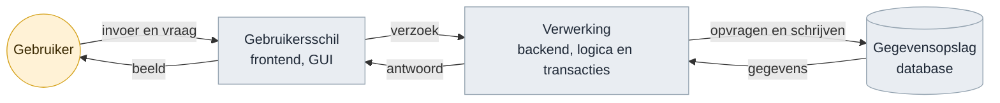
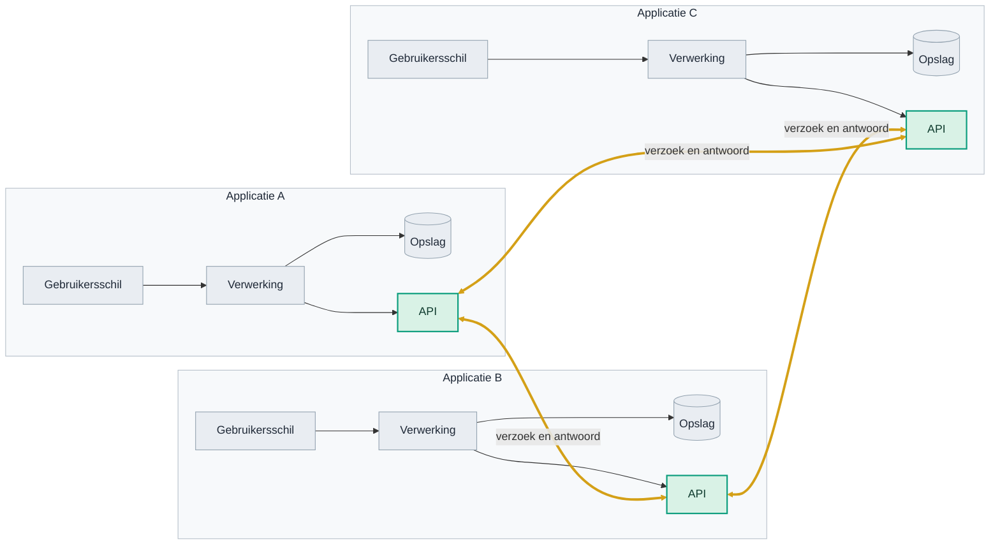
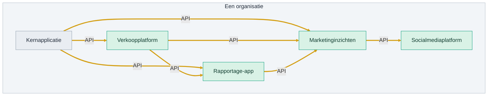
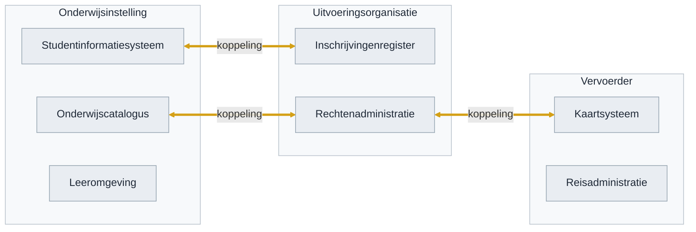
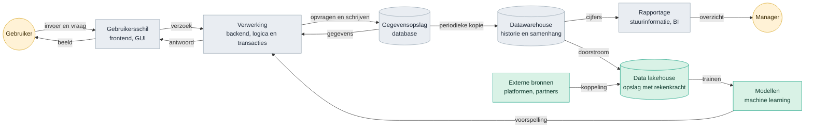
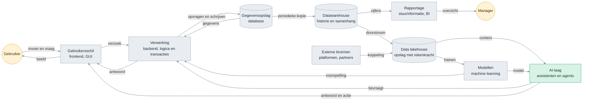
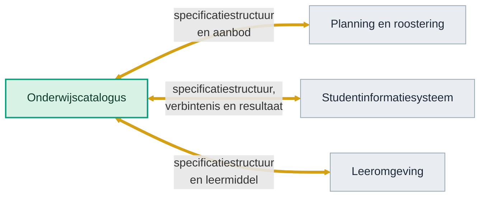

<!-- 1. TITEL -->

  <h1 style="font-size: 2.6rem; line-height: 1.15; margin-bottom: 0.7rem; color: var(--np-ink);">Hoe weten we of we het juiste bouwen?</h1>
  
Dertig jaar technologietrend, en het traject van OKx daarnaast gelegd

  
Niek Derksen &middot; OKx &middot; 4-9-2026

<!--
Geen verdediging maar een onderzoek: welke kant wijst de historie op, en ligt
ons traject op die lijn.
-->

---

<!-- 2. AANLEIDING -->

# Aanleiding

  
Bouwen we geen stoomtrein door koppelvlakken te standaardiseren?

  
Zeker met de opkomst van AI. Hebben we straks geen vliegende auto's?

<!--
De vraag van de opdrachtgever, in twee blokken. Het verhaal eromheen vertel ik:
een standaardisatietraject duurt jaren en de wereld verandert snel; wie in 1995
het perfecte faxprotocol standaardiseerde had gelijk en verloor toch.
-->

---

<!-- 3. CONCLUSIE -->

# Conclusie

  
Elke technologiegolf van dertig jaar maakte gegevensuitwisseling belangrijker. Geen enkele maakte hem kleiner.

  
AI is de eerste laag die zelf niets opslaat. Die leunt volledig op wat de lagen eronder aanleveren.

  
OKx werkt precies daar: aan de afspraken over wat er tussen systemen gaat en wat het betekent.

<!--
Conclusie voorop, drie regels. De rest van het deck is de onderbouwing en hoeft
niet lineair doorlopen te worden.
-->

---

<!-- 4. ONDERBOUWING -->

# Onderbouwing

  
<strong>Historie volgen.</strong> Welke lagen kwamen er in dertig jaar bij?

  
<strong>Trend eruit halen.</strong> Wat vroeg elke golf?

  
<strong>Ons traject ernaast leggen.</strong> Welke kansen en risico's levert dat op?

<!--
De leeswijzer voor de rest van het deck.
-->

---

<!-- 5. LAAG 1 -->

# Fundament IT-applicaties, jaren 80 en 90

Drie blokken en een kringloop. De gebruiker geeft invoer of stelt een vraag aan de gebruikersschil, die stuurt een verzoek naar de verwerking, die haalt of schrijft in de gegevensopslag en stuurt het antwoord terug. Alles binnen een organisatie.

  
Voorbeeld

  
De schooladministratie op een server in de kelder. Een applicatie, een gebruiker, een gebouw.

<!--
De pijlen zijn het punt, niet de blokken. Elke pijl is een informatiestroom met
een vraag en een antwoord.
-->

---

<!-- 6. INTERNET -->

# Het internet: systemen aan elkaar

  
Voorbeeld

  
iDEAL. De webwinkel praat met je bank, zonder dat die twee ooit samen zijn gebouwd.

<!--
De API is de rand van de applicatie en praat met de API van een ander. Drie
applicaties leveren drie koppelingen op; bij tien zijn het er vijfenveertig.
Elke lijn is een afspraak.
-->

---

<!-- 7. LAAG 2 -->

# Systeem in de jaren 2000

```mermaid
flowchart LR
  U(("Gebruiker"))
  GUI["Gebruikersschil<br/>frontend, GUI"]
  BE["Verwerking<br/>backend, logica en transacties"]
  DB[("Gegevensopslag<br/>database")]
  U -- "invoer en vraag" --> GUI
  GUI -- "verzoek" --> BE
  BE -- "opvragen en schrijven" --> DB
  DB -- "gegevens" --> BE
  BE -- "antwoord" --> GUI
  GUI -- "beeld" --> U
  DWH[("Datawarehouse<br/>historie en samenhang")]
  BI["Rapportage<br/>stuurinformatie, BI"]
  M(("Manager"))
  DB -- "periodieke kopie" --> DWH
  DWH -- "cijfers" --> BI
  BI -- "overzicht" --> M
  style U fill:#fff2d6,stroke:#D4A017,color:#3b2a02
  style GUI fill:#e9edf2,stroke:#94a3b0,color:#1f2937
  style BE fill:#e9edf2,stroke:#94a3b0,color:#1f2937
  style DB fill:#e9edf2,stroke:#94a3b0,color:#1f2937
  style DWH fill:#d9f2e6,stroke:#0E9E7E,color:#0f3b2e
  style BI fill:#d9f2e6,stroke:#0E9E7E,color:#0f3b2e
  style M fill:#fff2d6,stroke:#D4A017,color:#3b2a02
```

  
Voorbeeld

  
De bonuskaart. De supermarkt weet wat er verkocht is en stuurt daarop bij.

<!--
Hier begint het patroon: elke nieuwe laag leunt op gegevens uit de laag
eronder, dus de vraag naar uitwisseling wordt groter.
-->

---

<!-- 8. ECOSYSTEEM -->

# Van applicatie naar ecosysteem van applicaties

Vijf applicaties, zeven koppelingen. Niet meer een applicatie met een paar lagen, maar tientallen applicaties naast elkaar, elk met eigen verwerking en opslag.

  
Voorbeeld

  
Een instelling met tientallen pakketten naast elkaar: rooster, leeromgeving, studentinformatie, aanmeldportaal, wallet.

<!--
Dit is inmiddels het normale beeld bij een instelling, en het is de
voedingsbodem voor de laag die hierna komt: het lakehouse voedt zich uit dit
ecosysteem.
-->

---

<!-- 9. TWEE WERELDEN -->

# Ecosystemen koppelen aan ecosystemen

  
Voorbeeld

  
Het studentenreisproduct. Instelling, uitvoeringsorganisatie en vervoerder moeten het eens zijn over wie student is en vanaf wanneer.

<!--
Niet meer twee applicaties, maar drie ecosystemen uit drie verschillende
domeinen die elkaars gegevens nodig hebben. Elk heeft zijn eigen taal, eigen
regels en eigen belangen.
-->

---

<!-- 10. HETZELFDE WOORD -->

# Hetzelfde woord, een andere betekenis

  

    
Onderwijsontwerper

    
groep

    
Studenten die samen dezelfde leeruitkomst nastreven, ongeacht waar en wanneer.

  

  
&ne;

  

    
Planner

    
groep

    
Het aantal studenten dat op dat tijdstip in dat lokaal past.

  

Twee systemen die allebei werken, en toch niet samenwerken. De leiding leggen is techniek. Het eens worden over wat het woord betekent, is dat niet.

<!--
Dit is het hele probleem in een plaatje. Het werkt met elk woord: klant,
deelnemer, periode, resultaat. Zolang dit niet vastligt, levert elke koppeling
een nieuw misverstand op.
-->

---

<!-- 11. LAAG 3 -->

# Systeem in de jaren 2010

  
Voorbeeld

  
Spotify. Wat je te horen krijgt komt uit modellen die op miljarden luisterbeurten zijn getraind.

<!--
Twee dingen tegelijk: de stapel wordt hoger en hij wordt breder. Externe
bronnen betekenen dat uitwisseling niet meer alleen intern is.
-->

---

<!-- 12. LAAG 4 -->

# Systeem nu

Elke laag van dertig jaar staat er nog. Wat ze verbindt zijn de pijlen: <strong>informatiestromen, vastgelegd in afspraken</strong>. De AI-laag heeft zelf geen opslag en bestaat volledig bij de gratie van wat die pijlen aanleveren.

  
Voorbeeld

  
Een assistent die je hele reis boekt terwijl jij een zin typt.

<!--
Dit is het kantelpunt. De AI-laag heeft zelf geen opslag: hij bestaat bij de
gratie van wat de pijlen aanleveren.
-->

---

<!-- 13. DE TREND -->

# Steeds meer lagen om te verbinden

Geteld in de vier platen hiervoor: het aantal blokken groeide, maar het aantal informatiestromen ertussen groeide harder.

  

    
Jaren 80 en 90

    
4 blokken

    

      

      
6 stromen

    

  

  

    
Jaren 2000

    
7 blokken

    

      

      
9 stromen

    

  

  

    
Jaren 2010

    
10 blokken

    

      

      
13 stromen

    

  

  

    
Nu, met AI

    
11 blokken

    

      

      
17 stromen

    

  

En dat is nog binnen een organisatie. Zet er de koppelingen tussen organisaties naast en het loopt hard op. AI verwerkt informatie makkelijker dan ooit, en vergroot daarmee de vraag naar wat er te verwerken valt.

<!--
De aantallen komen uit de platen hiervoor, dus ze zijn na te tellen. De
boodschap is de verhouding: blokken maal ruim twee, stromen maal bijna drie.
-->

---

<!-- 14. WAAR OKX ZIT -->

# Wat OKx doet

OKx wijst de punten aan waar systemen elkaar raken, en legt vast wat er over zo'n punt gaat en wat het betekent. Niet willekeurig, maar op basis van wat een student moet kunnen: kiezen, inschrijven, leren, resultaat halen.

<!--
Drie koppelingen op een koppelvlak, dat van de onderwijscatalogus. De gouden
lijnen zijn het werk. De doelen eronder komen uit de requirementsboom.
-->

---

<!-- 15. WAT DAT MOGELIJK MAAKT -->

# Wat dat straks mogelijk maakt

  

    
Onderwijsontwerp

vraag naast aanbod

    

Ons aanbod in leeruitkomsten

Gevraagde vaardigheden uit de markt

    
&#9660;

    
Agent

    
&#9660;

    
Waar sluit ons aanbod niet aan op de markt, en wat ontwikkelen we bij

  

  

    
Ori&euml;ntatie en leerroute

tussen instellingen en sectoren

    

Behaalde en gewenste leeruitkomsten

Aanbod van meerdere instellingen

    
&#9660;

    
Agent

    
&#9660;

    
Welke volgende stap past bij jouw doelen, ook bij een andere instelling

  

  

    
Lesopzet

binnen de instelling

    

Onderwijsspecificatie

Leermiddelen in het LMS

    
&#9660;

    
Agent

    
&#9660;

    
Een concept-lesopzet bij de specificatie

  

<strong>Drie schalen, hetzelfde raamwerk eronder.</strong> De agent moet bij die informatie kunnen en weten wat ze betekent. Het eerste is een koppeling. Het tweede is een afspraak.

<!--
Drie gevallen, elk met dezelfde vorm: bronnen, agent, resultaat. Wat verschilt
is de schaal waarop vergeleken wordt: vraag naast aanbod, tussen instellingen
en over mbo, hbo en wo heen, en binnen een instelling. Wat gelijk blijft is de
sleutel eronder. Zonder dat raamwerk moet elke vergelijking apart gebouwd
worden, met raamwerk is het telkens dezelfde beweging.
-->

---

<!-- 16. KANSEN -->

# Vier kansen

| Kans | Waar die vandaan komt |
|---|---|
| De sector als eerste met een specificatie die een agent kan gebruiken | De payloads zijn al machineleesbaar. Wie ook de interactie zo uitgeeft, levert iets dat elders nog niet bestaat |
| De specificatie als meer dan een document | Dezelfde bron kan een API-definitie voeden en de invoer zijn voor een testomgeving waarin een leverancier zich meet |
| Ons eigen tempo als voorbeeld | Twee releases in twee weken, mediaan 9 dagen per issue, met AI in de keten |
| Laat zijn heeft een voordeel | Andere sectoren zijn ons voor. Hun keuzes zijn over te nemen in plaats van uit te vinden |

De eerste twee zijn een positie die we kunnen innemen. De laatste twee zijn meewind die er sowieso is.

<!--
De tweede kans is nieuw en de interessantste: de specificatie is nu een
document, maar dezelfde inhoud kan meer dragen.
-->

---

<!-- 17. RISICO'S -->

# Twee risico's

  

    
Doorlooptijd tot een gedragen afspraak

    
Binnen het project gaat het snel. De tijd tot een afspraak die de sector draagt is niet gemeten; de eerste toets is de review van v0.1.0. Duurt dat te lang, dan is de uitkomst achterhaald bij oplevering.

  

  

    
Vastgroeien aan een standaard

    
Als de eisen alleen in OEAPI-vorm bestaan, kost een nieuwe versie of een ander protocol een nieuwe specificatie. Dat is het stoomtreinrisico, maar dan van binnenuit.

  

<strong style="color: #0E9E7E;">De remedie</strong>: wensen en eisen standaardonafhankelijk vastleggen, en die pas daarna vertalen naar de techniekkeuze. De eis blijft dan staan als de techniek wisselt.

<!--
Het risico is niet dat we te weinig standaardiseren, maar dat we ons vastleggen
op een standaard in plaats van op de eis eronder. Machineleesbaar zijn we al;
dat is geen risico maar een vertrekpunt.
-->

---

<!-- 18. WAT DE SECTOR MERKT -->

# Wat instellingen en leveranciers hiervan merken

<strong style="color: #2E86C1;">Instellingen</strong>

Een student kan alleen over systemen heen kiezen als die systemen het eens zijn over wat een leeruitkomst is. Ligt de eis standaardonafhankelijk vast, dan zit een instelling niet vast aan de techniekkeuze van een leverancier.

<strong style="color: #E8912B;">Leveranciers</strong>

Zij bouwen tegen het koppelvlak van de onderwijscatalogus, met drie koppelingen. Komt er een nieuwe versie of een ander protocol, dan kost dat een vertaling in plaats van opnieuw specificeren.

<strong style="color: #D4A017;">Wat hier niet ter discussie staat</strong>: het detailniveau dat leveranciers toegezegd hebben gekregen voor v0.1.0. Wordt daaraan getornd, dan is dat een apart gesprek met elke leverancier, gevoerd door de projectleiding.

<!--
De onderste kaart voorkomt dat een inzetkeuze gelezen wordt als het
terugdraaien van een toezegging.
-->

---

<!-- 19. WAAR ZETTEN WE OP IN -->

# Waar zetten we op in?

Drie richtingen waar de kansen en de risico's samenkomen. Ze kunnen niet alle drie tegelijk voorrang krijgen.

| Inzet | Wat het oplevert | Wat het vraagt |
|---|---|---|
| **Tempo** | Een gedragen afspraak voordat de praktijk verder is | Een norm op doorlooptijd en sturing erop, bij de projectleiding |
| **Standaardonafhankelijk vastleggen** | De eis blijft staan als de techniek wisselt | De eisen los van OEAPI opschrijven, en de vertaling apart houden |
| **Meer dan een document** | De specificatie voedt ook een API-definitie en een testomgeving | Werk aan de uitgave, en onderhoud daarvan per release |

<strong>Gevraagd</strong>: welke van deze drie voorrang krijgt richting v0.1.0.

<!--
Geen aanbeveling met ja en nee; die keuze is niet aan de opsteller. Wel de drie
richtingen met wat ze kosten, zodat de keuze te maken is.
-->

---

<!-- 20. AFSLUITER -->

<!--
Einde. Npuls-afsluiter met logo en licentie.
-->
