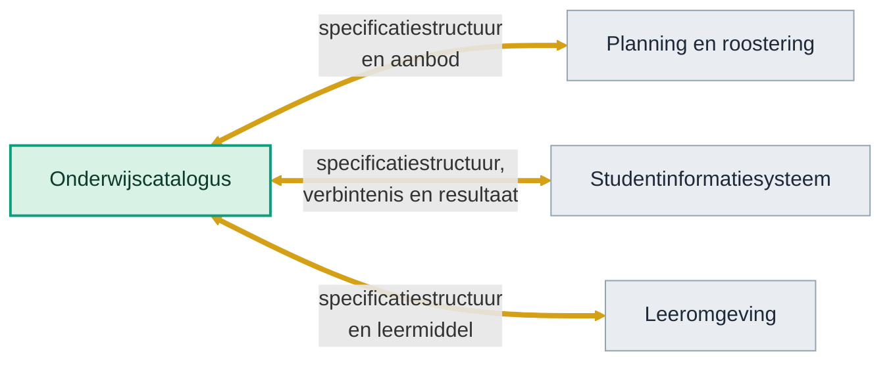

<!-- 1. TITEL -->

  <h1 style="font-size: 2.6rem; line-height: 1.15; margin-bottom: 0.7rem; color: var(--np-ink);">Hoe weten we of we het juiste bouwen?</h1>
  
Dertig jaar technologietrend, en het traject van OKx daarnaast gelegd

  
Niek Derksen &middot; OKx &middot; 4-9-2026

<!--
Geen verdediging maar een onderzoek: welke kant wijst de historie op, en ligt
ons traject op die lijn.
-->

---

<!-- 2. AANLEIDING -->

# Aanleiding

  
Bouwen we geen stoomtrein door koppelvlakken te standaardiseren?

  
Zeker met de opkomst van AI. Hebben we straks geen vliegende auto's?

<!--
De vraag van de opdrachtgever, in twee blokken. Het verhaal eromheen vertel ik:
een standaardisatietraject duurt jaren en de wereld verandert snel; wie in 1995
het perfecte faxprotocol standaardiseerde had gelijk en verloor toch.
-->

---

<!-- 3. CONCLUSIE -->

# Conclusie

Ja, we bouwen een stoomtrein. En we leggen meteen de rails.

De rails overleven de stoomtrein. Wat erover rijdt mag veranderen.

AI gaat op schouders staan. Wij kunnen die schouders zijn.

stoomtrein

hogesnelheidstrein

wat hierna komt

Dezelfde spoorbreedte, afgesproken in de negentiende eeuw, draagt de trein van vandaag.

<!--
De aanklacht wordt hier overgenomen in plaats van weersproken. Ja, de eerste
trein die erover rijdt is de huidige generatie systemen. De rails gaan langer
mee dan die trein, en dat is het hele punt.
-->

---

<!-- 4. HOE EEN SYSTEEM GROEIDE -->

# Waarom we met informatiestromen werken

Elke golf zette er een laag bij. Geen enkele haalde er een weg.

Jaren 80 en 90

Gebruikersschil

Verwerking

Opslag

Een systeem op een server in de kelder. Alles binnen dezelfde muren.

Jaren 2000

Gebruikersschil

Verwerking

Opslag

Koppelvlak (API)

Ander systeem

Systemen gaan elkaar bevragen. Het koppelvlak komt erbij.

Jaren 2010

Web en mobiel

Verwerking

Opslag

Koppelvlak (API)

Clouddienst

Ander ecosysteem

Niet meer een systeem maar een ecosysteem, dat aan andere ecosystemen hangt.

Nu, met AI

Agent (slaat niets op)

Web en mobiel

Verwerking

Opslag

Koppelvlak (API)

Clouddienst

Ander ecosysteem

Er komt een laag bij die zelf niets bewaart en alles van de lagen eronder betrekt.

<!--
Vier tijdvakken op een plaat, want de geschiedenis is de aanloop en niet het
onderwerp. Wat telt is dat er telkens een laag bij kwam en dat het verbinden
daarmee elke keer belangrijker werd.
-->

---

<!-- 5. DE TREND -->

# Steeds meer lagen om te verbinden

Geteld in de vier platen hiervoor: het aantal blokken groeide, maar het aantal informatiestromen ertussen groeide harder.

  

    
Jaren 80 en 90

    
4 blokken

    

      

      
6 stromen

    

  

  

    
Jaren 2000

    
7 blokken

    

      

      
9 stromen

    

  

  

    
Jaren 2010

    
10 blokken

    

      

      
13 stromen

    

  

  

    
Nu, met AI

    
11 blokken

    

      

      
17 stromen

    

  

En dat is nog binnen een organisatie. Zet er de koppelingen tussen organisaties naast en het loopt hard op. AI verwerkt informatie makkelijker dan ooit, en vergroot daarmee de vraag naar wat er te verwerken valt.

<!--
De aantallen komen uit de platen hiervoor, dus ze zijn na te tellen. De
boodschap is de verhouding: blokken maal ruim twee, stromen maal bijna drie.
-->

---

<!-- 6. WIJ KUNNEN ZO'N GIANT ZIJN -->

# Wat er gebeurde toen de afspraak er kwam

| Afspraak | Wat er al was | Wat er daarna kon |
|---|---|---|
| **Spoorbreedte**, Verenigde Staten 1886 | Duizenden mijlen spoor, in verschillende breedtes. Vracht werd bij elke overgang overgeladen | In twee dagen werd ruim 11.000 mijl omgespoord. Daarna reed een wagon over het hele net |
| **Zeecontainer**, ISO, jaren 60 | Schepen, kranen en havens. Elke rederij had zijn eigen maat | Een doos die op elk schip, elke trein en elke truck past |
| **TCP/IP**, jaren 80 | Netwerken die elkaar niet konden lezen | Het internet |

In alle drie bestond de techniek al. Wat ontbrak was de afspraak, en de groei kwam erna. <strong style="color:#0E9E7E;">AI komt straks op zulke schouders te staan. Wij kunnen die schouders zijn.</strong>

<!--
Bewust geen groeigrafiek van spoorwegen naast het BNP. Fogel heeft dat verband
in 1964 doorgeprikt en kwam op ongeveer drie procent; die claim houdt geen
tegenspraak. Wat wel houdt is de maatvoering: het spoor lag er al, de afspraak
kwam erbij, en pas daarna reed er iets doorheen.
-->

---

<!-- 7. WAT ALS AI ALLES ANDERS DOET -->

# Maar wat als AI alles anders gaat doen?

Wat AI overneemt

&bull;Ophalen, vertalen en combineren

&bull;Het bouwen van een integratie

&bull;Dat wordt goedkoop

Wat AI niet overneemt

&bull;Wie bron is (U3, AP11)

&bull;Wat een leeruitkomst betekent

&bull;Wanneer een resultaat rechtsgeldig is

Wat er dan verandert

&bull;Endpointdetail wordt minder waard

&bull;De betekenislaag wordt meer waard

&bull;De volgorde blijft: semantiek voor techniek

Een diploma is een rechtsfeit. Daar hoort vastlegging bij, geen kansverdeling. En twee agents die onderling hun eigen betekenis uitonderhandelen is voorlopig een droom, en als het lukt doen ze het op een afspraak.

<!--
Dit is de scherpste lezing van de vraag: niet of de techniek verandert, maar of
er straks nog iets te verbinden valt. Het antwoord is dat de naden die blijven
de eigenaarschapsnaden zijn, en die zijn juridisch en bestuurlijk, niet
technisch.
-->

---

<!-- 8. WAAR OKX ZIT -->

# Wat OKx doet

Van al die stromen leggen we er nu drie vast, tussen vier systemen.

Spoor, geen draad

Per instelling en per leverancier opnieuw bedacht is een draad. Met een afspraak eronder is het spoor waar iedereen op aansluit, en mag veranderen wat erover rijdt.

En daar leeft AI van

Een agent verzint geen betekenis, die leest wat de systemen aanleveren. Rommel erin is rommel eruit.

<!--
De gouden lijnen zijn het werk: drie koppelingen op een koppelvlak, dat van de
onderwijscatalogus. Hier valt de lijn samen: het spoor uit de conclusie, de
stromen die op de vorige plaat hard opliepen, en de voorwaarde voor AI. Shit in,
shit out, als je het zo wilt zeggen.
-->

---

<!-- 9. WAT DE AFSPRAAK OP GANG BRENGT -->

# Wat de afspraak op gang brengt

1

De afspraak staat

&#9654;

2

Systemen koppelen erop

&#9654;

3

Meer data van hoge kwaliteit, volgens de OKx-standaard

&#9654;

4

Voedingsbodem voor AI

Elke fase levert de eisen op voor de volgende.

<strong style="color: #0E9E7E;">AI heeft standaardisatie nodig</strong>, want daarmee wordt communiceren makkelijk. Elke stap in deze keten maakt de volgende fase van integratie sneller, en dat helpt de student, de instelling en de leverancier tegelijk.

<!--
De afspraak is geen eindpunt maar een startpunt. Zonder die eerste stap komt de
data niet op gang, en zonder data blijft AI-ondersteuning gokwerk.
-->

---

<!-- 10. WAT DAT MOGELIJK MAAKT -->

# Wat dat straks mogelijk maakt

  

    
Onderwijsontwerp

vraag naast aanbod

    

Ons aanbod in leeruitkomsten

Gevraagde vaardigheden uit de markt

    
&#9660;

    
Agent

    
&#9660;

    
Waar sluit ons aanbod niet aan op de markt, en wat ontwikkelen we bij

  

  

    
Ori&euml;ntatie en leerroute

tussen instellingen en sectoren

    

Behaalde en gewenste leeruitkomsten

Aanbod van meerdere instellingen

    
&#9660;

    
Agent

    
&#9660;

    
Welke volgende stap past bij jouw doelen, ook bij een andere instelling

  

  

    
Lesopzet

binnen de instelling

    

Onderwijsspecificatie

Leermiddelen in het LMS

    
&#9660;

    
Agent

    
&#9660;

    
Een concept-lesopzet bij de specificatie

  

<strong>Drie schalen, hetzelfde raamwerk eronder.</strong> OKx bouwt deze dingen niet zelf, maar haalt de blokkade weg waar ze nu op stuklopen. <strong style="color:#A8481F;">Dat is de katalysatorrol.</strong>

<!--
Drie gevallen, elk met dezelfde vorm: bronnen, agent, resultaat. Wat verschilt
is de schaal waarop vergeleken wordt: vraag naast aanbod, tussen instellingen
en over mbo, hbo en wo heen, en binnen een instelling. Wat gelijk blijft is de
sleutel eronder. Zonder dat raamwerk moet elke vergelijking apart gebouwd
worden, met raamwerk is het telkens dezelfde beweging.
-->

---

<!-- 11. RISICO'S -->

# Twee risico's

De afspraak komt te laat

De praktijk koppelt al. Techniek wisselt altijd, maar mogelijk komen de wisselingen nu zo snel dat er geen tijd is om ertussen te bouwen en te gebruiken.

Wat we al doen

&bull;Platform staat, er wordt op gebouwd

&bull;89 issues, acht deelnemers, ook een leverancier

&bull;Draagvlak traag, beweging meetbaar

De eis bestaat straks alleen nog in OEAPI-vorm

De keuze voor OEAPI staat niet ter discussie, dat is beleid. Het risico is dat de eis erachter nergens los is opgeschreven. Bij een nieuwe versie of een ander protocol begint het specificeren dan opnieuw.

Dan bouw je alleen de stoomtrein, en niet de rails eronder.

Wat we al doen

&bull;Uitlijnen met MORA en HORA

&bull;OKx-kader in het businesskader

&bull;Wat bouwen we, voor wie, onder welke omstandigheden

<!--
Het tweede risico is de vraag van de opdrachtgever, maar dan van binnenuit: de
stoomtrein ontstaat niet door de techniekkeuze, maar doordat de eis alleen nog
in de vorm van die techniek bestaat.
-->

---

<!-- 12. WAAR ZETTEN WE OP IN -->

# Waar zetten we op in?

Drie richtingen waar de kansen en de risico's samenkomen. Ze kunnen niet alle drie tegelijk voorrang krijgen.

| Inzet | Wat het oplevert | Wat het vraagt |
|---|---|---|
| **Tempo** | Vragen uit de sector snel beantwoorden: herleiden, versioneren en uitwerken kan nu | Focus en capaciteit voor het uitwerken van de specificatie |
| **Standaardonafhankelijk vastleggen** | De eis blijft staan als de techniek wisselt | De eisen in een referentiekader vastleggen, de vertaling naar OEAPI apart houden |
| **Meer dan een document** | Klaar voor wat er hierna over het spoor rijdt: de specificatie werkt nu al met AI | Adoptie en onderhoud van het GitHub-platform in het team |

<!--
Geen aanbeveling met ja en nee; die keuze is niet aan de opsteller. Wel de drie
richtingen met wat ze kosten, zodat de keuze te maken is.
-->

---

<!-- 13. AFSLUITER -->

<!--
Einde. Npuls-afsluiter met logo en licentie.
-->
