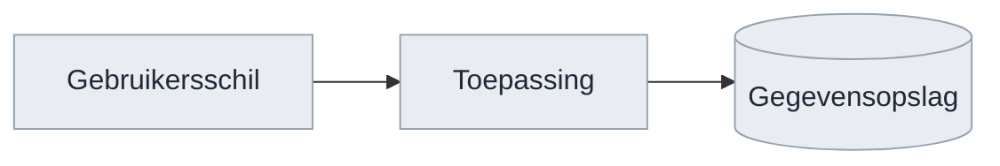
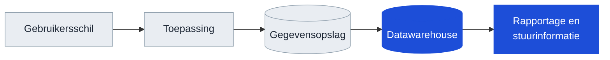
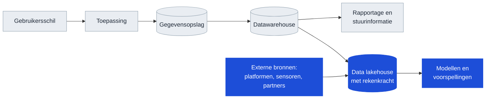
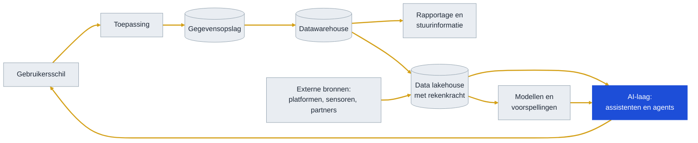

<!-- 1. TITEL -->

  <h1 style="font-size: 2.6rem; line-height: 1.15; margin-bottom: 0.7rem; color: var(--np-ink);">Hoe weten we of we het juiste bouwen?</h1>
  
Dertig jaar technologietrend, en het traject van OKx daarnaast gelegd

  
Niek Derksen &middot; OKx &middot; 4-9-2026

<!--
De vraag komt van de opdrachtgever, maar het deck is geen verdediging. Het is
een onderzoek: welke kant wijst de historie op, en ligt ons traject op die
lijn. Zo brengen.
-->

---

<!-- 2. AANLEIDING -->

# Aanleiding

De opdrachtgever stelde een vraag die het waard is om uit te zoeken.

Bouwen we geen stoomtrein door koppelvlakken te standaardiseren? Zeker met de opkomst van AI. Hebben we straks geen vliegende auto's?

Achter die vraag zit een reele zorg. Een standaardisatietraject duurt jaren, en de wereld eromheen verandert sneller dan ooit. Wie in 1995 het perfecte faxprotocol standaardiseerde, had gelijk en verloor toch.

De vraag is dus terecht. En hij is te beantwoorden, want zulke golven hebben een patroon.

<!--
De vraag laten staan zoals hij gesteld is en er niet meteen tegenin gaan. Het
faxvoorbeeld erkent dat de zorg hout snijdt.
-->

---

<!-- 3. HOE WE HET UITZOEKEN -->

# Hoe we dat uitzoeken

  

    
1

    
<strong>De historie volgen.</strong> Welke lagen kwamen er in dertig jaar bij een IT-ecosysteem bij, en wat deden ze met de rest?

  

  

    
2

    
<strong>De trend eruit halen.</strong> Wat elke golf vroeg, en of daar een richting in zit.

  

  

    
3

    
<strong>Ons traject ernaast leggen.</strong> Ligt het werk van OKx op die lijn, en welke kansen en risico's levert dat op?

  

<strong style="color: #0E7C66;">De uitkomst vooraf</strong>: de trend wijst een kant op, en ons traject ligt op die lijn. Dat levert vier kansen op en vier risico's. De vraag aan het eind gaat over waar we op inzetten.

<!--
De uitkomst staat er alvast, zodat niemand tot slide 14 hoeft te wachten. De
opbouw daarna is de onderbouwing en hoeft niet lineair.
-->

---

<!-- 4. LAAG 1 -->

# Een systeem, jaren negentig

Drie delen. Een scherm waarmee iemand werkt, een toepassing die de logica draait, en een plek waar de gegevens staan. Alles binnen een organisatie, alles onder een dak.

<!--
Bewust simpel beginnen. Iedereen in de zaal herkent dit beeld. De volgende
slides voegen er laag voor laag iets aan toe.
-->

---

<!-- 5. LAAG 2 -->

# Wat de dot-comjaren toevoegden

Organisaties wilden weten wat er in hun gegevens zat. Er kwam een datawarehouse bij, en daarbovenop rapportage en stuurinformatie. Een nieuwe laag, met een nieuwe vraag: hoe komen gegevens uit de bronsystemen daarin terecht?

<!--
Dit is het patroon dat door het hele verhaal loopt: elke nieuwe laag leunt op
gegevens uit de laag eronder. De vraag naar uitwisseling werd dus groter, niet
kleiner.
-->

---

<!-- 6. LAAG 3 -->

# Wat cloud, platformen en machine learning toevoegden

De hoeveelheid gegevens groeide, en de rekenkracht verhuisde naar de cloud. Het datawarehouse kreeg een opvolger die ook ongestructureerde gegevens aankan en er rekenkracht naast zet. Daarbovenop kwamen modellen en voorspellingen. En er kwamen bronnen bij van buiten de eigen organisatie.

<!--
Twee dingen tegelijk: de stapel wordt hoger en hij wordt breder. Externe
bronnen betekenen dat uitwisseling niet meer alleen intern is.
-->

---

<!-- 7. LAAG 4 -->

# Wat AI toevoegt

Elke laag in dertig jaar is erbij gekomen, geen enkele is verdwenen. En elke nieuwe laag leunt zwaarder op de laag eronder. Wat al die lagen verbindt, is <strong>gegevensuitwisseling</strong>: nog altijd via afspraken over wat er heen en weer gaat.

<!--
De pijlen zijn hier goudkleurig: dat is de gegevensuitwisseling, en dat is het
enige element dat in alle vier de plaatjes voorkomt. Dit is het kantelpunt van
het verhaal.
-->

---

<!-- 8. DE TREND -->

# De trend achter dertig jaar lagen

| Periode | Wat erbij kwam | Wat dat vroeg van uitwisseling |
|---|---|---|
| Jaren negentig | Datawarehouse en rapportage | Gegevens uit bronsystemen halen, periodiek |
| Dot-com en daarna | Webkoppelingen tussen organisaties | Afspraken tussen partijen in plaats van binnen een organisatie |
| Cloud en platformen | Externe bronnen en rekenkracht op afstand | Continu, over organisatiegrenzen heen |
| Machine learning | Modellen die op veel bronnen tegelijk leunen | Meer bronnen, betere kwaliteit, herleidbaar |
| AI-assistenten en agents | Een laag die alles wil kunnen bevragen | Alles hierboven, plus vindbaar en interpreteerbaar zonder mens |

Elke golf maakte de vraag naar gegevensuitwisseling groter. Geen enkele maakte hem kleiner. AI is de eerste laag die niets eigens opslaat en dus volledig afhankelijk is van wat de lagen eronder aanleveren.

<!--
Dit is de richting die uit de historie komt. Wie hem betwist, moet uitleggen
waarom deze golf de eerste is die het patroon omkeert.
-->

---

<!-- 9. ONS TRAJECT ERNAAST -->

# Ons traject ernaast gelegd

OKx werkt niet aan een laag. OKx werkt aan de verbinding tussen de lagen: welke gegevens tussen systemen gaan, wat ze betekenen, en wie waarvan de bron is. Dat is precies het element dat in alle vier de platen voorkomt en dat elke golf overleefde.

| De trend vraagt | Wat OKx daarvoor maakt |
|---|---|
| Afspraken tussen partijen, niet binnen een organisatie | Koppelingen tussen referentiecomponenten, met een eigenaar per gegeven |
| Bronnen van betere kwaliteit, herleidbaar | Een begrippenkader waarin vastligt wat een leeruitkomst is |
| Vindbaar en interpreteerbaar zonder mens | 24 datamodelschema's, meegeleverd bij elke release |

Een instelling met losse systemen en onduidelijke begrippen heeft niets aan een AI-laag: die kan alleen bevragen wat ontsloten en gedefinieerd is. Meer interconnectie levert sterkere bronnen op, en sterkere bronnen zijn waar AI op aanhaakt.

<!--
Dit is het antwoord op de vraag, maar dan als bevinding en niet als
verdediging. De tabel koppelt elke trendeis aan iets dat aantoonbaar bestaat.
-->

---

<!-- 10. KANSEN -->

# Vier kansen

| Kans | Waar die vandaan komt |
|---|---|
| De sector als eerste met een specificatie die een agent kan gebruiken | De payloads zijn al machineleesbaar. Wie ook de interactie zo uitgeeft, levert iets dat elders nog niet bestaat |
| Ons eigen tempo als voorbeeld | Twee releases in twee weken, mediaan 9 dagen per issue, met AI in de keten. Dat is een werkwijze die andere standaardisatietrajecten missen |
| De verschuiving werkt in ons voordeel | Bouwen wordt goedkoop, het eens worden over betekenis niet. Precies dat laatste is wat OKx maakt |
| Laat zijn heeft een voordeel | Andere sectoren zijn ons voor. Hun keuzes zijn over te nemen in plaats van uit te vinden |

De eerste twee zijn een positie die we kunnen innemen. De laatste twee zijn meewind die er sowieso is.

<!--
Deze slide ontbrak eerst helemaal; het deck signaleerde alleen gaten. De eerste
kans is de interessantste voor de opdrachtgever: dat is iets om over te
vertellen buiten de sector.
-->

---

<!-- 11. RISICO'S -->

# Vier risico's

| Risico | Stand van zaken | Wat er gebeurt als het blijft |
|---|---|---|
| Doorlooptijd tot een gedragen afspraak | Binnen het project gaat het snel. De tijd tot een afspraak die de sector draagt is niet gemeten; de eerste toets is de review van v0.1.0 | De uitkomst van die review overvalt ons |
| Interactie niet machineleesbaar | De 24 datamodelschema's wel, de interactiepatronen en endpoints niet | Kans 1 gaat naar een andere sector |
| Binding naar OEAPI open | Payloads zijn Nederlandstalig en wijken bewust af; het afleveringsmechanisme is niet belegd | Twee partijen die beide aan de specificatie voldoen, kunnen alsnog niet koppelen |
| Beheerpartij na Npuls | De route ligt vast via AMIGO richting Edustandaard. De partij niet | Alles in dit deck verloopt op de dag dat het programma stopt |

Drie van de vier staan los van AI en waren al bekend. Alleen het tweede wordt door de AI-ontwikkeling urgenter.

<!--
Signalering, geen aanklacht. De derde kolom maakt duidelijk waarom het ertoe
doet zonder er een verwijt van te maken.
-->

---

<!-- 12. WAT DE SECTOR MERKT -->

# Wat instellingen en leveranciers hiervan merken

<strong style="color: #0B4F6C;">Instellingen</strong>

Een student kan alleen over systemen heen kiezen als die systemen het eens zijn over wat een leeruitkomst is. Dat is wat OKx vastlegt. Wordt de interactie machineleesbaar, dan kan een instelling straks controleren of haar leveranciers zich eraan houden, in plaats van het te moeten geloven.

<strong style="color: #A8481F;">Leveranciers</strong>

Zij bouwen tegen het koppelvlak van de onderwijscatalogus, met drie koppelingen: naar planning en roostering, naar het studentinformatiesysteem en naar het leermanagementsysteem. Zolang de interactie alleen in tekst staat, kunnen zij niet automatisch valideren.

<strong style="color: #D4A017;">Wat hier niet ter discussie staat</strong>: het detailniveau dat leveranciers toegezegd hebben gekregen voor v0.1.0. Wordt daaraan getornd, dan is dat een apart gesprek met elke leverancier, gevoerd door de projectleiding.

<!--
De onderste kaart voorkomt dat een inzetkeuze op de volgende slide gelezen
wordt als het terugdraaien van een toezegging.
-->

---

<!-- 13. WAAR ZETTEN WE OP IN -->

# Waar zetten we op in?

Drie richtingen waar de kansen en de risico's samenkomen. Ze kunnen niet alle drie tegelijk voorrang krijgen.

| Inzet | Wat het oplevert | Wat het vraagt |
|---|---|---|
| **Tempo** | Een gedragen afspraak voordat de praktijk verder is. Dekt risico 1 | Een norm op doorlooptijd en sturing erop, bij de projectleiding |
| **Machineleesbaar** | Kans 1 verzilveren en risico 2 wegnemen | 3 tot 4 weken werk, plus onderhoud per release. Inschatting |
| **Borging** | Alles behouden na afloop van het programma. Dekt risico 4 | Een gesprek met Edustandaard en Npuls, met de langste doorlooptijd van de drie |

<strong>Gevraagd</strong>: welke van deze drie voorrang krijgt richting v0.1.0, en of borging daar los van alvast in gang gezet wordt. De binding naar OEAPI hoort bij de technische werkgroep en staat hier daarom niet als keuze.

<!--
Geen aanbeveling met ja en nee, want dat is niet aan mij. Wel de drie
richtingen met wat ze kosten, zodat de keuze te maken is. Borging staat er
apart bij omdat die de langste doorlooptijd heeft.
-->

---

<!-- 14. AFSLUITER -->

<!--
Einde. Npuls-afsluiter met logo en licentie.
-->
