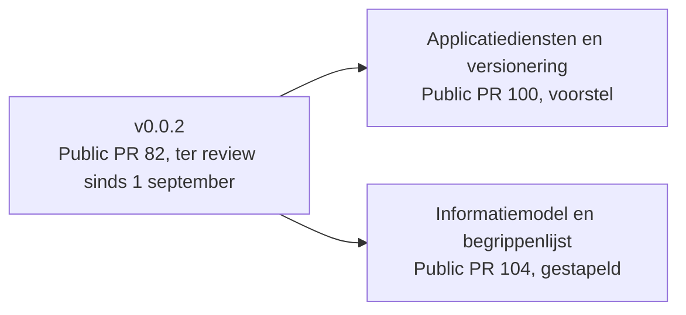
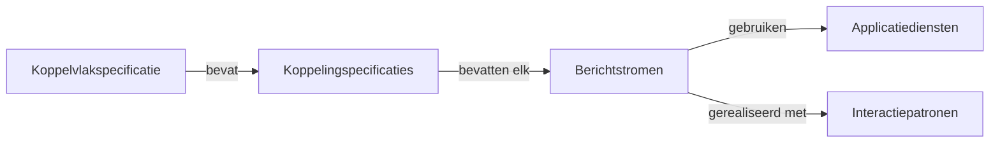
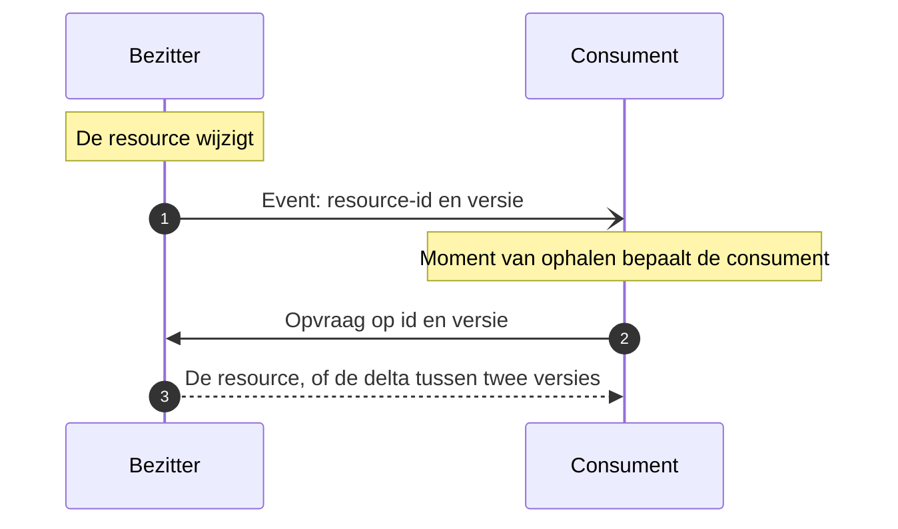
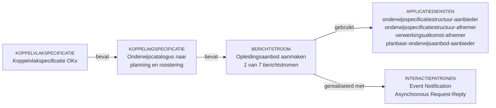
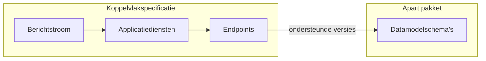
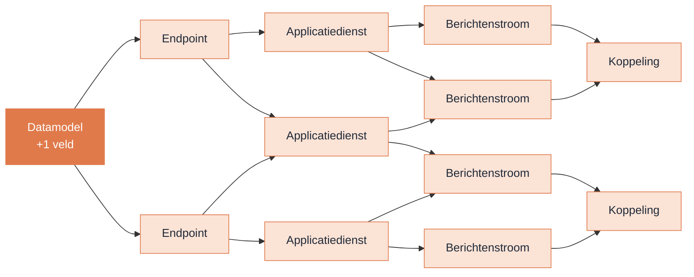

<!-- 1. TITEL -->

  <h1 style="font-size: 3.2rem; line-height: 1.15; margin-bottom: 0.8rem; color: var(--np-ink);">Kerngroep techniek</h1>
  
Stories &middot; Applicatiediensten en versionering &middot; Informatiemodel

  
OKx &middot; Npuls &middot; 15 september 2026

<!--
Ruud is afwezig. Niek en Garik trekken de sessie. Twee thema's: modulariteit en versionering
(Garik, het grootste deel van de tijd) en het informatiemodel met de begrippenlijst (Niek).
Daarna het open werk met een voorstel voor de prioritering.
-->

---

<!-- 1b. AGENDA -->

# Agenda

1

<strong>Terugblik op de afgelopen sprint</strong> De vier openstaande punten van 1 september en de review van v0.0.2 (Public PR 82): de requirementsboom als structuur en de stories, de bevindingen tot nu toe en wat nodig is om de review af te ronden

2

<strong>Versionering en modulariteit (Garik)</strong> Een laag applicatiediensten tussen component en endpoint, en de datamodellen als eigen pakket: het antwoord op de discussie van 19 augustus in Amersfoort

3

<strong>Informatiemodel OKx (Niek)</strong> Antwoord op Public #89: twee overzichtsplaten, de begrippen, de ontwerpkeuzes, de dekking door OEAPI en een eerste begrippenlijst met MORA en het Kernmodel Onderwijsinformatie

4

<strong>Open werk en prioritering</strong> De backlog per milestone, wat sinds 1 september van buiten binnenkwam, en een voorstel voor de volgorde: eerst de reviews, dan de keuzeregels

5

<strong>W.v.t.t.k., vervolg en voortgangspeiling</strong> 

<!--
Dezelfde agenda als in de uitnodiging, ingekort. Deel 2 is van Garik, deel 3 van Niek; deel 1
en 4 samen.
-->

---

<!-- 1c. SIGNALERING -->

# Meer tijd gevraagd op 1 september: voortgangscheck

Die vraag is gehoord. Ondertussen werkt het kernteam door, zodat er iets ligt om op te reageren zodra de tijd er is. Grijs is wat vandaag voor het eerst op tafel komt.

<strong>Wat er ligt om naar te kijken</strong>

v0.0.2 met de requirementsboom als structuur, Public PR 82
Vandaag op tafel
applicatiediensten en versionering, Public PR 100informatiemodel en begrippen, Public PR 104

<strong>Wat er al terugkwam</strong>

Xedule en YNC: opmerkingen per story, Public #99Kees en Luke: 28 opmerkingen op PR 82, 14 september

Formeel ingediende reviews: nog geen. De werkwijze vraagt per pull request een accept, of een iteratie, voordat er gereleased wordt.

<svg width="40" height="40" viewBox="0 0 44 44" style="flex:none;"><circle cx="22" cy="22" r="21" fill="#7A97F2"/><path d="M12 13 h8 a2 2 0 0 1 2 2 v16 a2 2 0 0 0 -2 -2 h-8 z M32 13 h-8 a2 2 0 0 0 -2 2 v16 a2 2 0 0 1 2 -2 h8 z" fill="#fff"/></svg>
Is er ruimte geweest om bij te lezen, en waar loopt het vast?

<svg width="40" height="40" viewBox="0 0 44 44" style="flex:none;"><circle cx="22" cy="22" r="21" fill="#E9A27F"/><text x="22" y="30" text-anchor="middle" fill="#fff" style="font-size:22px;font-weight:700;font-family:inherit">?</text></svg>
Wat helpt om een review af te ronden: tijd, uitleg, een sessie samen?

<svg width="40" height="40" viewBox="0 0 44 44" style="flex:none;"><circle cx="22" cy="22" r="21" fill="#7CCBA8"/><path d="M14 24 v-9 a2 2 0 0 1 4 0 v7 M18 22 v-11 a2 2 0 0 1 4 0 v11 M22 22 v-9 a2 2 0 0 1 4 0 v9 M26 23 v-6 a2 2 0 0 1 4 0 v9 c0 5 -3 8 -8 8 c-5 0 -8 -3 -8 -8" fill="none" stroke="#fff" stroke-width="2.5" stroke-linecap="round" stroke-linejoin="round"/></svg>
Waar kan het kernteam bijspringen?

<!--
Positief en vragend. De vraag om meer tijd van 1 september is gehoord; het kernteam is
doorgegaan zodat er iets ligt zodra de tijd er is. De aantallen komen uit GitHub, stand
15 september. PR 100 en PR 104 staan grijs: die komen vandaag voor het eerst op tafel en
vragen nog geen review. Wat terugkwam: de pdf van Xedule en YNC en de 28 opmerkingen van
Kees en Luke van gisteren zijn inhoudelijke reacties; een formele review op PR 82 is er nog
niet, en de werkwijze vraagt die voor een release (accepteren of itereren). De demo-opmerkingen
van 1 september tellen niet mee. De drie vragen zijn die van Garik uit de voorbereiding.
-->

---

<!-- 2. STAND VAN ZAKEN -->

# Stand van zaken

| Afgesproken op 1 september | Stand |
|---|---|
| Versioneringsvoorstel als pull request | Ligt er: [Public PR 100](https://github.com/Npuls-OKx/Public/pull/100), groter geworden dan aangekondigd |
| Uitkomst van de review op v0.0.2 | Twee reacties binnen, zie de volgende slide |
| Informatiemodel eerst reviewen, dan de payloads | Ligt er: [Public PR 104](https://github.com/Npuls-OKx/Public/pull/104), laag 1 en 2 van de informatie- en gegevensmodellen |

<!--
Drie regels, elk met status. Bronnen: de slide Vervolg van het deck van 1 september, en de
twee pull requests. PR 100 raakt 63 bestanden; het was aangekondigd als een versioneringsvoorstel
en is een herindeling van de koppelvlakspecificatie geworden.
-->

---

<!-- 3. REVIEW OP V0.0.2 -->

# Review op v0.0.2: twee reacties, één rode draad

- Xedule en YNC: een pdf met opmerkingen per story ([Public #99](https://github.com/Npuls-OKx/Public/issues/99))
- Kees en Luke: 28 reviewopmerkingen op inleiding, ADR 0025, epics, features en stories ([Public PR 82](https://github.com/Npuls-OKx/Public/pull/82), 14 september); de formele review volgt

<strong>Applicatiefunctionaliteit, geen koppelvlak</strong> Stories en features beschrijven hoe een onderwijscatalogus werkt of wat een school kiest, niet de interactie tussen systemen

<strong>Uitgangspunt of feature</strong> Leeruitkomsten als gegeven, versionering, query-parameters: uitgangspunten en implementatiekeuzes staan als feature

<strong>Notify of transactie</strong> Wanneer informeren systemen elkaar en wanneer verandert een aanroep echt iets; wie is de client van het endpoint en wie is waarvoor verantwoordelijk

Voorstel van Kees en Luke voor vandaag: eerst vaststellen wat een koppelvlakspecificatie bepaalt en vastlegt, dan pas de inhoud van de stories.

<!--
Twee reacties op v0.0.2. De pdf van Xedule en YNC (#99) bevat acht pagina's opmerkingen per
story; Niels heeft daarop geantwoord dat de stories met de PoC-instellingen verder worden
aangepakt. Kees en Luke hebben op 14 september de epics, features en stories bekeken: 28
opmerkingen op PR 82 (inleiding 3, ADR 0025 1, epics 3, features 15, stories 6), de review
zelf volgt via GitHub. Hun overkoepelende gevoel, per mail aan Niek: het neigt naar een
functionele beschrijving van applicaties of componenten of naar beleidskeuzes van een school,
in plaats van een aanloop naar een koppelvlakspecificatie; dezelfde afdronk als in #99. Voorbeelden
uit de opmerkingen: "is onderwijscatalogusfunctionaliteit, niet iets met koppelvlak te maken"
(stories 9 en 19), "je kiest hier hoe een school zijn onderwijs gaat doen" (epics 14), "is dit
geen uitgangspunt in plaats van feature" (features 41, 42, 44), "wanneer transactioneel en
synchroon" (features 39, 70), "wat we missen is de client van het endpoint" (ADR 0025), "welke
verbintenistoestand, opleiding of leergelegenheid; beschrijf wat de docent wil doen" (stories 58).
De reacties uit de demo van 1 september tellen niet als review. Vragend stellen: het voorstel
om eerst het kader te bespreken past bij het eerste agendapunt.
-->

---

<!-- 3b. VAN STORY NAAR KOPPELVLAK -->

# Van story naar koppelvlak: waar OKx ophoudt

  
  
Schets van Niels, concept.

- **Scholen praten in stories** en in wat een applicatie moet kunnen
- **OKx maakt er generieke stories en bouwstenen van**, herleidbaar naar de leerroutes
- **Alleen rechts is de koppelvlakspecificatie**: koppelvlakdienst, koppeling, endpoints, interactie

Een story die applicatiefunctionaliteit beschrijft is de aanloop, niet het product.

<!--
Antwoord op de rode draad van Kees en Luke: de stories neigen naar applicatiefunctionaliteit
of beleidskeuzes. De schets van Niels legt de lagen naast elkaar: het PoC-schoolperspectief
(userstories van de app, app-dienst, sectordienst), het gedeelde perspectief (leerroutes,
studentreis en instellingsreis, userstories OKx, generieke userstories en bouwstenen) en de
OKx-architectuur met de kerngroep techniek (features, koppelvlakdienst, koppeling, endpoints,
interactie, informatiemodel). OKx specificeert de koppelvlakfunctionaliteit; de
applicatiefunctionaliteit is een interne zaak van het component, ook al hangen ze samen.
Uit de voorbereiding met Garik: wij zitten niet op het terrein van de leverancier maar op de
grens, omdat een koppeling anders niet vast te leggen is. Soll-min is haalbaar op korte en
middellange termijn (leerroutes 1 tot 3), Soll-plus het ideaalplaatje (leerroutes 4 tot 9).
-->

---

<!-- 4. OPDRACHTEN VORIGE SESSIE -->

# Openstaande punten van 1 september

| Punt | Stand |
|---|---|
| Versionering per koppeling ([Public #47](https://github.com/Npuls-OKx/Public/issues/47)) | Voorstel ligt er als [Public PR 100](https://github.com/Npuls-OKx/Public/pull/100), vandaag op tafel |
| Meerdere instanties van een referentiecomponent ([meta #80](https://github.com/Npuls-OKx/meta/issues/80)) | Niet opgepakt |
| Keuzes en regelsets ([Public #74](https://github.com/Npuls-OKx/Public/issues/74)) | Niet opgepakt; staat in het voorstel voor de prioritering |
| Informatiemodel voor payloads ([meta #163](https://github.com/Npuls-OKx/meta/issues/163)) | Uitgewerkt in [meta PR 225](https://github.com/Npuls-OKx/meta/pull/225), ter review voor leveranciers in [Public PR 104](https://github.com/Npuls-OKx/Public/pull/104); vandaag op tafel |

<!--
Twee van de vier opgepakt, twee niet. Bron: de slide Openstaande punten van 1 september en
de stand van de issues op 11 september. Meta #80 heeft sinds juli een reactie van Ruud met
het rondje uit de kerngroep en verder niets.
-->

---

<!-- DIVIDER DEEL 1 -->

  

    
Deel 1

    <h1 style="color: #FFFFFF !important; font-size: 3rem;">Modulariteit en versionering</h1>
  

<!--
Blok van Garik. De opzet staat; Garik vervangt en vult aan met zijn
eigen sheets, voorbeeld en diagrammen.
-->

---

<!-- BOUWBLOKKEN -->

# Bouwblokken van de koppelvlakspecificatie

---

<!-- KOPPELINGSPECIFICATIE -->

# Koppelingspecificatie

  
Een benoemde verbinding tussen twee of meer componenten die met elkaar moeten interacteren. Per interactie bevat zij een lijst van berichtstromen.

---

<!-- DATASTROMEN -->

# Berichtstromen

  
Een verzameling gegevensstromen die gegevens tussen systemen overdraagt.

---

<!-- APPLICATIEDIENSTEN -->

# Applicatiediensten

  
Een verzameling koppelvlakfunctionaliteiten die een component kan implementeren.

  

Een verzameling endpoints

  

Het vermogen om specifieke soorten gegevens af te nemen

---

<!-- INTERACTIEPATRONEN -->

# Interactiepatronen

Een interactiepatroon beschrijft hoe twee partijen informatie uitwisselen, los van welke partijen dat zijn en welke informatie het betreft. Een koppelingspecificatie kiest per interactie een patroon en vult het in; het patroon staat één keer, in rollen: de <strong>bezitter</strong> van de resource en de <strong>consument</strong>.

| Patroon | Waarvoor | Naam uit |
|---|---|---|
| [Event Notification](https://github.com/Npuls-OKx/Public/blob/feature/restructure-and-versioning/Koppelvlakspecificaties/Interactiepatronen/event-notification.md) | De bezitter meldt dat er iets is; de consument haalt het op wanneer het hem uitkomt | Fowler |
| [Event-Carried State Transfer](https://github.com/Npuls-OKx/Public/blob/feature/restructure-and-versioning/Koppelvlakspecificaties/Interactiepatronen/event-carried-state-transfer.md) | Het event draagt de wijziging zelf; de ontvanger hoeft niets op te halen | Fowler |
| [Asynchronous Request-Reply](https://github.com/Npuls-OKx/Public/blob/feature/restructure-and-versioning/Koppelvlakspecificaties/Interactiepatronen/asynchronous-request-reply.md) | De verwerking duurt; de uitkomst komt terug als apart bericht | Azure Cloud Design Patterns, AIP-151 |
| [Request-Reply](https://github.com/Npuls-OKx/Public/blob/feature/restructure-and-versioning/Koppelvlakspecificaties/Interactiepatronen/request-reply.md) | De afnemer vraagt zelf op, zonder voorafgaand event | Enterprise Integration Patterns |
| [Subscription registration](https://github.com/Npuls-OKx/Public/blob/feature/restructure-and-versioning/Koppelvlakspecificaties/Interactiepatronen/subscription-registration.md) | Vastleggen waar events afgeleverd mogen worden | WebSub (W3C), CloudEvents Subscriptions |

Vijf patronen, alle uit bestaande catalogi onder de naam die daar geldt. Bron: <code>Koppelvlakspecificaties/Interactiepatronen/</code> in Public PR 100.

<!--
Uit de README van de interactiepatronen op de branch van Public PR 100. Twee onderscheidingen
bepalen de keuze: of het event genoeg draagt om zonder opvraag te handelen scheidt de eerste
twee; wie begint scheidt de derde van de vierde. Wie bezitter en wie consument is volgt uit
resource-eigenaarschap (U3) en wisselt per resource, ook binnen een koppeling. De eisen aan
aflevering, idempotentie, foutafhandeling en volgorde staan in ADR 0018.
-->

---

<!-- VOORBEELD INTERACTIEPATROON -->

# Voorbeeld: Event Notification

- Het event draagt de aanleiding, de opvraag draagt de inhoud
- De consument kiest het moment en de vorm: de volledige structuur of de delta
- Een gemist event is herstelbaar, want de inhoud blijft bij de bezitter
- Geen bevestiging en geen termijn; wil de bezitter de uitkomst weten, dan is dat Asynchronous Request-Reply

Vastgelegd als uitgangspunt U4. Toegepast in alle drie de koppelingen: de onderwijscatalogus meldt dat een specificatie planbaar, beschikbaar of gewijzigd is; planning, SIS en LMS halen de structuur of de delta op.

<!--
Uit event-notification.md op de branch van Public PR 100. De naam en afbakening komen van
Martin Fowler; dat het bericht een verwijzing draagt in plaats van de inhoud is Claim Check,
in CloudEvents het attribuut dataref. Het event is idempotent op event-id en de volgorde blijft
behouden per resource-id. Het verschil met Event-Carried State Transfer: daar is een verloren
bericht verloren informatie, hier haalt de consument alsnog op met Request-Reply.
-->

---

<!-- VOORBEELD UIT DE SPECIFICATIE -->

# Voorbeeld uit de koppelvlakspecificatie

---

<!-- VERSIONERING: NIVEAU -->

# Versionering op het niveau van berichtstromen

  

Elke berichtstroom kan een versie dragen

  

Versies bestaan meestal naast elkaar, in plaats van elkaar te vervangen

---

<!-- VERSIONERING: AFHANKELIJKHEDEN -->

# Wat een berichtstroom nodig heeft

  Welke applicatiediensten en endpoints beschikbaar zijn, bepaalt de <strong>versie van de koppelvlakspecificatie</strong>.

---

<!-- VERSIONERING: VOORBEELD -->

# Voorbeeld: koppelvlakspecificatie 0.5

  

5

berichtstromen

  

20

applicatiediensten

  

0.5

versie

  Alle applicatiediensten dragen versie 0.5, de versie van de koppelvlakspecificatie.

---

<!-- VERSIONERING: OPHOGEN -->

# Wanneer de versie ophoogt

  

    Patch
    
Een berichtstroom toevoegen of wijzigen zonder iets te breken, zolang die bestaande applicatiediensten en interactiepatronen gebruikt

  

  

    Major, minor of patch
    
Applicatiediensten toevoegen, bijwerken of wijzigen; de zwaarte van de wijziging bepaalt de ophoging

  

---

<!-- 6. HET PROBLEEM -->

# Een veld erbij in een datamodel, en dan?

- Een optioneel veld breekt geen bestaande koppeling
- Zonder versie ziet een implementatiepartij niet wie het veld wel en niet ondersteunt
- Dus: een versie op elke laag, of een knip die de kettingreactie stopt

<!--
BLOK GARIK. Bron: de afstemming van 11 september. Het voorbeeld dat Garik gaf: partij een
implementeert het nieuwe veld, partij twee niet, en niemand kan zien dat de een op versie Y
zit en de ander op X. Hier komt zijn eigen voorbeeld en diagram.
-->

---

<!-- 8. HET VOORSTEL -->

# Datamodellen als eigen pakket

- De datamodellen krijgen samen een eigen versie, los van endpoint en dienst
- Een kleine wijziging in een model dwingt geen ophoging af in de lagen erboven
- Een implementatiepartij plant de overstap zelf

Status: voorstel. Nog niet in de pull request opgenomen.

<!--
BLOK GARIK. Bron: de afstemming van 11 september. Dit deel zit nog niet in PR 100; Garik was
het aan het toevoegen. Hier komen zijn sheets over wat dit betekent voor de implementatielaag
en hoe flexibel een leverancier kan zijn.
-->

---

<!-- 9. DE A/B-VRAAG -->

# Twee varianten voor de versie van de datamodellen

**A. Eén versie voor alle datamodellen**

- Eén nummer om te volgen
- Elke wijziging raakt iedereen

**B. Een versie per domein**

- Een wijziging blijft bij het domein
- Meer nummers om te volgen

Gezocht: welke variant sluit het best aan bij de ervaring in het veld, A, B of een andere.

<!--
BLOK GARIK. De A/B-test uit de afstemming van 11 september. Garik richt de scheiding tussen de
datamodellen alvast in en demonstreert die. Het antwoord van de leveranciers bepaalt welke
variant in PR 100 wordt uitgewerkt.
-->

---

<!-- DIVIDER DEEL 2 -->

  

    
Deel 2

    <h1 style="color: #FFFFFF !important; font-size: 3rem;">Informatiemodel</h1>
  

---

<!-- 11. DE VRAAG -->

# De vraag uit de kerngroep

"Voordat we de details in de koppeling velden specificeren hebben we behoefte om het very high level domain model te valideren. Waar kunnen we die vinden?"

<a href="https://github.com/Npuls-OKx/Public/issues/89">Public #89</a>, 1 september 2026

- Het antwoord: twee platen uit het ArchiMate-model, met de conventies en de keuzes erachter
- Het OKx-model staat los van OEAPI; de mapping is een tweede plaat
- Status: concept; gereviewd in [meta PR 225](https://github.com/Npuls-OKx/meta/pull/225) en gepubliceerd als laag 1 en 2 van het pakket informatie- en gegevensmodellen in [Public PR 104](https://github.com/Npuls-OKx/Public/pull/104), gestapeld op PR 100. Twee ontwerpkeuzes liggen bij het kernteam ([meta #227](https://github.com/Npuls-OKx/meta/issues/227), [#228](https://github.com/Npuls-OKx/meta/issues/228)); de modelvragen uit de tegenlezing staan in [meta #234](https://github.com/Npuls-OKx/meta/issues/234)

<!--
De vraag letterlijk, want het deck beantwoordt hem. Niels stelde in hetzelfde issue voor om
vanuit twee platen te werken; Ruud ging akkoord; Jan Hendrik gaf op 4 september eerste
feedback op de plaat, die is verwerkt.
-->

---

<!-- 12. DE PLAAT -->

  

<!--
Het informatiemodel OKx, versie v0.1, stand 14 september. Leeswijzer: de kolommen zijn de begrippen,
van kwalificatiekader links tot resultaatstructuur onderaan. Geel is het OKx-referentiekader,
grijs valt buiten scope. De leeruitkomst, tweede kolom, is de sleutel: elke specificatie en de
summatieve resultaatstructuur wijzen ernaar. Bron: architecture/model/informatiemodel/ in meta,
branch van PR 225, nu ook in Public PR 104 als Informatie-en-gegevensmodellen/informatiemodel.md.
Op de sessie inzoomen in de browser of het document ernaast openen.
-->

---

<!-- 13. DE BEGRIPPEN -->

# Zeven begrippen delen de keten in

| Begrip | Beantwoordt de vraag |
|---|---|
| Kwalificatiekader mbo | Wat is normatief geldig |
| Onderwijskundig kader instelling | Wat moet de student kennen en kunnen |
| Onderwijsspecificatie | Wat wordt georganiseerd |
| Onderwijsaanbod | Wanneer, met hoeveel plekken, met wie |
| Onderwijsverbintenis | Welke relatie heeft een student met dat aanbod |
| Onderwijsresultaat | Wat is er behaald |
| Resultaatstructuur | Hoe telt dat op tot een uitspraak over de kwalificatie |

<!--
Letterlijk overgenomen uit de begrippentabel in informatiemodel.md. Het informatiemodel is de
aanzet tot het conceptueel informatiemodel, MIM-niveau 2; de begrippen zelf staan op niveau 1
in het begrippenkader en de begrippenlijst.
-->

---

<!-- 14. DE MAPPINGPLAAT -->

  

<!--
Dezelfde objecttypen met OEAPI v6 ernaast. Blauw is OEAPI; de pijl is realisatie: het
OEAPI-object is de vorm waarin een OKx-objecttype over de lijn gaat. Versie v0.1, stand
14 september. De bevindingen staan op de volgende slide.
-->

---

<!-- 15. BEVINDINGEN OEAPI -->

# Wat de mapping op OEAPI v6 laat zien

- Eén OEAPI-object draagt vaak meerdere OKx-objecttypen: `Programme` vier, `ProgrammeOffering` drie
- De leeruitkomst heeft een tegenhanger, `LearningOutcome`
- De resultaatstructuur is nog niet gemapt: OEAPI kent cesuur, schaal en pogingen per toetsonderdeel, maar geen weging per specificatie en geen aggregatieregel
- 24 objecttypen binnen scope zonder OEAPI-object: per stuk signalering of bewuste afwijking

Gezocht: hoe mapt OEAPI een kwalificatiekader naar objecten? Kwalificatiedossier, kwalificatie, kerntaak en werkproces hebben in de mapping nu geen tegenhanger.

<!--
Bron: informatiemodel-oeapi-mapping.md. Geverifieerd tegen de OEAPI 6.0 OpenAPI-specificatie:
LearningOutcome bestaat met eigen endpoints. Voor de resultaatstructuur is de mapping nog niet
gemaakt; wat er tot nu toe gevonden is: weight staat per resultaat, niet per specificatie;
passFrom (cesuur), resultValueType (schaal) en attempts staan op het toetsonderdeel; final op
het resultaat; het afrondingscriterium over onderdelen heen bestaat alleen als vrije tekst in
qualificationRequirements. Of het kan is niet vastgesteld. Andersom kent OEAPI objecten die de
plaat niet heeft: Organisation, AcademicSession, Membership en de poging (Attempt). De vraag over het kwalificatiekader is
een echte vraag aan de zaal: in de OpenAPI-specificatie is geen object voor dossier, kwalificatie,
kerntaak of werkproces gevonden, maar wie OEAPI in de praktijk implementeert weet misschien hoe
dat elders wordt opgelost.
-->

---

<!-- 16. BEGRIPPENKADER -->

# Eerste begrippenkader

- Elk begrip gerelateerd aan de referentiearchitecturen: MORA, ROSA (Kernmodel Onderwijsinformatie) en HORA
- Doel: iteratief uitbreiden en reviewen

| Begrip | Definitie | Herkomst | ROSA | MORA | HORA |
|---|---|---|---|---|---|
| `Kwalificatie dossier` | Het kwalificatiedossier beschrijft de eisen waaraan een student moet voldoen om zijn diploma te behalen | overgenomen uit MORA | geen tegenhanger | <a href="https://mora.mbodigitaal.nl/index.php/Id-3389d485-20a7-6e53-21df-d09eb49d4762">Kwalificatie dossier</a> | nog niet onderzocht |
| `Onderwijsverbintenis` | Een afspraak voor het gaan volgen, volgen en hebben gevolgd van onderwijs | overgenomen uit ROSA | <a href="https://rosa.wikixl.nl/index.php/Id-ec977035c9be4b01bb1c14a5950a1799">onderwijsdeelname</a> | geen tegenhanger | nog niet onderzocht |
| `Onderwijseenheid specificatie` | De specificatie van de fundamentele eenheid waarin onderwijs wordt ontworpen en aangeboden | afgeleid uit klus 53 | <a href="https://rosa.wikixl.nl/index.php/Id-c74c161c6f1f4690933a31ce4d11f3b8">onderwijseenheid</a> | <a href="https://mora.mbodigitaal.nl/index.php/Id-17db36ca-368f-450e-cbfe-604b2fafee6e">Opleidings-onderdeel</a> | nog niet onderzocht |
| `Toetsgelegenheid` | Het georganiseerde aanbod van een toetsmoment: wanneer, waar en onder welke condities | afgeleid uit klus 53 | geen tegenhanger | geen tegenhanger | nog niet onderzocht |
| `Keuzedeelruimte` | Een oningevuld keuzedeel: vrijgemaakte ruimte waarin een student een keuzedeel kiest | nieuw voor OKx | geen tegenhanger | geen tegenhanger | nog niet onderzocht |

Uitsnede: vijf van de 73 begrippen en objecttypen. Status: v0.2, concept. MORA en ROSA zijn geraadpleegd, HORA volgt.

<!--
Uitsnede uit begrippen.md in Public PR 104, stand 14 september. Definities
zijn ingekort tot de eerste zin; de volledige tekst staat in de lijst met citaat, URL en
ophaaldatum. De vijf rijen laten de vier soorten zien: overgenomen uit MORA, overgenomen uit
ROSA, twee die zijn afgeleid uit de alignment MORA en HORA (klus 53), en een eigen OKx-definitie
zonder tegenhanger. Stand van de hele lijst op 14 september: 73 begrippen, 22 overgenomen,
18 eigen OKx-definitie, 33 nog open.
-->

---

<!-- 17a. KEUZE: WAT IS INTEKENEN -->

# Positionering intekenen, aanmelden, inschrijven

De plaat onderscheidt drie objecttypen: het <code>Verzoek tot Aanbod / Intekening op specificatie</code>, de <code>Aanmelding</code> en de <code>Inschrijving</code>. Uit de afstemming van 14 september: aanbod rijpt in fasen, en dat bepaalt waar elke stap landt.

<svg width="100%" viewBox="0 0 940 250" style="display:block;margin:0.5rem 0 0.1rem;"><rect x="10" y="34" width="190" height="78" rx="8" fill="#FFFFFF" stroke="#7A97F2" stroke-width="2"/><text x="105.0" y="58" text-anchor="middle" fill="#1B1B2F" style="font-size:14px;font-weight:700;font-family:inherit">Specificatie</text><text x="105.0" y="78" text-anchor="middle" fill="#4A4F57" style="font-size:11px;font-family:inherit">het ontwerp,</text><text x="105.0" y="93" text-anchor="middle" fill="#4A4F57" style="font-size:11px;font-family:inherit">los van wanneer</text><text x="580" y="20" text-anchor="middle" fill="#6B7280" style="font-size:11px;letter-spacing:1px;font-family:inherit">ONDERWIJSAANBOD, STEEDS RIJPER</text><line x1="240" y1="26" x2="920" y2="26" stroke="#6B7280" stroke-width="1"/><rect x="240" y="34" width="210" height="78" rx="8" fill="#E6F7F0" stroke="#00AF81" stroke-width="2"/><text x="345.0" y="58" text-anchor="middle" fill="#1B1B2F" style="font-size:14px;font-weight:700;font-family:inherit">Intentie</text><text x="345.0" y="78" text-anchor="middle" fill="#4A4F57" style="font-size:11px;font-family:inherit">we gaan dit aanbieden;</text><text x="345.0" y="93" text-anchor="middle" fill="#4A4F57" style="font-size:11px;font-family:inherit">gaat door bij voldoende vraag</text><rect x="475" y="34" width="210" height="78" rx="8" fill="#B3E8D3" stroke="#00AF81" stroke-width="2"/><text x="580.0" y="58" text-anchor="middle" fill="#1B1B2F" style="font-size:14px;font-weight:700;font-family:inherit">Grofmazig gepland</text><text x="580.0" y="78" text-anchor="middle" fill="#4A4F57" style="font-size:11px;font-family:inherit">periode en start, gebouw,</text><text x="580.0" y="93" text-anchor="middle" fill="#4A4F57" style="font-size:11px;font-family:inherit">misschien al een docent</text><rect x="710" y="34" width="210" height="78" rx="8" fill="#00AF81" stroke="#00AF81" stroke-width="2"/><text x="815.0" y="58" text-anchor="middle" fill="#FFFFFF" style="font-size:14px;font-weight:700;font-family:inherit">Geroosterd</text><text x="815.0" y="78" text-anchor="middle" fill="#F0FFF8" style="font-size:11px;font-family:inherit">dag, tijd, lokaal, docent,</text><text x="815.0" y="93" text-anchor="middle" fill="#F0FFF8" style="font-size:11px;font-family:inherit">groep</text><line x1="202" y1="73" x2="236" y2="73" stroke="#6B7280" stroke-width="2"/><polygon points="236,68 242,73 236,78" fill="#6B7280"/><line x1="452" y1="73" x2="486" y2="73" stroke="#6B7280" stroke-width="2"/><polygon points="486,68 492,73 486,78" fill="#6B7280"/><line x1="687" y1="73" x2="721" y2="73" stroke="#6B7280" stroke-width="2"/><polygon points="721,68 727,73 721,78" fill="#6B7280"/><rect x="10" y="130" width="190" height="26" rx="13" fill="#7A97F2"/><text x="24" y="147" fill="#fff" style="font-size:12px;font-weight:700;font-family:inherit">intekenen: op de specificatie</text><rect x="240" y="172" width="680" height="26" rx="13" fill="#3DB88F"/><text x="254" y="189" fill="#fff" style="font-size:12px;font-weight:700;font-family:inherit">aanmelden: op aanbod, in elke fase van rijpheid</text><rect x="710" y="214" width="210" height="26" rx="13" fill="#E9A27F"/><text x="724" y="231" fill="#fff" style="font-size:12px;font-weight:700;font-family:inherit">inschrijven: op geroosterd</text><circle cx="904" cy="227" r="11" fill="#fff"/><text x="904" y="232" text-anchor="middle" fill="#E9A27F" style="font-size:15px;font-weight:700;font-family:inherit">?</text><path d="M200 143 C 225 143, 225 185, 238 185" fill="none" stroke="#6B7280" stroke-width="2"/><polygon points="236,180 244,185 236,190" fill="#6B7280"/><text x="222" y="167" text-anchor="middle" fill="#6B7280" style="font-size:10px;font-family:inherit">bevestiging</text><line x1="815" y1="198" x2="815" y2="212" stroke="#6B7280" stroke-width="2"/><polygon points="810,210 815,216 820,210" fill="#6B7280"/></svg>

Geldt op elk niveau:&nbsp;opleidingopleidingsprogrammaonderwijseenheidleeronderdeelles

<strong>Hoe zien jullie dit?</strong> Wordt een intekening door bevestiging een aanmelding, en is de inschrijving pas rond op geroosterd aanbod?

<!--
Bron: afstemming met Niels en Ronald op 14 september (Jamie, minuut 9 tot 17) en de modelronde
daarna. Intekenen gebeurt op de specificatie: ik zie nog geen aanbod, school, regel dit. Zodra
er aanbod is, in welke fase ook, wordt de intekening door bevestiging een aanmelding; aanmelden
kan ook direct op aanbod. De inschrijving, de overeenkomst die naar BRON gaat, is pas rond als
het aanbod geroosterd is; dat is de aanname met het vraagteken. Ronald: in de praktijk
aanbodgedreven op opleidingsniveau, inschrijven op de opleidingsgroep, intekenen vraaggestuurd
met aanmelden-tot en afmelden-tot; het kan in stappen, eerst intekenen op specificatie en later
het aanbod kiezen. Op de plaat: aanmelding Op basis van aanbod, middels een verbintenis, wordt
inschrijving. Open: of de fasering van aanbod een toestand is of eigen objecttypen (Public #105).
-->

---

<!-- 17a2. VERBINTENIS EN VERZOEK -->

# Verbintenissen bestaan alleen op aanbod. Hoe dan met intekenen?

<strong>Aanmelden en inschrijven: middels een verbintenis</strong>
<svg width="100%" viewBox="0 0 400 150" style="display:block;margin:0.3rem 0 0.1rem;"><rect x="4" y="16" width="88" height="40" rx="7" fill="#FFFFFF" stroke="#7A97F2" stroke-width="2"/><text x="48.0" y="40.0" text-anchor="middle" fill="#1B1B2F" style="font-size:11px;font-weight:700;font-family:inherit">Persoon</text><rect x="156" y="16" width="88" height="40" rx="7" fill="#00AF81" stroke="#00AF81" stroke-width="2"/><text x="200.0" y="35.0" text-anchor="middle" fill="#FFFFFF" style="font-size:11px;font-weight:700;font-family:inherit">Aanmelding</text><text x="200.0" y="49.0" text-anchor="middle" fill="#FFFFFF" style="font-size:9px;font-family:inherit">wordt Inschrijving</text><rect x="308" y="16" width="88" height="40" rx="7" fill="#FFFFFF" stroke="#00AF81" stroke-width="2"/><text x="352.0" y="40.0" text-anchor="middle" fill="#1B1B2F" style="font-size:11px;font-weight:700;font-family:inherit">Aanbod</text><rect x="156" y="100" width="88" height="40" rx="7" fill="#00AF81" stroke="#00AF81" stroke-width="2"/><text x="200.0" y="124.0" text-anchor="middle" fill="#FFFFFF" style="font-size:11px;font-weight:700;font-family:inherit">Verbintenis</text><line x1="92" y1="36.0" x2="156" y2="36.0" stroke="#6B7280" stroke-width="2"/><polygon points="156,36.0 148.0,32.0 148.0,40.0" fill="#6B7280"/><text x="124.0" y="28.0" text-anchor="middle" fill="#6B7280" style="font-size:9px;font-family:inherit">doet</text><line x1="308" y1="36.0" x2="244" y2="36.0" stroke="#6B7280" stroke-width="2"/><polygon points="244,36.0 252.0,40.0 252.0,32.0" fill="#6B7280"/><text x="276.0" y="28.0" text-anchor="middle" fill="#6B7280" style="font-size:9px;font-family:inherit">op basis van</text><line x1="200.0" y1="56" x2="200.0" y2="100" stroke="#6B7280" stroke-width="2"/><polygon points="200.0,100 204.0,92.0 196.0,92.0" fill="#6B7280"/><text x="228.0" y="82" text-anchor="middle" fill="#6B7280" style="font-size:9px;font-family:inherit">middels</text></svg>

De verbintenis is de afspraak op het aanbod. Een aanmelding gaat op aanbod, loopt via een verbintenis en wordt een inschrijving: beide zijn uit te wisselen omdat er aanbod is om aan te hangen.

<strong>Intekenen: nog geen aanbod, dus geen verbintenis</strong>
<svg width="100%" viewBox="0 0 400 150" style="display:block;margin:0.3rem 0 0.1rem;"><rect x="4" y="16" width="88" height="40" rx="7" fill="#FFFFFF" stroke="#7A97F2" stroke-width="2"/><text x="48.0" y="40.0" text-anchor="middle" fill="#1B1B2F" style="font-size:11px;font-weight:700;font-family:inherit">Persoon</text><rect x="156" y="16" width="88" height="40" rx="7" fill="#E9A27F" stroke="#E9A27F" stroke-width="2"/><text x="200.0" y="35.0" text-anchor="middle" fill="#FFFFFF" style="font-size:9px;font-weight:700;font-family:inherit">Verzoek tot aanbod</text><text x="200.0" y="49.0" text-anchor="middle" fill="#FFFFFF" style="font-size:9px;font-family:inherit">intekening</text><rect x="308" y="16" width="88" height="40" rx="7" fill="#FFFFFF" stroke="#7A97F2" stroke-width="2"/><text x="352.0" y="40.0" text-anchor="middle" fill="#1B1B2F" style="font-size:11px;font-weight:700;font-family:inherit">Specificatie</text><rect x="156" y="100" width="88" height="40" rx="7" fill="#FFFFFF" stroke="#00AF81" stroke-width="2"/><text x="200.0" y="124.0" text-anchor="middle" fill="#1B1B2F" style="font-size:11px;font-weight:700;font-family:inherit">Aanbod</text><line x1="92" y1="36.0" x2="156" y2="36.0" stroke="#6B7280" stroke-width="2"/><polygon points="156,36.0 148.0,32.0 148.0,40.0" fill="#6B7280"/><text x="124.0" y="28.0" text-anchor="middle" fill="#6B7280" style="font-size:9px;font-family:inherit">doet</text><line x1="308" y1="36.0" x2="244" y2="36.0" stroke="#6B7280" stroke-width="2"/><polygon points="244,36.0 252.0,40.0 252.0,32.0" fill="#6B7280"/><text x="276.0" y="28.0" text-anchor="middle" fill="#6B7280" style="font-size:9px;font-family:inherit">input voor</text><line x1="200.0" y1="56" x2="200.0" y2="100" stroke="#6B7280" stroke-width="2"/><polygon points="200.0,100 204.0,92.0 196.0,92.0" fill="#6B7280"/><text x="228.0" y="82" text-anchor="middle" fill="#6B7280" style="font-size:9px;font-family:inherit">leidt tot</text></svg>

Concept: het <code>Verzoek tot Aanbod</code> (request for offering) als eigen objecttype. Specificaties zijn de input, het leidt tot aanbod; zodra dat er is volgt de bevestiging en daarmee de aanmelding.

<strong>Vraag:</strong> is een verzoek tot aanbod als eigen objecttype de juiste manier om intekenen zonder verbintenis uit te wisselen, of zien jullie een andere?

<!--
Op de plaat: de aanmelding gaat Op basis van een aanbod en middels een verbintenis, en wordt
een inschrijving; de inschrijving staat in de kolom Onderwijsverbintenis. Intekenen gebeurt op
een specificatie, en een verbintenis is per definitie een afspraak op aanbod (Kernmodel
Onderwijsinformatie: het gaan volgen, volgen en hebben gevolgd van onderwijs). Daarom staat het
Verzoek tot Aanbod / Intekening op specificatie als eigen objecttype buiten de kolommen, met
Input voor vanuit de specificaties en Leidt tot naar het aanbod. Het sluit aan op ADR 0015,
Request for Offering: de haalbaarheidstoets tussen studentkeuze en planning. Uit de afstemming
van 14 september: intekenen op specificatie kan, aanmelden en inschrijven op aanbod.
-->

---

<!-- 17b. GEVRAAGD OP HET INFORMATIEMODEL -->

# Gevraagd: het informatiemodel naast het eigen model leggen

1
<strong>Lezen</strong>

Het informatiemodel met de ontwerpkeuzes, de mapping op OEAPI v6 en de begrippenlijst: laag 1 en 2 van het pakket informatie- en gegevensmodellen in <a href="https://github.com/Npuls-OKx/Public/pull/104">Public PR 104</a>

2
<strong>Mappen</strong>

Per objecttype naast het eigen informatiemodel: gelijk, een verbijzondering, of ontbreekt. Waar botst een ontwerpkeuze met de praktijk, welke definitie is een andere

3
<strong>Terugmelden</strong>

Wat je ziet en wat je mist, als reviewopmerking op de pull request of als issue in Public. Ook een half antwoord helpt

Aanbod: het informatiemodel als onderwerp van het volgende architectuur-inloopuur, met het kernteam erbij voor vragen.

<!--
Dit is de concrete vraag bij deel 3. Niet: keur het goed, maar: leg het naast je eigen model en
zeg waar het wringt. De leverancierstegenlezing (meta #234) laat zien wat zo'n mapping oplevert;
Public #105 vraagt specifiek naar lifecycle, sleutels en BPV. Het inloopuur is de plek voor wie
liever praat dan schrijft.
-->

---

<!-- DIVIDER DEEL 3 -->

  

    
Deel 3

    <h1 style="color: #FFFFFF !important; font-size: 3rem;">Open werk</h1>
  

---

<!-- 18. OPEN WERK -->

# Werk per onderwerp

<a href="https://github.com/Npuls-OKx/Public/milestone/4" style="color:var(--np-ink);">Koppelvlakspecificatie releaseproces en kwaliteit</a> Public

11

<svg width="18" height="18" viewBox="0 0 44 44" style="flex:none;"><circle cx="22" cy="22" r="21" fill="#7A97F2"/><circle cx="15" cy="13" r="4" fill="#fff"/><circle cx="15" cy="31" r="4" fill="#fff"/><circle cx="30" cy="31" r="4" fill="#fff"/><line x1="15" y1="17" x2="15" y2="27" stroke="#fff" stroke-width="3"/><path d="M30 27 v-6 a5 5 0 0 0 -5 -5 h-4" fill="none" stroke="#fff" stroke-width="3" stroke-linecap="round"/></svg><a href="https://github.com/Npuls-OKx/Public/pull/82">PR 82</a>

&#9679; <a href="https://github.com/Npuls-OKx/Public/milestone/3" style="color:var(--np-ink);">Requirementsboom doorontwikkelen</a> Public

2

9

&#9679; <a href="https://github.com/Npuls-OKx/Public/milestone/5" style="color:var(--np-ink);">Koppelingspecificatiestructuur doorontwikkelen</a> Public

1

10

<svg width="18" height="18" viewBox="0 0 44 44" style="flex:none;"><circle cx="22" cy="22" r="21" fill="#7A97F2"/><circle cx="15" cy="13" r="4" fill="#fff"/><circle cx="15" cy="31" r="4" fill="#fff"/><circle cx="30" cy="31" r="4" fill="#fff"/><line x1="15" y1="17" x2="15" y2="27" stroke="#fff" stroke-width="3"/><path d="M30 27 v-6 a5 5 0 0 0 -5 -5 h-4" fill="none" stroke="#fff" stroke-width="3" stroke-linecap="round"/></svg><a href="https://github.com/Npuls-OKx/Public/pull/100">PR 100</a>, <a href="https://github.com/Npuls-OKx/Public/pull/104">PR 104</a>

&#9679; <a href="https://github.com/Npuls-OKx/meta/milestone/7" style="color:var(--np-ink);">Begrippenkader en informatiemodel verdiepen</a> meta

17

<svg width="18" height="18" viewBox="0 0 44 44" style="flex:none;"><circle cx="22" cy="22" r="21" fill="#7A97F2"/><circle cx="15" cy="13" r="4" fill="#fff"/><circle cx="15" cy="31" r="4" fill="#fff"/><circle cx="30" cy="31" r="4" fill="#fff"/><line x1="15" y1="17" x2="15" y2="27" stroke="#fff" stroke-width="3"/><path d="M30 27 v-6 a5 5 0 0 0 -5 -5 h-4" fill="none" stroke="#fff" stroke-width="3" stroke-linecap="round"/></svg><a href="https://github.com/Npuls-OKx/meta/pull/225">PR 225</a>, <a href="https://github.com/Npuls-OKx/meta/pull/233">PR 233</a>

<a href="https://github.com/Npuls-OKx/Public/milestone/1" style="color:var(--np-ink);">Leerroute-refactor met harness-waarborgen</a> Public

3

3

<a href="https://github.com/Npuls-OKx/Public/milestone/7" style="color:var(--np-ink);">Keuzedelen kiesbaarheid en groepsindeling</a> Public

3

<a href="https://github.com/Npuls-OKx/Public/milestone/6" style="color:var(--np-ink);">Informatiestromen hoofdplaat</a> Public

4

Stand van 14 september. Onderwerpen zijn de milestones; de balklengte is het aantal issues, groen gesloten, grijs open; het icoon markeert werk dat als pull request ter review ligt. Oranje: staat vandaag op de agenda. Niet getoond: Agent-harness (Public, 2 open) en de interne milestones van meta.

<!--
Een balk per milestone, groen wat gesloten is, grijs wat open staat, met het pull request-icoon
waar het werk in een branch ter review ligt. Oranje stip: staat vandaag op de agenda. Het beeld:
het grote werk van deze periode zit in de pull requests en niet in gesloten issues; de hoofdplaat
is af (vier correcties gesloten sinds 1 september). Van buiten het kernteam kwamen sinds
1 september zeven issues: vijf van Kees (#85 tot en met #89) en twee van Xedule (#84, #99).
Nieuw sinds 11 september: het informatiemodel ligt als Public PR 104 gestapeld op PR 100, met
de 26 modelvragen uit de leverancierstegenlezing in meta #234 (milestone Begrippenkader, 17 open).
Bron: de milestones en issues van beide repositories, GitHub, 14 september.
-->

---

<!-- 18b. VERZET WERK -->

# Wat er sinds 1 september is verzet

<svg width="22" height="22" viewBox="0 0 44 44" style="flex:none;"><circle cx="22" cy="22" r="21" fill="#7A97F2"/><circle cx="14" cy="12" r="4" fill="#fff"/><circle cx="14" cy="32" r="4" fill="#fff"/><circle cx="31" cy="22" r="4" fill="#fff"/><path d="M14 16 v12 M14 22 h13" fill="none" stroke="#fff" stroke-width="3" stroke-linecap="round"/></svg>PR gemerged

<svg width="22" height="22" viewBox="0 0 44 44" style="flex:none;"><circle cx="22" cy="22" r="21" fill="#7A97F2"/><line x1="22" y1="12" x2="22" y2="32" stroke="#fff" stroke-width="3.5" stroke-linecap="round"/><line x1="12" y1="22" x2="32" y2="22" stroke="#fff" stroke-width="3.5" stroke-linecap="round"/></svg>PR geopend

<svg width="22" height="22" viewBox="0 0 44 44" style="flex:none;"><circle cx="22" cy="22" r="21" fill="#7A97F2"/><polyline points="12,23 19,30 32,15" fill="none" stroke="#fff" stroke-width="3.5" stroke-linecap="round" stroke-linejoin="round"/></svg>issues gesloten

<svg width="22" height="22" viewBox="0 0 44 44" style="flex:none;"><circle cx="22" cy="22" r="21" fill="#7A97F2"/><line x1="22" y1="12" x2="22" y2="32" stroke="#fff" stroke-width="3.5" stroke-linecap="round"/><line x1="12" y1="22" x2="32" y2="22" stroke="#fff" stroke-width="3.5" stroke-linecap="round"/></svg>issues geopend

<svg width="22" height="22" viewBox="0 0 44 44" style="flex:none;"><circle cx="22" cy="22" r="21" fill="#7A97F2"/><line x1="8" y1="22" x2="36" y2="22" stroke="#fff" stroke-width="3"/><circle cx="22" cy="22" r="6" fill="#fff"/></svg>commits op dev

Public

2

2

5

12

6

meta

5

9

11

25

58

**Public:** overzichtsplaat en branching-diagram; redactie op kaderscenario leerroute 1; applicatiediensten en versionering op een branch, 63 bestanden ([PR 100](https://github.com/Npuls-OKx/Public/pull/100))

**meta:** deck van 1 september met PowerPoint-export; Nederlands als voertaal; lezerspersona's; informatiemodel en begrippenlijst, 28 commits ([PR 225](https://github.com/Npuls-OKx/meta/pull/225)), gepubliceerd naar Public ([PR 104](https://github.com/Npuls-OKx/Public/pull/104))

<!--
Stand van 15 september, beide repositories, alles na 1 september. De aantallen zeggen iets
over de hoeveelheid werk, niet over de kwaliteit ervan; dat oordeel ligt bij de review. Het
grote werk van deze periode staat op branches en niet op dev: PR 100 en PR 104 in Public en
PR 225 in meta. De 25 nieuwe issues op meta zijn grotendeels intern harness- en reviewwerk, plus de modelvragen uit de tegenlezing (#234, #235).
-->

---

<!-- 19. VOORSTEL PRIORITERING -->

# Voorstel voor de prioritering

<strong>Nu</strong>

<svg width="44" height="44" viewBox="0 0 44 44" style="flex:none;"><circle cx="22" cy="22" r="21" fill="#7CCBA8"/><polygon points="17,12 34,22 17,32" fill="#fff"/></svg>
Review op de pull requests: versionering (<a href="https://github.com/Npuls-OKx/Public/pull/100">Public PR 100</a>), het informatiemodel (<a href="https://github.com/Npuls-OKx/Public/pull/104">Public PR 104</a>), v0.0.2 (<a href="https://github.com/Npuls-OKx/Public/pull/82">Public PR 82</a>: bij open vragen verwerken en opnieuw itereren)

<svg width="44" height="44" viewBox="0 0 44 44" style="flex:none;"><circle cx="22" cy="22" r="21" fill="#7CCBA8"/><polygon points="17,12 34,22 17,32" fill="#fff"/></svg>
Student keuze regelsets toetsen aan de scenario's (<a href="https://github.com/Npuls-OKx/Public/issues/74">Public #74</a>, <a href="https://github.com/Npuls-OKx/Public/issues/64">#64</a>, <a href="https://github.com/Npuls-OKx/Public/issues/1">#1</a>)

<svg width="44" height="44" viewBox="0 0 44 44" style="flex:none;"><circle cx="22" cy="22" r="21" fill="#7CCBA8"/><polygon points="17,12 34,22 17,32" fill="#fff"/></svg>
Verdere uitwerking van de requirementsboom en de business-architectuur, langs de schets van Niels: van stories naar koppelvlakfunctionaliteit

<strong>Wacht</strong>

<svg width="44" height="44" viewBox="0 0 44 44" style="flex:none;"><circle cx="22" cy="22" r="21" fill="#B8BEC7"/><rect x="15" y="12" width="5" height="20" rx="1" fill="#fff"/><rect x="24" y="12" width="5" height="20" rx="1" fill="#fff"/></svg>
Meerdere instanties van een referentiecomponent (<a href="https://github.com/Npuls-OKx/meta/issues/80">meta #80</a>)

<svg width="44" height="44" viewBox="0 0 44 44" style="flex:none;"><circle cx="22" cy="22" r="21" fill="#B8BEC7"/><rect x="15" y="12" width="5" height="20" rx="1" fill="#fff"/><rect x="24" y="12" width="5" height="20" rx="1" fill="#fff"/></svg>
Terminologie- en correctie-issues

Status: voorstel van het kernteam. Zonder keuze blijft alles even zwaar en beweegt niets.

<!--
Voorstel, geen besluit. Links wat het kernteam eerst wil doen: zonder review geen release en
zonder release geen bouw; en de student keuze regelsets, omdat elke studentkeuze doorwerkt in
planning, rooster en leeromgeving. Rechts wat daarmee wacht. De requirementsboom en de business-architectuur lopen door, langs de
schets van Niels. Vraag aan de groep: klopt deze volgorde, en wat ontbreekt? De naam student keuze regelset volgt het informatiemodel.
-->

---

<!-- 20. GEVRAAGD -->

# Gevraagd

<svg width="40" height="40" viewBox="0 0 44 44" style="flex:none;"><circle cx="22" cy="22" r="21" fill="#7A97F2"/><circle cx="19" cy="19" r="8" fill="none" stroke="#fff" stroke-width="3"/><line x1="25" y1="25" x2="33" y2="33" stroke="#fff" stroke-width="3" stroke-linecap="round"/></svg><dl class="np-besluit review" style="flex:1;"><dt>Review</dt><dd><a href="https://github.com/Npuls-OKx/Public/pull/100">Public PR 100</a>: applicatiediensten als laag en de datamodellen als eigen pakket (modulariteit en versionering)</dd></dl>

<svg width="40" height="40" viewBox="0 0 44 44" style="flex:none;"><circle cx="22" cy="22" r="21" fill="#7A97F2"/><circle cx="19" cy="19" r="8" fill="none" stroke="#fff" stroke-width="3"/><line x1="25" y1="25" x2="33" y2="33" stroke="#fff" stroke-width="3" stroke-linecap="round"/></svg><dl class="np-besluit review" style="flex:1;"><dt>Review</dt><dd><a href="https://github.com/Npuls-OKx/Public/pull/104">Public PR 104</a>: het informatiemodel en de begrippen naast het eigen model leggen</dd></dl>

<svg width="40" height="40" viewBox="0 0 44 44" style="flex:none;"><circle cx="22" cy="22" r="21" fill="#7A97F2"/><circle cx="19" cy="19" r="8" fill="none" stroke="#fff" stroke-width="3"/><line x1="25" y1="25" x2="33" y2="33" stroke="#fff" stroke-width="3" stroke-linecap="round"/></svg><dl class="np-besluit review" style="flex:1;"><dt>Review</dt><dd><a href="https://github.com/Npuls-OKx/Public/pull/82">Public PR 82</a>: v0.0.2 afronden: accepteren of itereren</dd></dl>

<svg width="40" height="40" viewBox="0 0 44 44" style="flex:none;"><circle cx="22" cy="22" r="21" fill="#E9A27F"/><polyline points="12,23 19,30 32,15" fill="none" stroke="#fff" stroke-width="3.5" stroke-linecap="round" stroke-linejoin="round"/></svg><dl class="np-besluit " style="flex:1;"><dt>Besluit</dt><dd>de prioritering van het open werk: eerst de reviews, dan de student keuze regelsets</dd></dl>

<svg width="40" height="40" viewBox="0 0 44 44" style="flex:none;"><circle cx="22" cy="22" r="21" fill="#7A97F2"/><path d="M11 13 h22 a3 3 0 0 1 3 3 v11 a3 3 0 0 1 -3 3 h-12 l-6 5 v-5 h-4 a3 3 0 0 1 -3 -3 v-11 a3 3 0 0 1 3 -3 z" fill="#fff"/></svg><dl class="np-besluit kennisname" style="flex:1;"><dt>Input</dt><dd>wat is er nodig om bij te komen en bij te blijven: tijd, uitleg, een sessie samen</dd></dl>

<!--
Drie reviews, een besluit, een input. Geen besluit over het informatiemodel zelf: dat is pas aan
de orde als de ADR-punten zijn opgelost (meta #227 en #228); wel de vraag om het naast het eigen
model te leggen. Het besluit over de prioritering is nodig, want zonder keuze beweegt niets. De
laatste input sluit de voortgangscheck van het begin: wat helpt om een review af te ronden en
daarna bij te blijven.
-->
---

<!-- 21. VERVOLG -->

# Vervolg

<svg width="44" height="44" viewBox="0 0 44 44" style="flex:none;"><circle cx="22" cy="22" r="21" fill="#E9A27F"/><rect x="11" y="14" width="22" height="19" rx="2" fill="#fff"/><rect x="11" y="14" width="22" height="5" fill="#E9A27F" opacity="0.35"/><rect x="15" y="10" width="3" height="6" rx="1" fill="#fff"/><rect x="26" y="10" width="3" height="6" rx="1" fill="#fff"/><rect x="15" y="22" width="4" height="4" fill="#E9A27F"/><rect x="21" y="22" width="4" height="4" fill="#E9A27F"/><rect x="27" y="22" width="4" height="4" fill="#E9A27F"/></svg>
<strong>Volgende sessie: woensdag 30 september 2026</strong>

<svg width="44" height="44" viewBox="0 0 44 44" style="flex:none;"><circle cx="22" cy="22" r="21" fill="#E9A27F"/><path d="M22 10 a8 8 0 0 1 8 8 c0 6 -8 15 -8 15 s-8 -9 -8 -15 a8 8 0 0 1 8 -8 z" fill="#fff"/><circle cx="22" cy="18" r="3" fill="#E9A27F"/></svg>
Amersfoort, op locatie

<svg width="36" height="36" viewBox="0 0 44 44" style="flex:none;"><circle cx="22" cy="22" r="21" fill="#7A97F2"/><circle cx="19" cy="19" r="8" fill="none" stroke="#fff" stroke-width="3"/><line x1="25" y1="25" x2="33" y2="33" stroke="#fff" stroke-width="3" stroke-linecap="round"/></svg>
Review op <a href="https://github.com/Npuls-OKx/Public/pull/100">Public PR 100</a>: modulariteit en versionering

<svg width="36" height="36" viewBox="0 0 44 44" style="flex:none;"><circle cx="22" cy="22" r="21" fill="#7A97F2"/><circle cx="19" cy="19" r="8" fill="none" stroke="#fff" stroke-width="3"/><line x1="25" y1="25" x2="33" y2="33" stroke="#fff" stroke-width="3" stroke-linecap="round"/></svg>
Review op <a href="https://github.com/Npuls-OKx/Public/pull/104">Public PR 104</a>: het informatiemodel en de begrippen

<svg width="36" height="36" viewBox="0 0 44 44" style="flex:none;"><circle cx="22" cy="22" r="21" fill="#7CCBA8"/><polygon points="17,12 34,22 17,32" fill="#fff"/></svg>
Eventueel: voorstel voor de student keuze regelsets

Commentaar op een lopende release: in de pull request. Nieuw punt: als issue op <strong>github.com/Npuls-OKx/Public</strong>

<!--
De volgende sessie is op locatie in Amersfoort, woensdag 30 september; expliciet noemen, want de
vaste tweewekelijkse dinsdag verschuift. De twee reviews volgen uit Gevraagd; het voorstel voor
de student keuze regelsets alleen als de prioritering dat toelaat. Geen andere data beloven.
-->

---

<!-- PEILING -->

# Hoe gaat het?

<svg width="44" height="44" viewBox="0 0 44 44" style="flex:none;"><circle cx="22" cy="22" r="21" fill="#7A97F2"/><path d="M12 27 a10 10 0 0 1 20 0" fill="none" stroke="#fff" stroke-width="3.5" stroke-linecap="round"/><line x1="22" y1="27" x2="27" y2="19" stroke="#fff" stroke-width="3" stroke-linecap="round"/><circle cx="22" cy="27" r="2.5" fill="#fff"/></svg>
Welk cijfer krijgt de voortgang, en waarom?

<svg width="44" height="44" viewBox="0 0 44 44" style="flex:none;"><circle cx="22" cy="22" r="21" fill="#7CCBA8"/><polyline points="12,23 19,30 32,15" fill="none" stroke="#fff" stroke-width="3.5" stroke-linecap="round" stroke-linejoin="round"/></svg>
Wat ging er goed?

<svg width="44" height="44" viewBox="0 0 44 44" style="flex:none;"><circle cx="22" cy="22" r="21" fill="#E9A27F"/><line x1="22" y1="32" x2="22" y2="13" stroke="#fff" stroke-width="3.5" stroke-linecap="round"/><polyline points="14,21 22,13 30,21" fill="none" stroke="#fff" stroke-width="3.5" stroke-linecap="round" stroke-linejoin="round"/></svg>
Wat kan er beter?

  

    
1

    
2

    
3

    
4

    
5

    
6

    
7

    
8

    
9

    
10

  

  

    loopt nietloopt goed
  

<!--
Vaste afsluiting van elke sessie, zie meta #205. Het cijfer maakt de lijn over sessies
zichtbaar, de twee open vragen leveren de inhoud.
-->

---

<!-- AFSLUITER -->

<!--
Einde. Npuls-afsluiter met logo en licentie.
-->
