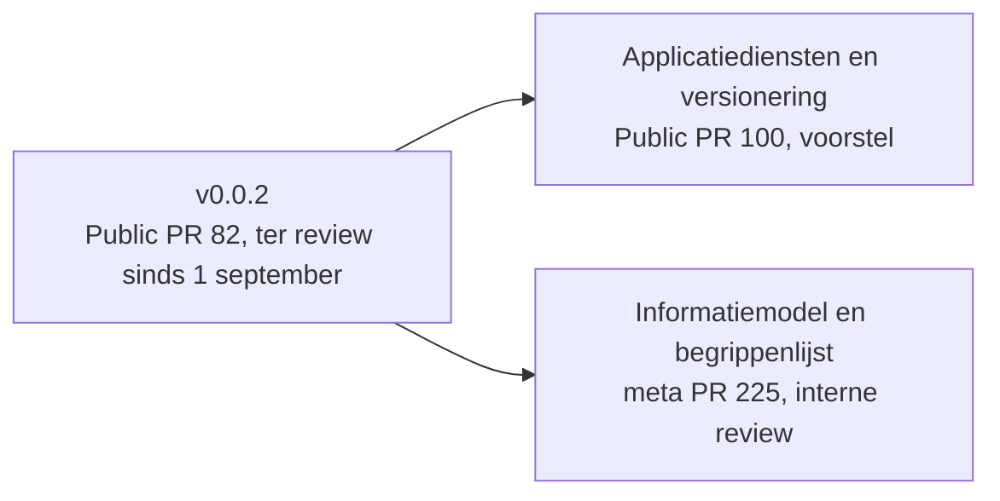
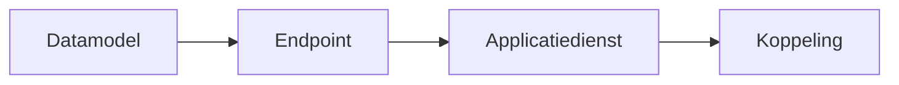

<!-- 1. TITEL -->

  <h1 style="font-size: 3.2rem; line-height: 1.15; margin-bottom: 0.8rem; color: var(--np-ink);">Kerngroep techniek</h1>
  
De koppelvlakspecificatie krijgt een laag die versioneren mogelijk maakt, en het informatiemodel waar om gevraagd is ligt er

  
OKx &middot; Npuls &middot; 15 september 2026

<!--
Ruud is afwezig. Niek en Garik trekken de sessie. Twee thema's: versionering en modulariteit
(Garik, het grootste deel van de tijd) en het informatiemodel met de begrippenlijst (Niek).
Daarna het open werk met een voorstel voor de prioritering.
-->

---

<!-- 2. STAND VAN ZAKEN -->

# Stand van zaken

| Afgesproken op 1 september | Stand |
|---|---|
| Versioneringsvoorstel als pull request | Ligt er: [Public PR 100](https://github.com/Npuls-OKx/Public/pull/100), groter geworden dan aangekondigd |
| Uitkomst van de review op v0.0.2 | Eén reactie binnen, zie de volgende slide |
| Informatiemodel eerst reviewen, dan de payloads | Issue geworden ([meta #163](https://github.com/Npuls-OKx/meta/issues/163)), uitgewerkt in [meta PR 225](https://github.com/Npuls-OKx/meta/pull/225) |

<!--
Drie regels, elk met status. Bronnen: de slide Vervolg van het deck van 1 september, en de
twee pull requests. PR 100 raakt 63 bestanden; het was aangekondigd als een versioneringsvoorstel
en is een herindeling van de koppelvlakspecificatie geworden.
-->

---

<!-- 3. REVIEW OP V0.0.2 -->

# Review op v0.0.2: wat is er gezien?

- Eén reactie binnen: Xedule en YNC, een pdf met opmerkingen per story ([Public #99](https://github.com/Npuls-OKx/Public/issues/99))
- Op de pull request zelf geen review ingediend; de reacties die erop staan komen uit de demo van 1 september ([Public PR 82](https://github.com/Npuls-OKx/Public/pull/82))

Gezocht: de bevindingen van ieder die v0.0.2 heeft doorgenomen, en wat er nodig is om de review te laten gebeuren.

<!--
Vragend stellen, niet verwijtend. De drie reviewregels en de comment op PR 82 zijn tijdens de
demo van 1 september geplaatst en tellen niet als review. De pdf van Xedule en YNC bevat acht
pagina's opmerkingen per story; Niels heeft daarop geantwoord dat de stories met de
PoC-instellingen verder worden aangepakt.
-->

---

<!-- 4. OPDRACHTEN VORIGE SESSIE -->

# Openstaande punten van 1 september

| Punt | Stand |
|---|---|
| Versionering per koppeling ([Public #47](https://github.com/Npuls-OKx/Public/issues/47)) | Voorstel ligt er als [Public PR 100](https://github.com/Npuls-OKx/Public/pull/100), vandaag op tafel |
| Meerdere instanties van een referentiecomponent ([meta #80](https://github.com/Npuls-OKx/meta/issues/80)) | Niet opgepakt |
| Keuzes en regelsets ([Public #74](https://github.com/Npuls-OKx/Public/issues/74)) | Niet opgepakt; staat in het voorstel voor de prioritering |
| Informatiemodel voor payloads ([meta #163](https://github.com/Npuls-OKx/meta/issues/163)) | Uitgewerkt in [meta PR 225](https://github.com/Npuls-OKx/meta/pull/225), vandaag op tafel |

<!--
Twee van de vier opgepakt, twee niet. Bron: de slide Openstaande punten van 1 september en
de stand van de issues op 11 september. Meta #80 heeft sinds juli een reactie van Ruud met
het rondje uit de kerngroep en verder niets.
-->

---

<!-- DIVIDER DEEL 1 -->

  

    
Deel 1

    <h1 style="color: #FFFFFF !important; font-size: 3rem;">Versionering en modulariteit</h1>
  

<!--
Blok van Garik: slides 6 tot en met 9. De opzet staat; Garik vervangt en vult aan met zijn
eigen sheets, voorbeeld en diagrammen.
-->

---

<!-- 6. HET PROBLEEM -->

# Een veld erbij in een datamodel, en dan?

- Een optioneel veld breekt geen bestaande koppeling
- Zonder versie ziet een implementatiepartij niet wie het veld wel en niet ondersteunt
- Dus: een versie op elke laag, of een knip die de kettingreactie stopt

<!--
BLOK GARIK. Bron: de afstemming van 11 september. Het voorbeeld dat Garik gaf: partij een
implementeert het nieuwe veld, partij twee niet, en niemand kan zien dat de een op versie Y
zit en de ander op X. Hier komt zijn eigen voorbeeld en diagram.
-->

---

<!-- 7. DE LAAG -->

# Applicatiediensten als laag tussen component en endpoint

**Wat het oplost**

- Eén contract, niet drie keer beschreven per koppeling
- Aanbieden en afnemen zijn twee losse diensten
- Elke dienst zelfstandig te claimen en te versioneren

**Wat er ligt**

- Veertien paren aanbieder en afnemer, uit de requirementsboom
- Vijf generieke interactiepatronen, met de naam uit de catalogus waar ze vandaan komen
- Twaalf functionele eisen vervangen door de stories die ze navertelden

Status: voorstel, <a href="https://github.com/Npuls-OKx/Public/pull/100">Public PR 100</a>. Hoogstens twee gelijktijdig actieve major versies per dienst.

<!--
BLOK GARIK. Bron: de beschrijving van Public PR 100 en Koppelvlakspecificaties/Applicatiediensten/README.md
op de branch. Er is nog geen plaat van de nieuwe laag; de opgeslagen overzichtsplaat toont
de oude opbouw. Garik levert het diagram.
-->

---

<!-- 8. HET VOORSTEL -->

# Datamodellen als eigen pakket

- De datamodellen krijgen samen een eigen versie, los van endpoint en dienst
- Een kleine wijziging in een model dwingt geen ophoging af in de lagen erboven
- Een implementatiepartij plant de overstap zelf

Status: voorstel. Nog niet in de pull request opgenomen.

<!--
BLOK GARIK. Bron: de afstemming van 11 september. Dit deel zit nog niet in PR 100; Garik was
het aan het toevoegen. Hier komen zijn sheets over wat dit betekent voor de implementatielaag
en hoe flexibel een leverancier kan zijn.
-->

---

<!-- 9. DE A/B-VRAAG -->

# Twee varianten voor de versie van de datamodellen

**A. Eén versie voor alle datamodellen**

- Eén nummer om te volgen
- Elke wijziging raakt iedereen

**B. Een versie per domein**

- Een wijziging blijft bij het domein
- Meer nummers om te volgen

Gezocht: welke variant landt in de implementatie het best, gezien vanuit het eigen systeem.

<!--
BLOK GARIK. De A/B-test uit de afstemming van 11 september. Garik richt de scheiding tussen de
datamodellen alvast in en demonstreert die. Het antwoord van de leveranciers bepaalt welke
variant in PR 100 wordt uitgewerkt.
-->

---

<!-- DIVIDER DEEL 2 -->

  

    
Deel 2

    <h1 style="color: #FFFFFF !important; font-size: 3rem;">Informatiemodel</h1>
  

---

<!-- 11. DE VRAAG -->

# De vraag uit de kerngroep

"Voordat we de details in de koppeling velden specificeren hebben we behoefte om het very high level domain model te valideren. Waar kunnen we die vinden?"

<a href="https://github.com/Npuls-OKx/Public/issues/89">Public #89</a>, 1 september 2026

- Het antwoord: twee platen uit het ArchiMate-model, met de conventies en de keuzes erachter
- Het OKx-model staat los van OEAPI; de mapping is een tweede plaat
- Status: concept, interne review afgerond, ter review in [meta PR 225](https://github.com/Npuls-OKx/meta/pull/225); twee ontwerpkeuzes liggen bij het kernteam ([meta #227](https://github.com/Npuls-OKx/meta/issues/227), [#228](https://github.com/Npuls-OKx/meta/issues/228))

<!--
De vraag letterlijk, want het deck beantwoordt hem. Niels stelde in hetzelfde issue voor om
vanuit twee platen te werken; Ruud ging akkoord; Jan Hendrik gaf op 4 september eerste
feedback op de plaat, die is verwerkt.
-->

---

<!-- 12. DE PLAAT -->

# Het informatiemodel

De kolommen zijn de begrippen, van kwalificatiekader tot resultaatstructuur. Geel is het OKx-referentiekader, grijs valt buiten scope. De leeruitkomst is de sleutel.

<!--
Plaat op volle breedte, de leeswijzer eronder. Versie v0.1 van 9 september, 62 objecttypen,
147 relaties. Bron: architecture/model/informatiemodel/ in meta, branch van PR 225.
-->

---

<!-- 13. DE BEGRIPPEN -->

# Zeven begrippen delen de keten in

| Begrip | Beantwoordt de vraag |
|---|---|
| Kwalificatiekader mbo | Wat is normatief geldig |
| Onderwijskundig kader instelling | Wat moet de student kennen en kunnen |
| Onderwijsspecificatie | Wat wordt georganiseerd |
| Onderwijsaanbod | Wanneer, met hoeveel plekken, met wie |
| Onderwijsverbintenis | Welke relatie heeft een student met dat aanbod |
| Onderwijsresultaat | Wat is er behaald |
| Resultaatstructuur | Hoe telt dat op tot een uitspraak over de kwalificatie |

<!--
Letterlijk overgenomen uit de begrippentabel in informatiemodel.md. Het informatiemodel is de
aanzet tot het conceptueel informatiemodel, MIM-niveau 2; de begrippen zelf staan op niveau 1
in het begrippenkader en de begrippenlijst.
-->

---

<!-- 15. NAAST OEAPI -->

# Waar OEAPI v6 het model dekt, en waar niet

- Eén OEAPI-object draagt vaak meerdere OKx-objecttypen: `Programme` vier, `ProgrammeOffering` drie
- Het kwalificatiekader heeft geen tegenhanger; de leeruitkomst wel, `LearningOutcome`
- De resultaatstructuur is nog niet op OEAPI gemapt; de vraag is of dat kan, en het lijkt er nu op van niet
- 21 objecttypen binnen scope zonder OEAPI-object: per stuk signalering of bewuste afwijking

  
  
Blauw is OEAPI v6; de pijl is realisatie.

<!--
Bron: informatiemodel-oeapi-mapping.md. Geverifieerd tegen de OEAPI 6.0 OpenAPI-specificatie:
LearningOutcome bestaat met eigen endpoints. Voor de resultaatstructuur is de mapping nog niet
gemaakt; wat er tot nu toe gevonden is: weight staat per resultaat, niet per specificatie, en
het afrondingscriterium bestaat alleen als vrije tekst in qualificationRequirements. Daarom de
inschatting dat het niet kan; vastgesteld is dat niet.
-->

---

<!-- 16. BEGRIPPENKADER -->

# Eerste begrippenkader

- Elk begrip gerelateerd aan de referentiearchitecturen: MORA, ROSA (Kernmodel Onderwijsinformatie) en HORA
- Doel: iteratief uitbreiden en reviewen

| | |
|---|---|
| Begrippen en objecttypen van het informatiemodel | 69 |
| Definitie overgenomen uit MORA of ROSA | 20 |
| Eigen OKx-definitie | 14 |
| Nog geen definitie | 35 |

Status: v0.2, concept. MORA en ROSA zijn geraadpleegd, HORA volgt.

<!--
Bron: begrippenlijst.md op de branch van meta PR 225, stand 11 september. De getallen
veranderen zolang de PR beweegt; vlak voor de sessie opnieuw tegen de bron controleren.
Per begrip staat in de lijst per kader of er een tegenhanger is (met citaat en link), of er
gezocht is zonder resultaat, of dat het nog niet is onderzocht. MORA en KOI zijn op 9 september
opgehaald; elke definitie staat letterlijk in referentiekaders.json met URL en ophaaldatum.
-->

---

<!-- DIVIDER DEEL 3 -->

  

    
Deel 3

    <h1 style="color: #FFFFFF !important; font-size: 3rem;">Open werk</h1>
  

---

<!-- 18. OPEN WERK -->

# Open werk in Npuls-OKx/Public

**Zes milestones met openstaand werk**

| Milestone | Open |
|---|---|
| [Releaseproces en kwaliteit](https://github.com/Npuls-OKx/Public/milestone/4) | 11 |
| [Requirementsboom doorontwikkelen](https://github.com/Npuls-OKx/Public/milestone/3) | 9 |
| [Interactiepatroon-documenten](https://github.com/Npuls-OKx/Public/milestone/5) | 7 |
| [Leerroute-refactor](https://github.com/Npuls-OKx/Public/milestone/1) | 3 |
| [Keuzedelen](https://github.com/Npuls-OKx/Public/milestone/7) | 3 |
| [Agent-harness](https://github.com/Npuls-OKx/Public/milestone/2) | 2 |

**Sinds 1 september van buiten het kernteam**

- Vijf issues van Kees over granulariteit, definities, eigenaarschap en leestijd ([#85](https://github.com/Npuls-OKx/Public/issues/85) tot en met [#89](https://github.com/Npuls-OKx/Public/issues/89))
- Twee van Xedule: notificaties ontvangen ([#84](https://github.com/Npuls-OKx/Public/issues/84)) en de opmerkingen per story ([#99](https://github.com/Npuls-OKx/Public/issues/99))

**Wat nu loopt**

- Versionering ([PR 100](https://github.com/Npuls-OKx/Public/pull/100)), informatiemodel ([#89](https://github.com/Npuls-OKx/Public/issues/89)), granulariteit ([#85](https://github.com/Npuls-OKx/Public/issues/85)), stories met de PoC-instellingen ([#99](https://github.com/Npuls-OKx/Public/issues/99))

<!--
Stand van 11 september: 44 open issues, waarvan 7 zonder milestone. Links de milestones met hun
aantallen; rechts wat er van buiten binnenkwam en wat er aantoonbaar aan gewerkt wordt (een
pull request, een toegewezen persoon, of een antwoord in het issue). Wat niet in de laatste
regel staat, wordt op dit moment niet opgepakt.
-->

---

<!-- 19. VOORSTEL PRIORITERING -->

# Voorstel voor de prioritering

| | Eerst | Waarom |
|---|---|---|
| 1 | Review op de pull requests: versionering ([Public PR 100](https://github.com/Npuls-OKx/Public/pull/100)), v0.0.2 ([Public PR 82](https://github.com/Npuls-OKx/Public/pull/82)), het informatiemodel zodra het naar Public gaat | Zonder review geen release, en zonder release geen bouw |
| 2 | Keuzedeelregels: de typologie toetsen aan de echte scenario's ([Public #74](https://github.com/Npuls-OKx/Public/issues/74), [#64](https://github.com/Npuls-OKx/Public/issues/64), [#1](https://github.com/Npuls-OKx/Public/issues/1)) | Elke studentkeuze werkt door in planning, rooster en leeromgeving; dit is de spil van flexibilisering |

**Wat daarmee wacht:** meerdere instanties van een referentiecomponent ([meta #80](https://github.com/Npuls-OKx/meta/issues/80)), de terminologie- en correctie-issues, en de verdieping van de requirementsboom.

Status: voorstel van het kernteam. Zonder keuze blijft alles even zwaar en beweegt niets.

<!--
Voorstel, geen besluit. De volgorde en de twee prioriteiten komen van Niek; de rest is afgeleid
uit de backlog. Vraag aan de groep: klopt deze volgorde, en wat ontbreekt?
-->

---

<!-- 20. GEVRAAGD -->

# Gevraagd

<dl class="np-besluit kennisname" style="margin-top: 1rem;">
  <dt>Input</dt><dd>welke versioneringsvariant landt in de implementatie het best, A of B</dd>
</dl>

<dl class="np-besluit review" style="margin-top: 0.8rem;">
  <dt>Review</dt><dd>het informatiemodel op conceptueel niveau: klopt de samenhang, welke objecttypen missen, en welke begrippen missen in de lijst. Tot de volgende sessie, in <a href="https://github.com/Npuls-OKx/meta/pull/225">meta PR 225</a></dd>
</dl>

<dl class="np-besluit" style="margin-top: 0.8rem;">
  <dt>Besluit</dt><dd>de prioritering van het open werk: eerst de reviews, dan de keuzedeelregels</dd>
</dl>

<dl class="np-besluit kennisname" style="margin-top: 0.8rem;">
  <dt>Input</dt><dd>de bevindingen op v0.0.2, en wat er nodig is om de review te laten gebeuren</dd>
</dl>

<!--
Geen besluit over het informatiemodel zelf: dat is pas aan de orde als de ADR-punten zijn
opgelost. Wel een besluit over de prioritering, want zonder keuze beweegt niets.
-->

---

<!-- 21. VERVOLG -->

# Vervolg

Volgende sessie:

- De gekozen versioneringsvariant, uitgewerkt in Public PR 100
- Het informatiemodel na de interne besluiten als pull request naar Public
- De keuzedeelregels, getoetst aan de scenario's

Op 6 oktober is de leeruitkomstendag; daar wordt het informatiemodel getoond. Commentaar op een lopende release: in de pull request. Nieuw punt: als issue op <strong>github.com/Npuls-OKx/Public</strong>

<!--
De drie regels volgen uit Gevraagd; de datum van 6 oktober komt uit de afstemming van
11 september. Geen andere data beloven.
-->

---

<!-- PEILING -->

# Hoe gaat het?

- Welk cijfer krijgt de voortgang, en waarom?
- Wat ging er goed?
- Wat kan er beter?

  

    
1

    
2

    
3

    
4

    
5

    
6

    
7

    
8

    
9

    
10

  

  

    loopt nietloopt goed
  

<!--
Vaste afsluiting van elke sessie, zie meta #205. Het cijfer maakt de lijn over sessies
zichtbaar, de twee open vragen leveren de inhoud.
-->

---

<!-- AFSLUITER -->

<!--
Einde. Npuls-afsluiter met logo en licentie.
-->
