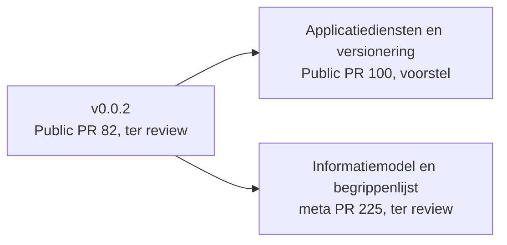
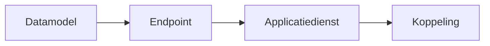

<!-- 1. TITEL -->

  <h1 style="font-size: 3.2rem; line-height: 1.15; margin-bottom: 0.8rem; color: var(--np-ink);">Kerngroep techniek</h1>
  
De koppelvlakspecificatie krijgt een laag die versioneren mogelijk maakt, en het informatiemodel dat leveranciers vroegen ligt er

  
OKx &middot; Npuls &middot; 15 september 2026 &middot; Niek Derksen en Garik Hakopian

<!--
PLAN. Ruud is afwezig; Niek en Garik trekken de sessie. Twee thema's: versionering (Garik,
grootste deel van de tijd) en het informatiemodel (Niek). Bron: afstemming 11 september.
-->

---

<!-- 2. STAND VAN ZAKEN -->

# Stand van zaken

| Sinds 1 september | Stand |
|---|---|
| Review op v0.0.2 door deze groep | *invullen: wat kwam er binnen op Public PR 82* |
| Versioneringsvoorstel als pull request | Ligt er, Public PR 100, groter geworden dan aangekondigd |
| Informatiemodel voor payloads | Ligt er, meta PR 225, met begrippenlijst |

<!--
PLAN. Drie regels, elk met status. De eerste regel vraagt de uitkomst van PR 82 op; die
staat nergens in de historie en moet uit de PR-comments of van Garik komen.
-->

---

<!-- 3. OPDRACHTEN VORIGE SESSIE -->

# Opdrachten vorige sessie

| Openstaand punt op 1 september | Wat ermee gebeurd is |
|---|---|
| Versionering per koppeling (Public #47) | Voorstel ligt er als Public PR 100, vandaag op tafel |
| Meerdere instanties van een referentiecomponent (meta #80) | *invullen: stand* |
| Keuzes en regelsets (Public #74) | *invullen: stand* |
| Informatiemodel voor payloads | Issue geworden (meta #163), uitgewerkt in meta PR 225, vandaag op tafel |

<!--
PLAN. Eerlijk: twee van de vier zijn opgepakt, twee niet. De stand van #80 en #74 nog
tegen de issues controleren voor het deck definitief is.
-->

---

<!-- 4. THEMA 1: HET PROBLEEM (blok van Garik) -->

# Een veld erbij in een datamodel, en dan?

- Een optioneel veld breekt geen bestaande koppeling
- Maar zonder versie ziet een implementatiepartij niet wie het veld wel en niet ondersteunt
- Dus: versioneren op elke laag, of een knip die de kettingreactie stopt

<!--
BLOK GARIK, slides 4 tot en met 7. Dit is de plek en de vraag; Garik levert de sheets met
zijn voorbeeld en diagrammen. Bron voor de opzet: het overleg van 11 september.
-->

---

<!-- 5. THEMA 1: DE LAAG -->

# Applicatiediensten als laag tussen component en endpoint

- Eén contract, niet drie keer beschreven per koppeling
- Veertien paren aanbieder en afnemer, afgeleid uit de requirementsboom
- Elke dienst zelfstandig te claimen en zelfstandig te versioneren
- Vijf generieke interactiepatronen, met de naam uit de catalogus waar ze vandaan komen

Status: voorstel, Public PR 100.

<!--
BLOK GARIK. Bron: de PR-beschrijving van Public PR 100.
-->

---

<!-- 6. THEMA 1: HET VOORSTEL -->

# Datamodellen als eigen pakket

- Datamodellen krijgen een eigen versie, los van endpoint en dienst
- Een kleine wijziging in een model dwingt geen versie-ophoging af in de lagen erboven
- Een implementatiepartij plant de overstap zelf

Status: voorstel. Wat dit betekent voor de implementatielaag: sheets van Garik.

<!--
BLOK GARIK. Hier komen zijn voorbeeld en diagrammen. De vraag die leveranciers stellen, uit
het overleg: wat betekent dit voor mijn implementatielaag en hoe flexibel kan ik zijn.
-->

---

<!-- 7. THEMA 1: DE A/B-VRAAG -->

# Twee varianten, en de vraag aan jullie

**A. Eén versie voor alle datamodellen**

- Eén nummer om te volgen
- Elke wijziging raakt iedereen

**B. Een versie per domein**

- Wijzigingen blijven bij het domein
- Meer nummers om te volgen

Welke variant landt in jullie implementatie het best?

<!--
BLOK GARIK. De A/B-test uit het overleg. Garik richt de scheiding tussen de datamodellen
alvast in en demonstreert die.
-->

---

<!-- 8. THEMA 2: HET INFORMATIEMODEL -->

# Het informatiemodel: hoe alles aan elkaar hangt

*Plaat: OKx informatiemodel v0.1, zeven begrippen als kolommen, 62 objecttypen.*

- Zeven begrippen delen de keten in: kwalificatiekader, onderwijskundig kader, specificatie, aanbod, verbintenis, resultaat, resultaatstructuur
- De leeruitkomst is de sleutel die specificaties en resultaatstructuur verbindt
- Elf ontwerpkeuzes, elk terug te lezen in de documentatie

Status: concept, ter review in meta PR 225.

<!--
PLAN. De plaat zelf op de slide, groot. De jpg staat in architecture/model/informatiemodel
op branch 89 en komt met PR 225 naar dev; tot die tijd kopiëren naar presentaties/src/public.
-->

---

<!-- 9. THEMA 2: DE KEUZES DIE EEN BESLUIT VRAGEN -->

# Wat er nog open staat in het model

| Punt | Waarom het een besluit is |
|---|---|
| Leeruitkomsten op dossier- en kwalificatieniveau | ADR 0019 zegt nee, ADR 0022 zegt ja; de plaat kiest nu impliciet |
| De schrijfwijze van de objecttypen | Waar MORA hetzelfde object kent volgt OKx MORA; elders loopt het door elkaar |
| De voorwaarde in de keuzeregelset | Uitgedrukt in behaalde leeruitkomsten, niet in doorlopen specificaties |

<!--
PLAN. Drie punten die uit de interne reviews kwamen. Formuleren als besluitvraag, niet als
fout. Status van beide ADR's: voorstel.
-->

---

<!-- 10. THEMA 2: NAAST OEAPI -->

# Waar OEAPI v6 het model dekt, en waar niet

- Eén OEAPI-object draagt vaak meerdere OKx-objecttypen: `Programme` vier, `ProgrammeOffering` drie
- Het kwalificatiekader heeft geen tegenhanger; de leeruitkomst wel, `LearningOutcome`
- De resultaatstructuur is niet in OEAPI uit te drukken
- 21 objecttypen binnen scope zonder OEAPI-object: per objecttype signalering of bewuste afwijking

<!--
PLAN. De mappingplaat op de slide. Bron: informatiemodel-oeapi-mapping.md.
-->

---

<!-- 11. BEGRIPPENLIJST -->

# De begrippenlijst: eerst het kader, dan pas eigen woorden

| | |
|---|---|
| Begrippen en objecttypen van het informatiemodel | 69 |
| Definitie rechtstreeks uit MORA of het Kernmodel Onderwijsinformatie | 20 |
| Eigen OKx-definitie, als verbijzondering of als nieuw begrip | 14 |
| Nog geen definitie | 35 |

Per begrip per kader: een tegenhanger met citaat en link, <em>geen tegenhanger gevonden</em>, of <em>nog niet onderzocht</em>. Nooit een lege cel.

<!--
PLAN. De getallen komen uit begrippenlijst.md op branch 89 en veranderen als de PR nog
beweegt; vlak voor het deck definitief is opnieuw tegen de bron controleren.
-->

---

<!-- 12. GEVRAAGD -->

# Gevraagd

<dl style="font-size: 1rem; line-height: 1.9; margin-top: 1rem;">
  <dt>Input</dt><dd>welke versioneringsvariant landt in jullie implementatie het best, A of B</dd>
  <dt>Review</dt><dd>het informatiemodel op conceptueel niveau: klopt de samenhang, en welke objecttypen missen</dd>
  <dt>Input</dt><dd>welke begrippen missen in de lijst, en waar wijkt jullie definitie af</dd>
</dl>

<!--
PLAN. Drie vragen, elk in de vaste vorm. Geen besluit gevraagd over het informatiemodel:
dat is pas aan de orde als de twee ADR-punten zijn opgelost.
-->

---

<!-- 13. VERVOLG -->

# Vervolg

- Versionering: de gekozen variant uitwerken in Public PR 100
- Informatiemodel: na de interne besluiten als pull request naar Public
- Begrippenlijst: volgende batch, en HORA onderzoeken
- Leeruitkomstendag 6 oktober: het informatiemodel wordt daar getoond

Commentaar op een lopende release: in de pull request. Nieuw onderwerp: als issue op github.com/Npuls-OKx/Public.

<!--
PLAN. Geen data beloven behalve wat al vaststaat (6 oktober komt uit het overleg).
-->

---

<!-- 14. PEILING -->

# Hoe gaat het?

- Een cijfer voor de voortgang
- Wat ging er goed
- Wat kan er beter

<!--
PLAN. Zelfde peiling als 1 september, zie meta #205.
-->
